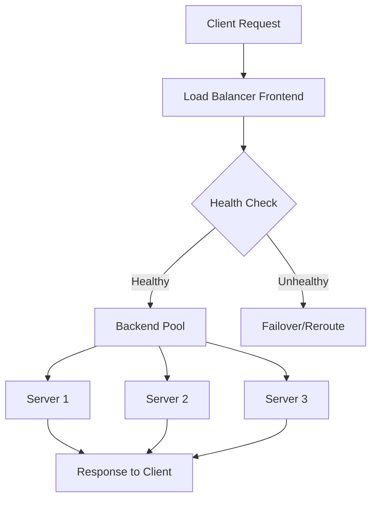

## Overview

Load balancing is the process of distributing network traffic across multiple servers to ensure optimal resource utilization, maximize throughput, minimize response time, and avoid overload on any single server. It enhances application availability, scalability, and fault tolerance by directing client requests to healthy backend instances based on predefined algorithms and health checks.

## Detailed Explanation

### Key Concepts

- **Frontend**: The entry point that receives incoming traffic.
- **Backend Pool**: A group of servers (VMs, containers, or services) that handle the distributed load.
- **Load Balancing Rules**: Define how traffic is distributed, including protocols, ports, and algorithms.
- **Health Probes**: Mechanisms to check server health and route traffic only to operational instances.
- **Session Persistence**: Ensures requests from the same client are directed to the same server for stateful applications.

### Types of Load Balancers

1. **Hardware Load Balancers**: Physical devices like F5 BIG-IP, offering high performance but less flexibility.
2. **Software Load Balancers**: Applications like NGINX, HAProxy, or cloud-native services (e.g., AWS ELB, Azure Load Balancer).
3. **Cloud Load Balancers**: Managed services that scale automatically, such as Elastic Load Balancing (ELB) on AWS.

### Load Balancing Algorithms

Load balancing algorithms determine how traffic is distributed. Common types include:

| Algorithm | Description | Pros | Cons | Use Case |
|-----------|-------------|------|------|----------|
| Round Robin | Cycles through servers sequentially | Simple, fair distribution | Ignores server load | Static content serving |
| Least Connections | Routes to server with fewest active connections | Balances load dynamically | Assumes equal server capacity | Variable request processing |
| IP Hash | Uses client IP to assign server | Session persistence | Uneven distribution if IPs cluster | Stateful applications |
| Weighted Round Robin | Assigns weights based on server capacity | Accounts for heterogeneous servers | Manual weight tuning | Mixed server capacities |
| Least Response Time | Routes to server with fastest response | Optimizes performance | Requires monitoring | Latency-sensitive apps |

### Strategies

- **DNS-Based Load Balancing**: Distributes traffic at the DNS level using round-robin or geo-based routing.
- **Layer 4 (Transport Layer)**: Balances based on IP and port, e.g., TCP/UDP load balancing.
- **Layer 7 (Application Layer)**: Inspects HTTP headers, cookies, etc., for intelligent routing.
- **Global Server Load Balancing (GSLB)**: Distributes across geographically dispersed data centers.

### Architecture Diagram



## Real-world Examples & Use Cases

- **Web Applications**: Netflix uses load balancers to handle millions of concurrent streams, distributing traffic across global CDNs and servers.
- **E-commerce**: Amazon ELB manages traffic spikes during sales events, ensuring high availability for millions of users.
- **Microservices**: Companies like Uber employ service mesh load balancers (e.g., Istio) to route requests between microservices.
- **Gaming**: Online games like Fortnite use load balancers for matchmaking and session management across regions.
- **API Gateways**: Load balancers integrate with API gateways to throttle and route API calls, as seen in Stripe's payment processing.

## Code Examples

### Simple Round-Robin Load Balancer in Python

```python
class RoundRobinLoadBalancer:
    def __init__(self, servers):
        self.servers = servers
        self.index = 0

    def get_server(self):
        server = self.servers[self.index]
        self.index = (self.index + 1) % len(self.servers)
        return server

# Usage
lb = RoundRobinLoadBalancer(['server1', 'server2', 'server3'])
print(lb.get_server())  # server1
print(lb.get_server())  # server2
```

### Least Connections in Java

```java
import java.util.*;

public class LeastConnectionsLoadBalancer {
    private Map<String, Integer> serverConnections = new HashMap<>();

    public LeastConnectionsLoadBalancer(List<String> servers) {
        for (String server : servers) {
            serverConnections.put(server, 0);
        }
    }

    public String getServer() {
        return serverConnections.entrySet().stream()
                .min(Map.Entry.comparingByValue())
                .map(Map.Entry::getKey)
                .orElse(null);
    }

    public void incrementConnection(String server) {
        serverConnections.put(server, serverConnections.get(server) + 1);
    }

    public void decrementConnection(String server) {
        serverConnections.put(server, Math.max(0, serverConnections.get(server) - 1));
    }
}
```

### NGINX Configuration for Load Balancing

```nginx
upstream backend {
    server backend1.example.com;
    server backend2.example.com;
    server backend3.example.com;
}

server {
    listen 80;
    location / {
        proxy_pass http://backend;
    }
}
```

## References

- [Wikipedia: Load Balancing (Computing)](https://en.wikipedia.org/wiki/Load_balancing_(computing))
- [NGINX: Load Balancing](https://www.nginx.com/resources/glossary/load-balancing/)
- [AWS: What is Load Balancing?](https://aws.amazon.com/what-is/load-balancing/)
- [Microsoft Azure: What is Azure Load Balancer?](https://learn.microsoft.com/en-us/azure/load-balancer/load-balancer-overview)

## Github-README Links & Related Topics

- [API Gateway vs Load Balancer](./api-gateway-vs-load-balancer/README.md)
- [API Gateway Design](./api-gateway-design/README.md)
- [Cloud Architecture Patterns](./cloud-architecture-patterns/README.md)
- [Scalability Patterns](./high-scalability-patterns/README.md)

## STAR Summary

**Situation**: In a high-traffic e-commerce platform, uneven server load caused frequent outages during peak hours.

**Task**: Implement load balancing to distribute traffic evenly and improve availability.

**Action**: Deployed AWS ELB with least connections algorithm, configured health probes, and integrated auto-scaling.

**Result**: Reduced response time by 40%, eliminated outages, and handled 3x traffic spikes seamlessly.

## Common Pitfalls & Edge Cases

- **Sticky Sessions Overhead**: Over-relying on session persistence can prevent even distribution; use when necessary.
- **Health Probe Misconfiguration**: Incorrect probes may mark healthy servers as down; test thoroughly.
- **Single Point of Failure**: Load balancer itself can fail; use redundant setups or cloud-managed services.
- **Geo-Load Balancing Latency**: Routing to distant servers increases latency; prioritize regional balancing.
- **Algorithm Mismatch**: Round-robin on heterogeneous servers leads to overload; use weighted algorithms.

## Tools & Libraries

- **NGINX**: Open-source web server and load balancer.
- **HAProxy**: High-performance TCP/HTTP load balancer.
- **AWS Elastic Load Balancing**: Managed service for EC2 instances.
- **Azure Load Balancer**: Cloud-native load balancing for VMs.
- **Istio**: Service mesh with built-in load balancing for Kubernetes.