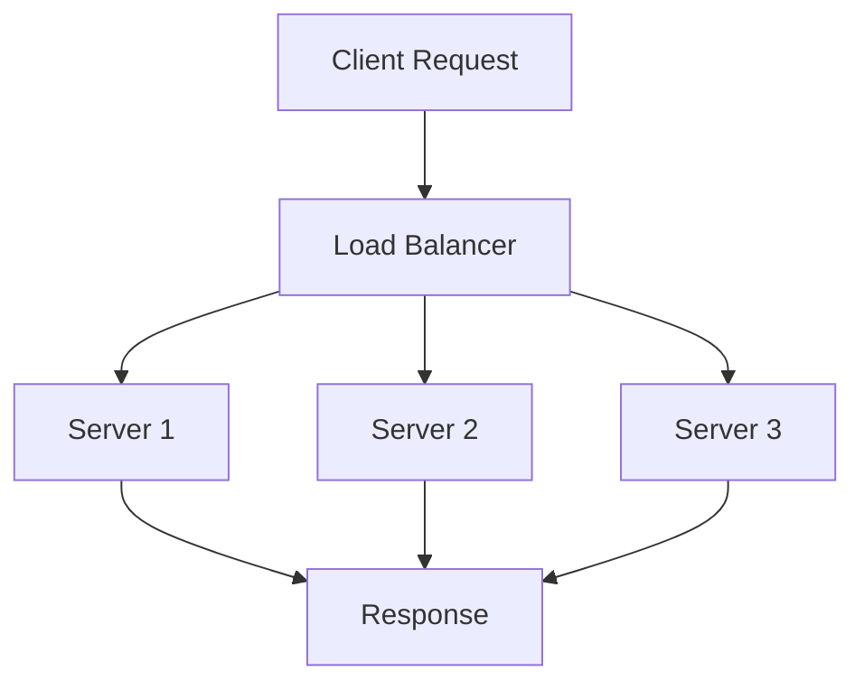

# Load Balancing and Strategies

## Overview

Load balancing distributes incoming network traffic across multiple servers to ensure no single server becomes overwhelmed, improving reliability, performance, and scalability.

## Detailed Explanation

### Types of Load Balancing

- **Layer 4 (Transport Layer)**: Routes based on IP and port. Fast, but less intelligent.
- **Layer 7 (Application Layer)**: Routes based on content, cookies, headers. More flexible.

### Load Balancing Algorithms

- **Round Robin**: Cycles through servers sequentially.
- **Least Connections**: Routes to server with fewest active connections.
- **IP Hash**: Routes based on client IP for session persistence.
- **Weighted**: Assigns weights to servers based on capacity.

### Components

- **Load Balancer**: Hardware (F5) or software (Nginx, HAProxy).
- **Health Checks**: Monitors server health to avoid routing to failed servers.



## Real-world Examples & Use Cases

- **Web Applications**: Distribute HTTP requests across web servers.
- **Databases**: Read replicas load balancing.
- **Microservices**: API gateway load balancing.
- **Global Scale**: CDN load balancing for content delivery.

## Code Examples

### Nginx Load Balancing

```nginx
upstream backend {
    server backend1.example.com;
    server backend2.example.com;
    server backend3.example.com;
}

server {
    listen 80;
    location / {
        proxy_pass http://backend;
        proxy_set_header Host $host;
    }
}
```

### HAProxy Configuration

```haproxy
frontend http_front
    bind *:80
    default_backend http_back

backend http_back
    balance roundrobin
    server server1 192.168.1.1:80 check
    server server2 192.168.1.2:80 check
```

## Common Pitfalls & Edge Cases

- **Session Stickiness**: Ensuring user sessions stay on same server.
- **Health Check Failures**: False positives/negatives.
- **Overload**: Load balancer itself becoming bottleneck.
- **SSL Termination**: Handling encrypted traffic.

## Tools & Libraries

- Nginx
- HAProxy
- AWS ELB
- Google Cloud Load Balancing

## References

- [Nginx Load Balancing](https://nginx.org/en/docs/http/load_balancing.html)
- [HAProxy Documentation](https://www.haproxy.org/)

## Github-README Links & Related Topics

- [Proxy Forward and Reverse](../proxy-forward-and-reverse/README.md)
- [High Scalability Patterns](../high-scalability-patterns/README.md)
- [Latency and Throughput](../latency-and-throughput/README.md)
