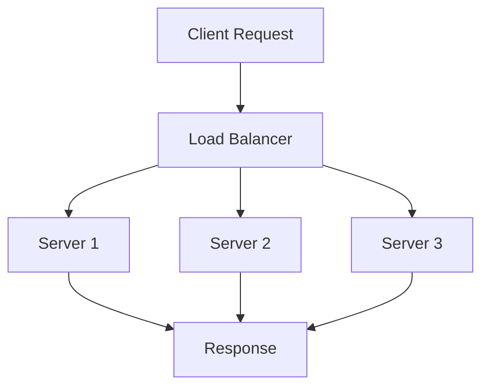

## Overview

Load balancing is a technique to distribute network traffic across multiple servers to optimize resource utilization, maximize throughput, minimize response time, and avoid overload of any single resource. It ensures high availability, fault tolerance, and scalability in distributed systems.

## Detailed Explanation

Load balancers can operate at different layers of the OSI model:

- **Layer 4 (Transport Layer):** Routes traffic based on IP address and port. Faster but less intelligent.
- **Layer 7 (Application Layer):** Routes based on content, such as HTTP headers, cookies, or URL paths. More flexible but higher overhead.

### Common Load Balancing Algorithms

- **Round Robin:** Distributes requests sequentially to each server in the pool.
- **Least Connections:** Routes to the server with the fewest active connections.
- **IP Hash:** Uses a hash of the client's IP address to consistently route to the same server.
- **Weighted Round Robin:** Assigns weights to servers based on capacity.
- **Least Response Time:** Routes to the server with the fastest response time.



### Benefits

- Improved performance and responsiveness.
- High availability through redundancy.
- Scalability by adding more servers.
- Fault tolerance with health checks.

### Challenges

- Session persistence (sticky sessions).
- SSL termination overhead.
- Single point of failure (mitigated by redundant load balancers).

## Real-world Examples & Use Cases

- **Web Applications:** Distributing HTTP requests across web servers (e.g., Amazon ELB).
- **Microservices:** Routing API calls to service instances.
- **Content Delivery Networks (CDNs):** Balancing traffic to edge servers.
- **Databases:** Read replicas load balancing.
- **Gaming Servers:** Handling player connections during peak times.

## Code Examples

### Nginx Load Balancing Configuration

```nginx
# /etc/nginx/nginx.conf
upstream backend {
    least_conn;  # Algorithm: least connections
    server backend1.example.com:8080 weight=3;
    server backend2.example.com:8080 weight=1;
    server backend3.example.com:8080 backup;
}

server {
    listen 80;
    location / {
        proxy_pass http://backend;
        proxy_set_header Host $host;
        proxy_set_header X-Real-IP $remote_addr;
    }
}
```

### HAProxy Configuration

```haproxy
# /etc/haproxy/haproxy.cfg
frontend http_front
    bind *:80
    default_backend http_back

backend http_back
    balance roundrobin
    server server1 192.168.1.10:8080 check
    server server2 192.168.1.11:8080 check
    server server3 192.168.1.12:8080 check backup
```

### AWS Elastic Load Balancer (ELB) with Terraform

```hcl
resource "aws_elb" "web_elb" {
  name               = "web-elb"
  availability_zones = ["us-east-1a", "us-east-1b"]

  listener {
    instance_port     = 80
    instance_protocol = "http"
    lb_port           = 80
    lb_protocol       = "http"
  }

  health_check {
    healthy_threshold   = 2
    unhealthy_threshold = 2
    timeout             = 3
    target              = "HTTP:80/"
    interval            = 30
  }

  instances = [aws_instance.web1.id, aws_instance.web2.id]
}
```

## Common Pitfalls & Edge Cases

- **Session Affinity Issues:** Sticky sessions can lead to uneven load.
- **Health Check Failures:** Incorrect thresholds causing unnecessary failovers.
- **SSL Offloading:** Certificate management and security implications.
- **Edge Case:** Flash crowds causing temporary overload.
- **Network Partitioning:** Load balancer unable to reach some servers.

## Tools & Libraries

- **Hardware:** F5 BIG-IP, Citrix NetScaler
- **Software:** Nginx, HAProxy, Apache Traffic Server
- **Cloud:** AWS ELB/ALB, Google Cloud Load Balancing, Azure Load Balancer
- **Service Mesh:** Istio, Linkerd

## Github-README Links & Related Topics

- [proxy-forward-and-reverse](../proxy-forward-and-reverse/)
- [high-scalability-patterns](../high-scalability-patterns/)
- [system-design-basics](../system-design-basics/)

## References

- Nginx Load Balancing: https://docs.nginx.com/nginx/admin-guide/load-balancer/http-load-balancer/
- HAProxy Documentation: https://www.haproxy.org/
- AWS ELB Guide: https://docs.aws.amazon.com/elasticloadbalancing/latest/userguide/what-is-load-balancing.html
- Load Balancing Algorithms Explained: https://kemptechnologies.com/load-balancer/load-balancing-algorithms-techniques/