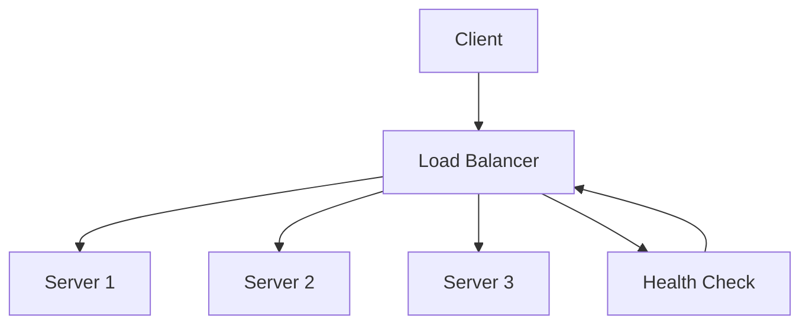

## Overview

Load balancing is the process of distributing network traffic across multiple servers to optimize resource utilization, maximize throughput, minimize response time, and avoid overload of any single server. It ensures high availability, fault tolerance, and scalability in distributed systems.

## Detailed Explanation

Load balancers act as intermediaries between clients and server pools, routing requests based on predefined algorithms. They can operate at different layers of the OSI model (L4 for transport, L7 for application).

### Load Balancing Algorithms

- **Round Robin**: Distributes requests sequentially across servers. Simple but doesn't consider server load.
- **Least Connections**: Routes to the server with the fewest active connections. Better for variable request processing times.
- **IP Hash**: Uses client IP to determine server assignment. Ensures session persistence.
- **Weighted Round Robin**: Assigns weights to servers based on capacity.
- **Least Response Time**: Routes to the server with the fastest response time.
- **Random**: Randomly selects a server, useful for simple implementations.

### Types of Load Balancers

- **Hardware Load Balancers**: Dedicated devices like F5 BIG-IP.
- **Software Load Balancers**: Nginx, HAProxy, Apache mod_proxy.
- **Cloud Load Balancers**: AWS ELB, Google Cloud Load Balancing.



## Real-world Examples & Use Cases

- **Web Applications**: Distributing HTTP requests across web server clusters.
- **Microservices**: Routing API calls to service instances in a Kubernetes cluster.
- **Databases**: Read replicas load balancing for query distribution.
- **CDNs**: Global traffic distribution to edge servers.

## Code Examples

### Nginx Load Balancing Configuration

```nginx
upstream backend {
    least_conn;  # Use least connections algorithm
    server backend1.example.com:8080 weight=3;
    server backend2.example.com:8080 weight=2;
    server backend3.example.com:8080 weight=1;
    server backend4.example.com:8080 backup;  # Backup server
}

server {
    listen 80;
    location / {
        proxy_pass http://backend;
        proxy_next_upstream error timeout invalid_header http_500 http_502 http_503 http_504;
        proxy_connect_timeout 2s;
        proxy_send_timeout 10s;
        proxy_read_timeout 10s;
    }
}
```

### HAProxy Configuration

```haproxy
frontend http_front
    bind *:80
    default_backend http_back

backend http_back
    balance roundrobin
    option httpchk GET /health
    http-check expect status 200
    server web1 192.168.1.10:80 check weight 1
    server web2 192.168.1.11:80 check weight 2
    server web3 192.168.1.12:80 check weight 1
```

### Simple Load Balancer in Go

```go
package main

import (
    "net/http"
    "net/http/httputil"
    "net/url"
    "sync/atomic"
)

type LoadBalancer struct {
    backends []*url.URL
    counter  int64
}

func (lb *LoadBalancer) ServeHTTP(w http.ResponseWriter, r *http.Request) {
    backend := lb.backends[atomic.AddInt64(&lb.counter, 1)%int64(len(lb.backends))]
    proxy := httputil.NewSingleHostReverseProxy(backend)
    proxy.ServeHTTP(w, r)
}

func main() {
    backends := []*url.URL{
        {Scheme: "http", Host: "localhost:8081"},
        {Scheme: "http", Host: "localhost:8082"},
    }
    lb := &LoadBalancer{backends: backends}
    http.ListenAndServe(":8080", lb)
}
```

## Common Pitfalls & Edge Cases

| Pitfall | Description | Mitigation |
|---------|-------------|------------|
| Session Affinity Issues | Sticky sessions break load distribution | Use distributed sessions or IP hash |
| Health Check Failures | Unhealthy servers still receive traffic | Implement proper health checks |
| Thundering Herd | All servers hit simultaneously after restart | Use gradual traffic increase |
| SSL Termination Overhead | Load balancer becomes bottleneck | Use hardware acceleration or offload |
| Algorithm Mismatch | Wrong algorithm for workload type | Analyze traffic patterns to choose algorithm |

## Tools & Libraries

| Tool | Type | Description |
|------|------|-------------|
| Nginx | Software LB | High-performance HTTP load balancer |
| HAProxy | Software LB | TCP/HTTP load balancer and proxy |
| AWS ELB/ALB | Cloud LB | Managed load balancing service |
| Google Cloud Load Balancing | Cloud LB | Global load balancing |
| Apache Traffic Server | Software LB | Caching proxy and load balancer |
| Envoy | Service Proxy | Modern L7 proxy and load balancer |

## References

- [Nginx Load Balancing](https://docs.nginx.com/nginx/admin-guide/load-balancer/http-load-balancer/)
- [HAProxy Documentation](https://www.haproxy.org/#docs)
- [AWS Elastic Load Balancing](https://aws.amazon.com/elasticloadbalancing/)
- [Load Balancing Algorithms](https://kemptechnologies.com/load-balancer/load-balancing-algorithms/)

## Github-README Links & Related Topics

- [Proxy Forward and Reverse](./proxy-forward-and-reverse/README.md)
- [High Scalability Patterns](./high-scalability-patterns/README.md)
- [Fault Tolerance Patterns](./fault-tolerance-patterns/README.md)
- [Container Orchestration](./container-orchestration/README.md)
