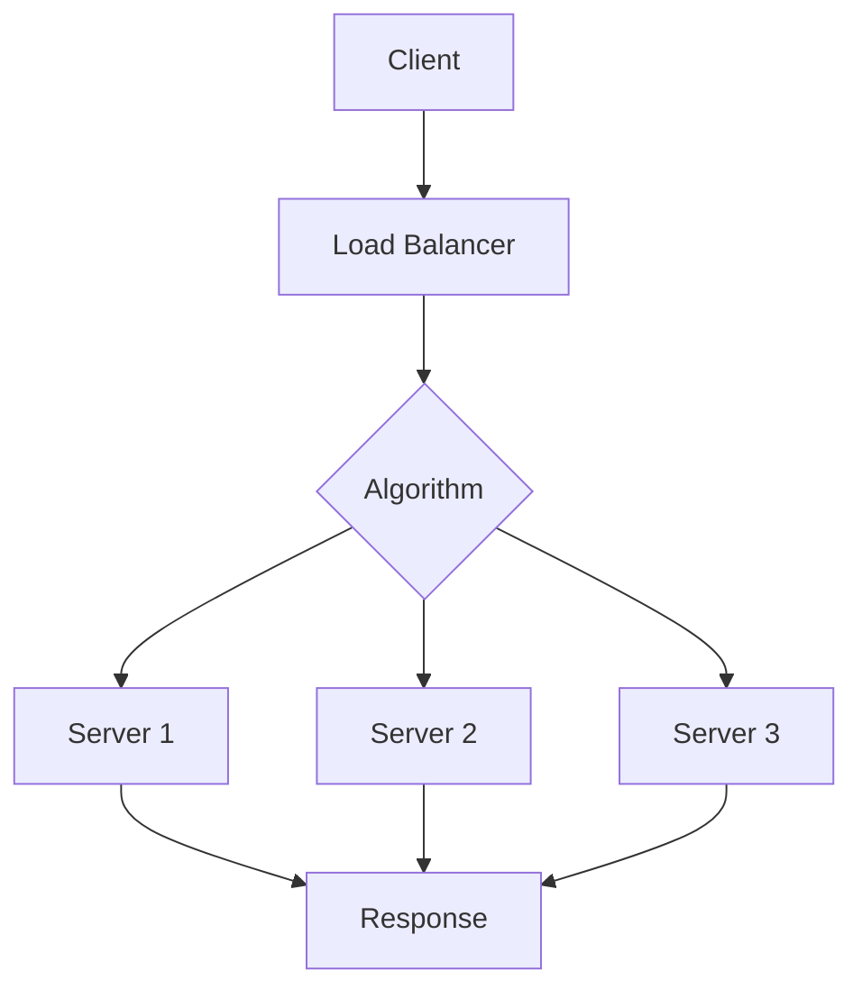

## Overview

Load balancing distributes network traffic across multiple servers to optimize resource use, maximize throughput, minimize response time, and prevent overload. It ensures high availability, scalability, and fault tolerance by routing requests to healthy backends using algorithms and health checks.

## Detailed Explanation

### Components

- **Frontend**: Receives client requests.
- **Backend Pool**: Servers handling distributed load.
- **Algorithms**: Rules for traffic distribution.
- **Health Checks**: Monitor server status.
- **Session Affinity**: Route related requests to same server.

### Types

- **Hardware**: Dedicated devices (e.g., F5).
- **Software**: Apps like NGINX, HAProxy.
- **Cloud**: Managed services (e.g., AWS ELB).

### Algorithms

| Algorithm | Description | Pros | Cons |
|-----------|-------------|------|------|
| Round Robin | Sequential cycling | Simple, fair | Ignores load |
| Least Connections | Fewest active connections | Dynamic balancing | Assumes equal capacity |
| IP Hash | Client IP-based | Session persistence | Uneven if IPs cluster |
| Weighted | Capacity-based weights | Heterogeneous servers | Manual tuning |



## Real-world Examples & Use Cases

- **Web Apps**: Distribute HTTP traffic for e-commerce sites.
- **APIs**: Balance microservice calls.
- **Databases**: Read replicas load balancing.
- **CDNs**: Global traffic distribution.

## Code Examples

### NGINX Config

```nginx
upstream backend {
    server server1:8080;
    server server2:8080;
}

server {
    listen 80;
    location / {
        proxy_pass http://backend;
    }
}
```

### Python Round Robin

```python
class LoadBalancer:
    def __init__(self, servers):
        self.servers = servers
        self.index = 0

    def get_server(self):
        server = self.servers[self.index % len(self.servers)]
        self.index += 1
        return server
```

## STAR Summary

- **Situation**: Uneven load causing outages.
- **Task**: Distribute traffic evenly.
- **Action**: Deploy load balancer with health checks.
- **Result**: Improved availability and performance.

## Journey / Sequence

1. Assess traffic patterns.
2. Choose algorithm and tool.
3. Configure backends and health checks.
4. Test failover and scaling.
5. Monitor and optimize.

## Data Models / Message Formats

Health check responses: HTTP 200 OK, JSON status.

## Common Pitfalls & Edge Cases

- **Overload Detection**: False positives in health checks.
- **Session Loss**: Affinity breaks on server failure.
- **Latency**: Geo-balancing adds delay.

## Tools & Libraries

| Tool | Purpose |
|------|---------|
| NGINX | Web load balancing |
| HAProxy | TCP/HTTP balancing |
| AWS ELB | Cloud-managed |
| Istio | Service mesh balancing |

## References

- [Load Balancing Overview](https://en.wikipedia.org/wiki/Load_balancing_(computing))
- [NGINX Load Balancing](https://nginx.org/en/docs/http/load_balancing.html)
- [AWS ELB Docs](https://aws.amazon.com/elasticloadbalancing/)

## Github-README Links & Related Topics

- [API Gateway](./api-gateway-design/)
- [Scalability Patterns](./high-scalability-patterns/)
- [Fault Tolerance](./fault-tolerance-in-distributed-systems/)