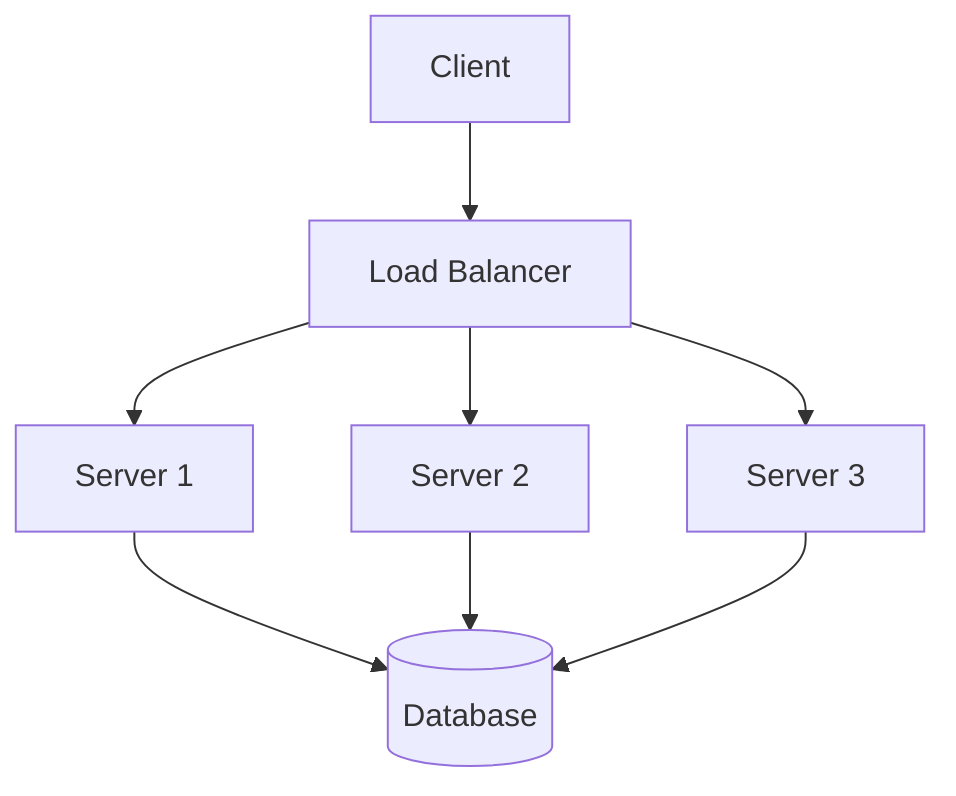

## Overview

Load balancing is a technique used in system design to distribute incoming network traffic across multiple servers or resources. This ensures optimal resource utilization, prevents any single server from becoming a bottleneck, and improves overall system availability, scalability, and fault tolerance. Load balancers act as intermediaries between clients and servers, routing requests based on predefined algorithms and strategies.

## Detailed Explanation

### Types of Load Balancers

- **Hardware Load Balancers**: Dedicated physical devices (e.g., F5 BIG-IP) that handle high-volume traffic with built-in security features.
- **Software Load Balancers**: Applications running on general-purpose servers (e.g., NGINX, HAProxy) or cloud services (e.g., AWS ELB).

### Load Balancing Algorithms

Load balancers use algorithms to decide how to distribute traffic:

| Algorithm | Description | Pros | Cons |
|-----------|-------------|------|------|
| Round-Robin | Cycles through servers sequentially | Simple, even distribution | Ignores server load |
| Least Connections | Routes to server with fewest active connections | Balances load dynamically | Assumes equal server capacity |
| IP Hash | Uses client IP to consistently route to same server | Session persistence | Uneven distribution if IPs cluster |
| Weighted Round-Robin | Assigns weights based on server capacity | Prioritizes powerful servers | Requires manual tuning |
| Least Response Time | Routes to server with fastest response | Optimizes performance | Computationally intensive |

### Load Balancing Strategies

- **Layer 4 (Transport Layer)**: Routes based on IP and port (e.g., TCP/UDP). Fast but less intelligent.
- **Layer 7 (Application Layer)**: Routes based on HTTP headers, cookies, or content (e.g., URL paths). Enables advanced features like content-based routing.
- **DNS Load Balancing**: Distributes traffic via DNS resolution (e.g., round-robin DNS).
- **Global Server Load Balancing (GSLB)**: Routes across geographically distributed servers for low latency.

### Architecture Diagram



## Real-world Examples & Use Cases

- **Web Applications**: Distributing HTTP requests across web servers (e.g., Netflix uses load balancing for video streaming).
- **Microservices**: Routing API calls in containerized environments (e.g., Kubernetes Ingress).
- **CDNs**: Balancing traffic across edge servers (e.g., Cloudflare).
- **Databases**: Read replicas load balancing for query distribution.
- **Gaming**: Handling millions of concurrent users (e.g., Roblox).

## Code Examples

### NGINX Configuration for Round-Robin Load Balancing

```nginx
upstream backend {
    server backend1.example.com;
    server backend2.example.com;
    server backend3.example.com;
}

server {
    listen 80;
    location / {
        proxy_pass http://backend;
    }
}
```

### Simple Python Load Balancer (Round-Robin)

```python
import socket
import select

servers = [('127.0.0.1', 8081), ('127.0.0.1', 8082)]
current = 0

def handle_client(client_socket):
    global current
    server = servers[current % len(servers)]
    current += 1
    # Forward request to server (simplified)
    server_socket = socket.socket(socket.AF_INET, socket.SOCK_STREAM)
    server_socket.connect(server)
    # ... proxy logic ...
```

### AWS ELB Configuration (CLI Example)

```bash
aws elb create-load-balancer --load-balancer-name my-load-balancer \
    --listeners Protocol=HTTP,LoadBalancerPort=80,InstancePort=80 \
    --availability-zones us-east-1a
```

## References

- [Wikipedia: Load Balancing (Computing)](https://en.wikipedia.org/wiki/Load_balancing_(computing))
- [AWS: What is Load Balancing?](https://aws.amazon.com/what-is/load-balancing/)
- [NGINX: Using nginx as HTTP load balancer](https://nginx.org/en/docs/http/load_balancing.html)

## Github-README Links & Related Topics

- [API Gateway vs Load Balancer](../api-gateway-vs-load-balancer/README.md)
- [API Gateway Design](../api-gateway-design/README.md)
- [Scalability Patterns](../high-scalability-patterns/README.md)
- [Fault Tolerance Patterns](../fault-tolerance-patterns/README.md)

## STAR Summary

- **Situation**: High-traffic applications risk server overload.
- **Task**: Implement load balancing to distribute traffic.
- **Action**: Choose algorithm (e.g., least connections), configure balancer (e.g., NGINX).
- **Result**: Improved uptime, reduced latency, better user experience.

## Journey / Sequence

1. Identify bottlenecks in single-server setups.
2. Select load balancer type (hardware/software).
3. Configure upstream servers and algorithm.
4. Implement health checks and monitoring.
5. Test failover and scale horizontally.

## Data Models / Message Formats

Load balancers handle HTTP requests/responses. For session persistence, use cookies or headers.

Example HTTP Request:
```
GET /api/data HTTP/1.1
Host: example.com
X-Session-ID: abc123
```

## Common Pitfalls & Edge Cases

- **Session Stickiness Issues**: IP hash fails with NAT or proxies.
- **Health Check Delays**: Slow detection of failed servers.
- **Thundering Herd**: Sudden traffic spikes after recovery.
- **SSL Termination**: Offloading can introduce latency.

## Tools & Libraries

- **NGINX**: Open-source load balancer.
- **HAProxy**: High-performance proxy.
- **AWS ELB/ALB**: Managed cloud load balancing.
- **Traefik**: Modern reverse proxy for containers.