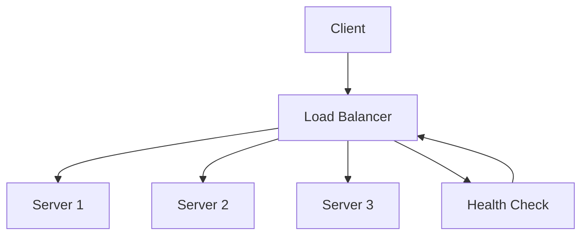

# Load Balancing Strategies

## Overview

Load balancing distributes incoming network traffic across multiple servers to ensure no single server becomes overwhelmed, improving availability, scalability, and fault tolerance. It can be implemented at various layers (DNS, transport, application) using different algorithms and strategies.

## Detailed Explanation

### Load Balancing Algorithms

- **Round Robin**: Cycles through servers sequentially.
- **Least Connections**: Routes to server with fewest active connections.
- **IP Hash**: Uses client IP to consistently route to same server.
- **Weighted Round Robin**: Assigns weights based on server capacity.
- **Least Response Time**: Routes to server with fastest response.
- **Random**: Randomly selects a server.

### Types of Load Balancers

- **Hardware**: Dedicated appliances (e.g., F5, Citrix).
- **Software**: Nginx, HAProxy, Apache.
- **Cloud**: AWS ELB, Azure Load Balancer, GCP Load Balancing.

### Layer 4 vs Layer 7

- **Layer 4**: Transport layer, routes based on IP/port, faster but less intelligent.
- **Layer 7**: Application layer, routes based on HTTP headers, content, etc.



## Real-world Examples & Use Cases

- **Web Applications**: Distribute HTTP requests across app servers.
- **Databases**: Read replicas for query load balancing.
- **Microservices**: API gateway load balancing across service instances.
- **CDNs**: Global load balancing for content delivery.

## Code Examples

### Nginx Load Balancing

```nginx
# nginx.conf
http {
    upstream backend {
        least_conn;  # Algorithm
        server backend1.example.com:8080 weight=3;
        server backend2.example.com:8080 weight=2;
        server backend3.example.com:8080 backup;
    }

    server {
        listen 80;
        location / {
            proxy_pass http://backend;
            proxy_set_header Host $host;
        }
    }
}
```

### HAProxy Configuration

```haproxy
# haproxy.cfg
frontend http_front
    bind *:80
    default_backend http_back

backend http_back
    balance leastconn
    server web1 192.168.1.10:80 check
    server web2 192.168.1.11:80 check
    server web3 192.168.1.12:80 check backup
```

### AWS Application Load Balancer (Terraform)

```hcl
resource "aws_lb" "app_lb" {
  name               = "app-lb"
  internal           = false
  load_balancer_type = "application"
  subnets            = [aws_subnet.public.id]

  enable_deletion_protection = false
}

resource "aws_lb_target_group" "app_tg" {
  name     = "app-tg"
  port     = 80
  protocol = "HTTP"
  vpc_id   = aws_vpc.main.id

  health_check {
    path = "/health"
  }
}

resource "aws_lb_listener" "app_listener" {
  load_balancer_arn = aws_lb.app_lb.arn
  port              = "80"
  protocol          = "HTTP"

  default_action {
    type             = "forward"
    target_group_arn = aws_lb_target_group.app_tg.arn
  }
}
```

## References

- [Nginx Load Balancing](https://docs.nginx.com/nginx/admin-guide/load-balancer/http-load-balancer/)
- [HAProxy Documentation](http://www.haproxy.org/#docs)
- [AWS Load Balancing](https://aws.amazon.com/elasticloadbalancing/)
- [Load Balancing Algorithms](https://www.nginx.com/resources/glossary/load-balancing/)

## Github-README Links & Related Topics

- [proxy-forward-reverse](proxy-forward-reverse/)
- [high-scalability-patterns](high-scalability-patterns/)
- [fault-tolerance-in-distributed-systems](fault-tolerance-in-distributed-systems/)