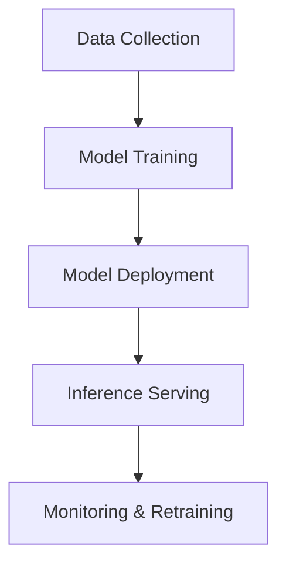

# Machine Learning in System Design

## Overview

Integrating machine learning into system design involves designing scalable, reliable systems that incorporate ML models for predictions, recommendations, and automation.

## Detailed Explanation

Key components:
- **Model Serving**: Deploying ML models for inference.
- **Data Pipelines**: Ingesting and processing data for training.
- **Scalability**: Handling large datasets and real-time predictions.

Challenges: Latency, accuracy, data privacy.

## Real-world Examples & Use Cases

- **Recommendation Systems**: Netflix movie suggestions.
- **Fraud Detection**: Banking transaction monitoring.
- **Autonomous Vehicles**: Real-time decision making.
- **Personalization**: E-commerce product recommendations.

## Code Examples

### TensorFlow Serving with Python

```python
import tensorflow as tf
from tensorflow_serving.apis import predict_pb2
from tensorflow_serving.apis import prediction_service_pb2_grpc

# Client code for inference
channel = grpc.insecure_channel('localhost:8500')
stub = prediction_service_pb2_grpc.PredictionServiceStub(channel)
request = predict_pb2.PredictRequest()
request.model_spec.name = 'model'
# ... set inputs
response = stub.Predict(request)
```

## Journey / Sequence



## Common Pitfalls & Edge Cases

- **Model Drift**: Performance degradation over time.
- **Bias**: Ensuring fair predictions.
- **Scalability**: Resource-intensive training.

## Tools & Libraries

- TensorFlow
- PyTorch
- Scikit-learn
- Kubernetes for serving

## References

- [TensorFlow Documentation](https://www.tensorflow.org/)
- [Designing Machine Learning Systems](https://www.oreilly.com/library/view/designing-machine-learning/9781098107956/)

## Github-README Links & Related Topics

- [Recommendation Systems](./recommendation-systems/README.md)
- [High Scalability Patterns](./high-scalability-patterns/README.md)