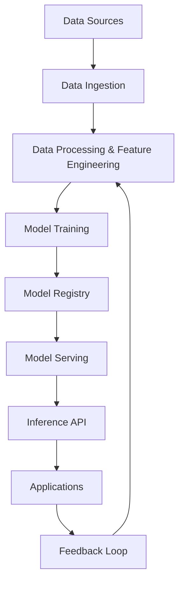

# Machine Learning in System Design

## Overview

Machine Learning (ML) in system design refers to the integration of ML models into large-scale systems to enable intelligent features such as predictions, recommendations, and automation. This involves designing architectures that handle data ingestion, model training, deployment, inference, and monitoring at scale. Key considerations include latency, accuracy, scalability, and data privacy.

## Detailed Explanation

### Key Components

- **Data Pipelines**: Systems for collecting, processing, and storing large volumes of data. This includes ETL processes, data lakes, and streaming platforms like Apache Kafka.
- **Model Training**: Distributed training environments using frameworks like TensorFlow or PyTorch, often on clusters with GPUs.
- **Model Serving**: Deploying trained models for real-time or batch inference. Techniques include model versioning, A/B testing, and auto-scaling.
- **Monitoring and Retraining**: Continuous evaluation of model performance, handling concept drift, and automated retraining pipelines.

### Challenges

| Challenge | Description | Mitigation Strategies |
|-----------|-------------|-----------------------|
| Latency | ML inference can be slow for complex models. | Use model optimization (e.g., quantization), edge computing, or simpler models. |
| Scalability | Handling high-throughput requests. | Horizontal scaling with load balancers, microservices architecture. |
| Data Privacy | Protecting user data in training and inference. | Differential privacy, federated learning, data anonymization. |
| Model Drift | Performance degradation over time. | Continuous monitoring, feedback loops for retraining. |
| Bias and Fairness | Ensuring unbiased predictions. | Bias audits, diverse datasets, fairness constraints in training. |

### Architecture Patterns



This diagram illustrates a typical ML pipeline in system design, emphasizing the feedback loop for continuous improvement.

## Real-world Examples & Use Cases

### Recommendation Systems
- **Netflix**: Uses collaborative filtering and deep learning to recommend movies. System handles millions of users with low-latency inference.
- **Amazon**: Product recommendations based on user behavior, integrated with e-commerce platform for real-time personalization.

### Fraud Detection
- **PayPal**: ML models analyze transaction patterns in real-time to detect fraudulent activities. System processes billions of transactions daily.
- **Credit Card Companies**: Anomaly detection using unsupervised learning to flag suspicious transactions.

### Autonomous Vehicles
- **Tesla Autopilot**: Real-time image processing and decision-making using convolutional neural networks (CNNs). Requires ultra-low latency and high reliability.
- **Waymo**: Uses reinforcement learning for navigation, with distributed systems handling sensor data fusion.

### Natural Language Processing
- **Chatbots (e.g., Google's Bard)**: Transformer-based models for conversational AI, deployed on scalable cloud infrastructure.
- **Search Engines**: Query understanding and ranking using ML to improve relevance.

### Healthcare
- **Diagnostic Systems**: ML models for medical imaging analysis, integrated with hospital systems for faster diagnoses.
- **Drug Discovery**: Predictive models for molecule efficacy, using high-performance computing clusters.

## Code Examples

### Simple ML Model Training with Scikit-learn

```python
from sklearn.ensemble import RandomForestClassifier
from sklearn.model_selection import train_test_split
from sklearn.metrics import accuracy_score
import pandas as pd

# Load data
data = pd.read_csv('data.csv')
X = data.drop('target', axis=1)
y = data['target']

# Split data
X_train, X_test, y_train, y_test = train_test_split(X, y, test_size=0.2)

# Train model
model = RandomForestClassifier(n_estimators=100)
model.fit(X_train, y_train)

# Evaluate
predictions = model.predict(X_test)
print(f'Accuracy: {accuracy_score(y_test, predictions)}')
```

### Model Serving with FastAPI

```python
from fastapi import FastAPI
from pydantic import BaseModel
import joblib

app = FastAPI()
model = joblib.load('model.pkl')

class PredictionRequest(BaseModel):
    features: list

@app.post('/predict')
def predict(request: PredictionRequest):
    prediction = model.predict([request.features])
    return {'prediction': prediction[0]}
```

### Distributed Training with TensorFlow

```python
import tensorflow as tf

# Define strategy for distributed training
strategy = tf.distribute.MirroredStrategy()

with strategy.scope():
    model = tf.keras.Sequential([
        tf.keras.layers.Dense(128, activation='relu'),
        tf.keras.layers.Dense(10, activation='softmax')
    ])
    model.compile(loss='categorical_crossentropy', optimizer='adam')

# Train on dataset
model.fit(dataset, epochs=10)
```

### Monitoring Model Performance

```python
import mlflow
import pandas as pd

# Log metrics
with mlflow.start_run():
    mlflow.log_metric('accuracy', 0.95)
    mlflow.log_param('model_type', 'RandomForest')

# Track drift
def check_drift(new_data, baseline_stats):
    # Implement drift detection logic
    pass
```

## References

- [Designing Machine Learning Systems by Chip Huyen](https://www.oreilly.com/library/view/designing-machine-learning/9781098107956/)
- [TensorFlow Serving Documentation](https://www.tensorflow.org/tfx/guide/serving)
- [MLOps Zoomcamp by DataTalks.Club](https://github.com/DataTalksClub/mlops-zoomcamp)
- [Federated Learning: Collaborative Machine Learning without Centralized Training Data](https://ai.googleblog.com/2017/04/federated-learning-collaborative.html)
- [Building Machine Learning Pipelines by Hannes Hapke and Catherine Nelson](https://www.oreilly.com/library/view/building-machine-learning/9781492053187/)

## Github-README Links & Related Topics

- [Microservices Architecture](./microservices-architecture/README.md)
- [Distributed Systems](./distributed-consensus/README.md)
- [Data Pipelines](./async-logging/README.md)  <!-- Assuming async-logging is a placeholder; adjust if needed -->
- [API Design Principles](./api-design-principles/README.md)
- [Monitoring and Logging](./monitoring-and-logging/README.md)