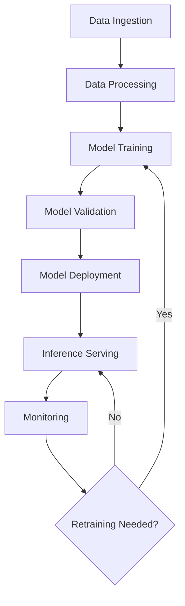

# Machine Learning in System Design

## Overview

Integrating machine learning (ML) into system design involves building scalable, reliable systems that handle data pipelines, model training, deployment, and inference at scale. This encompasses data ingestion, preprocessing, training infrastructure, model serving, and continuous monitoring to ensure models remain accurate and performant.

## Detailed Explanation

Key components of ML systems include:

- **Data Ingestion and Processing**: Collecting data from sources like databases, APIs, or sensors, followed by cleaning, normalization, and feature engineering.
- **Model Training**: Using distributed computing frameworks to train models on large datasets, often involving hyperparameter tuning and cross-validation.
- **Model Serving**: Deploying trained models for real-time or batch predictions, ensuring low latency and high throughput.
- **Monitoring and Retraining**: Tracking model performance metrics, detecting drift, and automating retraining pipelines.

Challenges include handling big data, ensuring model explainability, managing computational resources, and addressing ethical concerns like bias.



## Real-world Examples & Use Cases

- **Recommendation Engines**: Platforms like Netflix and Amazon use ML to personalize content and product suggestions, improving user engagement.
- **Fraud Detection**: Banks employ ML models to detect anomalous transactions in real-time.
- **Autonomous Vehicles**: Systems like Tesla's use ML for image recognition and decision-making.
- **Chatbots and NLP**: Services like Google's Bard or OpenAI's GPT use ML for natural language understanding.

## Code Examples

```python
# Example: Simple ML Pipeline with Scikit-Learn

from sklearn.model_selection import train_test_split
from sklearn.ensemble import RandomForestClassifier
from sklearn.metrics import accuracy_score
import pandas as pd

# Load dataset (example: Iris dataset)
from sklearn.datasets import load_iris
data = load_iris()
X, y = data.data, data.target

# Split data
X_train, X_test, y_train, y_test = train_test_split(X, y, test_size=0.2, random_state=42)

# Train model
model = RandomForestClassifier(n_estimators=100, random_state=42)
model.fit(X_train, y_train)

# Predict and evaluate
predictions = model.predict(X_test)
accuracy = accuracy_score(y_test, predictions)
print(f"Model Accuracy: {accuracy:.2f}")
```

```python
# TensorFlow Serving client example
import grpc
import tensorflow as tf
from tensorflow_serving.apis import predict_pb2
from tensorflow_serving.apis import prediction_service_pb2_grpc

channel = grpc.insecure_channel('localhost:8500')
stub = prediction_service_pb2_grpc.PredictionServiceStub(channel)

request = predict_pb2.PredictRequest()
request.model_spec.name = 'my_model'
request.model_spec.signature_name = 'serving_default'
request.inputs['input'].CopyFrom(tf.make_tensor_proto([[1.0, 2.0, 3.0]]))

result = stub.Predict(request, 10.0)
print(result)
```

## Tools & Libraries

- **Training**: TensorFlow, PyTorch, Scikit-Learn
- **Serving**: TensorFlow Serving, TorchServe
- **Orchestration**: Kubernetes, Apache Airflow
- **Monitoring**: Prometheus, MLflow

## Common Pitfalls & Edge Cases

- **Data Drift**: When training and production data distributions differ, leading to degraded performance.
- **Overfitting**: Models perform well on training data but poorly on unseen data.
- **Cold Start Problem**: Difficulty in making predictions for new users or items without historical data.
- **Scalability Issues**: Handling massive datasets and real-time inference at scale.

## References

- [TensorFlow Serving](https://www.tensorflow.org/tfx/guide/serving)
- [MLOps Best Practices](https://cloud.google.com/architecture/mlops-continuous-delivery-and-automation-pipelines-in-machine-learning)
- [Designing Machine Learning Systems by Chip Huyen](https://www.oreilly.com/library/view/designing-machine-learning/9781098107956/)
- [Machine Learning Engineering Open Book](https://github.com/stanfordmlgroup/ml-engineering)

## Github-README Links & Related Topics

- [Machine Learning Model Deployment](./machine-learning-model-deployment/README.md)
- [Machine Learning Model Serving](./machine-learning-model-serving/README.md)
- [System Design Basics](./system-design-basics/README.md)
- [Distributed Systems](./cap-theorem-and-distributed-systems/README.md)