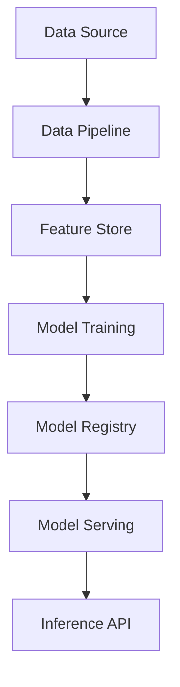

# Machine Learning in System Design

## Overview

Integrating machine learning components into system design requires considerations for model serving, data pipelines, scalability, and reliability.

## Detailed Explanation

### Model Serving

Deploy ML models for inference using frameworks like TensorFlow Serving or TorchServe.

### Data Pipelines

Build robust pipelines for data ingestion, preprocessing, and feature engineering.

### Scalability and Performance

Use distributed computing for training and serving at scale.

### Monitoring and Retraining

Monitor model performance and implement automated retraining.

## Real-world Examples & Use Cases

- Recommendation systems in e-commerce.
- Fraud detection in financial services.
- Image recognition in healthcare.

## Code Examples

```python
# TensorFlow Serving client example
import grpc
import tensorflow as tf
from tensorflow_serving.apis import predict_pb2
from tensorflow_serving.apis import prediction_service_pb2_grpc

channel = grpc.insecure_channel('localhost:8500')
stub = prediction_service_pb2_grpc.PredictionServiceStub(channel)

request = predict_pb2.PredictRequest()
request.model_spec.name = 'my_model'
request.model_spec.signature_name = 'serving_default'
request.inputs['input'].CopyFrom(tf.make_tensor_proto([[1.0, 2.0, 3.0]]))

result = stub.Predict(request, 10.0)
print(result)
```

## References

- [TensorFlow Serving](https://www.tensorflow.org/tfx/guide/serving)
- [MLOps Best Practices](https://cloud.google.com/architecture/mlops-continuous-delivery-and-automation-pipelines-in-machine-learning)

## Github-README Links & Related Topics

- [Machine Learning Model Deployment](./machine-learning-model-deployment/README.md)
- [Distributed Systems](./distributed-consensus/README.md)
- [Data Consistency Models](./data-consistency-models/README.md)

