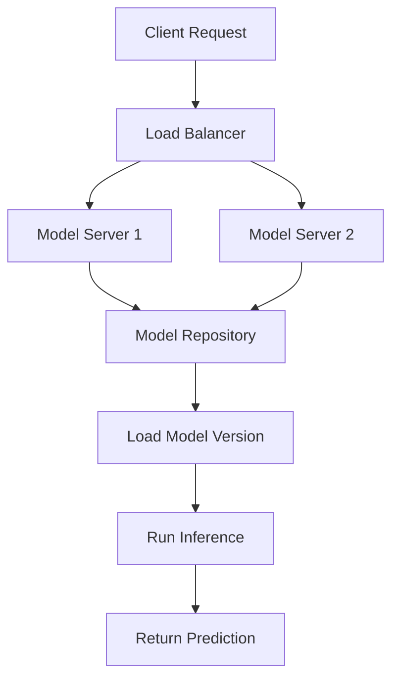

# Machine Learning Model Serving

## Overview

Machine learning model serving involves deploying trained models into production environments where they can receive input data and return predictions. TensorFlow Serving is a flexible, high-performance serving system for machine learning models.

## Detailed Explanation

Model serving bridges the gap between model development and production use. Key components:

- **Model Format**: Serialized models (TensorFlow SavedModel, ONNX, etc.).
- **Serving Infrastructure**: Servers that load models and handle inference requests.
- **API Layer**: REST/gRPC endpoints for client applications.
- **Scaling**: Auto-scaling based on load, model versioning.
- **Monitoring**: Performance metrics, prediction quality tracking.

TensorFlow Serving supports multiple models, versions, and can serve predictions with low latency.



## Real-world Examples & Use Cases

- **Recommendation Systems**: Personalized content suggestions.
- **Image Classification**: Object detection in photos or videos.
- **Natural Language Processing**: Sentiment analysis, language translation.
- **Fraud Detection**: Real-time transaction risk assessment.
- **Autonomous Vehicles**: Sensor data processing for decision making.

## Code Examples

### Serving a TensorFlow Model

```python
import tensorflow as tf
from tensorflow import keras

# Load and prepare model
model = keras.models.load_model('my_model.h5')
model.save('saved_model/my_model/1')  # Save in SavedModel format

# Start TensorFlow Serving (via Docker)
# docker run -p 8501:8501 --mount type=bind,source=$(pwd)/saved_model,target=/models/my_model -e MODEL_NAME=my_model -t tensorflow/serving
```

### Client Request for Prediction

```python
import requests
import json
import numpy as np

# Prepare input data
data = json.dumps({
    "signature_name": "serving_default",
    "instances": [
        {
            "input_1": [1.0, 2.0, 3.0, 4.0],
            "input_2": [0.5, 1.5, 2.5]
        }
    ]
})

# Send prediction request
headers = {"content-type": "application/json"}
response = requests.post(
    'http://localhost:8501/v1/models/my_model:predict',
    data=data,
    headers=headers
)

predictions = response.json()
print(predictions)
```

### Model Serving with FastAPI

```python
from fastapi import FastAPI
import joblib
import numpy as np

app = FastAPI()
model = joblib.load('model.pkl')

@app.post("/predict")
async def predict(data: dict):
    features = np.array(data['features']).reshape(1, -1)
    prediction = model.predict(features)
    return {"prediction": prediction.tolist()}
```

### A/B Testing with Model Versions

```python
# Serve multiple model versions
import tensorflow as tf

# Load both models
model_v1 = tf.saved_model.load('saved_model/my_model/1')
model_v2 = tf.saved_model.load('saved_model/my_model/2')

# Route requests based on user segment
def predict(features, user_id):
    if user_id % 2 == 0:
        return model_v1.signatures['serving_default'](features)
    else:
        return model_v2.signatures['serving_default'](features)
```

## Common Pitfalls & Edge Cases

- **Model Drift**: Monitor prediction quality over time.
- **Cold Starts**: Pre-load models to reduce latency.
- **Resource Management**: GPU/CPU allocation for inference.
- **Version Conflicts**: Handle model updates without downtime.
- **Input Validation**: Sanitize and validate input data.

## Tools & Libraries

- **TensorFlow Serving**: Production ML serving system.
- **TorchServe**: PyTorch model serving.
- **KFServing**: Kubernetes-native model serving.
- **BentoML**: Unified ML model serving framework.

## References

- [TensorFlow Serving Guide](https://www.tensorflow.org/tfx/guide/serving)
- [TensorFlow Serving API](https://www.tensorflow.org/tfx/serving/api_rest)
- [Machine Learning Model Deployment Patterns](https://martinfowler.com/articles/cd4ml.html)

## Github-README Links & Related Topics

- [TensorFlow Serving](https://github.com/tensorflow/serving)
- [MLOps Best Practices](https://cloud.google.com/architecture/mlops-continuous-delivery-and-automation-pipelines-in-machine-learning)