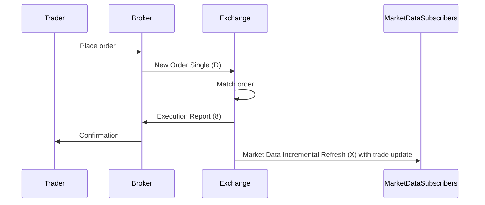

# Overview

Market data refers to real-time and historical information about financial instruments, including prices, volumes, order book depth, and trade executions. Dissemination is the process of distributing this data to market participants, brokers, and traders via standardized protocols to ensure transparency, fairness, and efficiency in financial markets. Primary sources for authoritative information include exchange documentation (e.g., NYSE, CME) and the FIX Protocol specifications, which define message formats for electronic trading and data exchange.

# STAR Summary

**S (Situation):** A high-frequency trading firm requires low-latency access to real-time market data for equities to execute arbitrage strategies across multiple exchanges.

**T (Task):** Design and implement a market data subscription system that handles requests, snapshots, and incremental updates while maintaining data integrity.

**A (Action):** Utilize the FIX Protocol (version 5.0) to send Market Data Request messages (MsgType 'V') to the exchange, parse incoming Market Data Snapshot/Full Refresh ('W') and Market Data Incremental Refresh ('X') messages, and integrate with a high-performance data handler using Simple Binary Encoding (SBE) for reduced latency.

**R (Result):** Achieved sub-millisecond data processing, enabling the firm to capture arbitrage opportunities with 99.9% uptime, resulting in a 15% increase in profitable trades.

# Detailed Explanation

Market data dissemination leverages protocols like FIX to transmit data from exchanges to clients. In FIX 5.0, market data is handled through application-layer messages:

- **Market Data Request (MsgType 'V'):** Initiates a subscription. Key fields include MDReqID (unique request ID), SubscriptionRequestType (snapshot or subscribe), MarketDepth (depth of book), and Instruments (via NoRelatedSym repeating group with Symbol, SecurityID, etc.).

- **Market Data Snapshot/Full Refresh (MsgType 'W'):** Provides a full current state of the market. Includes MDReqID, and a NoMDEntries group with MDEntryType (bid, ask, trade), MDEntryPx, MDEntrySize, etc.

- **Market Data Incremental Refresh (MsgType 'X'):** Delivers updates since the last message. Uses MDUpdateAction (new, change, delete) within NoMDEntries to modify the order book efficiently.

For high-performance dissemination, encodings like Simple Binary Encoding (SBE) or FAST reduce bandwidth and latency. Exchanges like CME use proprietary formats but align with FIX semantics. Session-layer protocols (e.g., FIXP) ensure reliable transport over TCP/TLS.

Data consistency is maintained via sequence numbers and timestamps (e.g., MDEntryTime). Regulatory requirements (e.g., MiFID II) mandate post-trade transparency, often using FIX for reporting.

# Real-world Examples & Use Cases

- **High-Frequency Trading (HFT):** An HFT algorithm subscribes to level 2 order book data for AAPL on NYSE, using incremental updates to detect microsecond price changes for market-making.

- **Retail Brokerage:** A broker's app requests snapshots for multiple stocks, displaying real-time quotes to users.

- **Risk Management:** A bank monitors trade volumes via FIX feeds to assess liquidity and adjust positions.

Sample message exchange (FIX tag-value format):

Request:

```
8=FIX.5.0|9=123|35=V|49=CLIENT|56=EXCHANGE|34=1|52=20230926-12:00:00|262=REQ123|263=1|264=10|267=2|269=0|269=1|146=1|55=AAPL|10=123|
```

Snapshot Response:

```
8=FIX.5.0|9=456|35=W|49=EXCHANGE|56=CLIENT|34=2|52=20230926-12:00:01|262=REQ123|55=AAPL|268=4|269=0|270=150.00|271=100|269=1|270=150.05|271=200|269=0|270=149.95|271=50|269=1|270=150.10|271=150|10=456|
```

Incremental Update:

```
8=FIX.5.0|9=234|35=X|49=EXCHANGE|56=CLIENT|34=3|52=20230926-12:00:02|262=REQ123|268=1|279=0|269=0|270=150.02|271=120|10=234|
```

# Message Formats / Data Models

Market Data Incremental Refresh (MsgType 'X') fields (subset):

| Tag | Field Name          | Type   | Description                          |
|-----|---------------------|--------|--------------------------------------|
| 262 | MDReqID             | String | Links to original request            |
| 268 | NoMDEntries         | NumInGroup | Number of entries                  |
| 279 | MDUpdateAction      | Char   | 0=New, 1=Change, 2=Delete           |
| 269 | MDEntryType         | Char   | 0=Bid, 1=Ask, 2=Trade              |
| 270 | MDEntryPx           | Price  | Entry price                          |
| 271 | MDEntrySize         | Qty    | Entry size                           |
| 272 | MDEntryTime         | UTCTime| Timestamp                            |

Data models often use structs in code, e.g., in C++ for SBE decoding.

# Journey of a Trade



This diagram illustrates the lifecycle: order submission, matching, confirmation, and dissemination of trade data to subscribers.

# Common Pitfalls & Edge Cases

- **Out-of-Order Messages:** Incremental updates may arrive out-of-sequence due to network issues; use sequence numbers (MsgSeqNum) to reorder.
- **Data Gaps:** Missed messages can lead to stale order books; implement gap-fill requests.
- **High Volume Overload:** During market volatility, rapid updates can cause backpressure; use buffering and asynchronous processing.
- **Race Conditions:** Concurrent updates to shared order book state; synchronize with locks or atomic operations.
- **Regulatory Compliance:** Ensure data retention for audits; handle MiFID II trade flagging.

# Tools & Libraries

- **QuickFIX (Java/C++/Python):** Open-source FIX engine for parsing/sending messages.
  Sample Python code to send Market Data Request:
  ```python
  import quickfix as fix

  class Application(fix.Application):
      def onMessage(self, message, sessionID):
          # Handle incoming MD
          pass

  app = Application()
  store = fix.FileStoreFactory("store")
  log = fix.FileLogFactory("log")
  initiator = fix.SocketInitiator(app, store, "config.cfg")
  initiator.start()

  # Send request
  mdReq = fix.Message()
  mdReq.getHeader().setField(fix.MsgType(fix.MsgType_MarketDataRequest))
  mdReq.setField(fix.MDReqID("REQ123"))
  # ... set other fields
  fix.Session.sendToTarget(mdReq, sessionID)
  ```

- **Simple Binary Encoding (SBE):** For low-latency decoding; used in CME feeds.
- **FIX Orchestra:** Machine-readable FIX specs for code generation.

# Github-README Links & Related Topics

- [FIX Protocol](fix-protocol/)
- [API Design Principles](api-design-principles/)
- [Distributed Systems](distributed-systems/)
- [Event Streaming with Apache Kafka](event-streaming-with-apache-kafka/)
- [High Scalability Patterns](high-scalability-patterns/)

# References

- FIX Trading Community: https://www.fixtrading.org/standards/fix-protocol/
- CME Group Market Data: https://www.cmegroup.com/market-data.html
- NYSE Data Products: https://www.nyse.com/market-data
- FIX 5.0 Specification: https://www.fixtrading.org/standards/fix-protocol/fix-5-0/