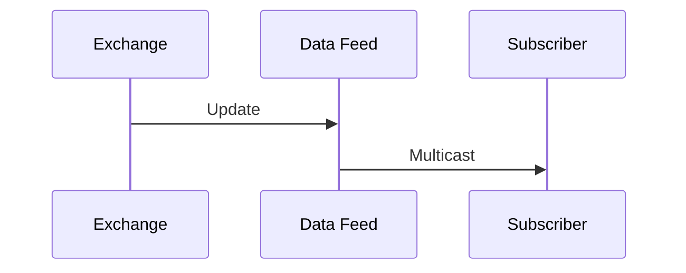

## Overview

Market data refers to real-time and historical information about financial instruments, including prices, volumes, and order book details. Dissemination involves distributing this data to market participants via protocols like ITCH, FIX, and proprietary feeds. Effective dissemination ensures transparency, supports trading decisions, and complies with regulations.

## STAR Summary
- **SITUATION**: Financial markets require timely, accurate data for fair trading.
- **TASK**: Develop systems for efficient market data collection and distribution.
- **ACTION**: Exchanges and vendors implemented protocols like ITCH for binary feeds and FIX for structured messages.
- **RESULT**: Market data is disseminated globally, enabling informed trading and market surveillance.

## Detailed Explanation

Market data types:

- Quotes: Bid/ask prices.

- Trades: Executed prices and volumes.

- Order Book: Full depth of buy/sell orders.

Dissemination methods:

- Multicast UDP for low-latency.

- TCP for reliability.

- Incremental vs. snapshot updates.

Protocols: ITCH for NASDAQ, FIX for global, proprietary for others.

## Real-world Examples & Use Cases

Exchanges like NYSE use proprietary feeds; data vendors like Bloomberg aggregate and redistribute.

Use cases: HFT, portfolio management, risk assessment.

## Message Formats / Data Models

Example FIX MarketDataSnapshot:

| Tag | Field | Description |
|-----|-------|-------------|
| 35 | W | MsgType |
| 55 | AAPL | Symbol |
| 268 | 2 | NoMDEntries |
| 269 | 0 | Bid |
| 270 | 150.00 | Price |

## Journey of a Trade

## Common Pitfalls & Edge Cases

- Data delays in high volatility.

- Feed outages.

- Regulatory reporting.

## Tools & Libraries

- Refinitiv or Bloomberg APIs.

- Open-source market data parsers.

## Github-README Links & Related Topics
- [FIX Protocol](../../protocols/fix-protocol/)
- [ITCH Protocol](../../protocols/itch-protocol/)
- [Execution Report](../../lifecycle/execution-report/)

# References

- SEC Market Data Rules: https://www.sec.gov/market-data
- FIX Market Data: https://www.fixtrading.org/standards/fix-5-0/