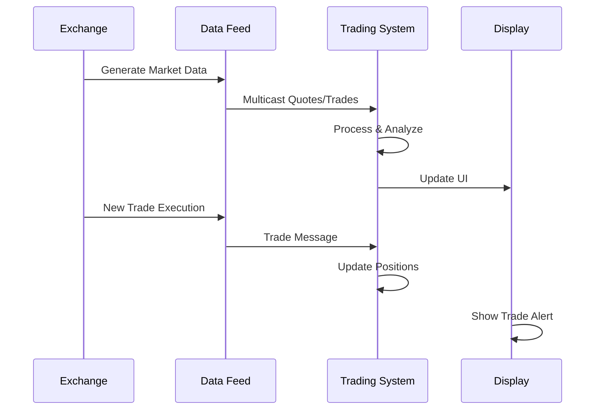

# Overview

Market data encompasses real-time and historical information about securities trading, including prices, volumes, and order book depth. Effective dissemination ensures fair access to market information for all participants. Modern market data systems use high-performance protocols and infrastructure to deliver data with minimal latency.

# STAR Summary

**SITUATION**: Fragmented market data sources and inconsistent formats hindered efficient trading and market transparency.

**TASK**: Create standardized systems for comprehensive market data collection, processing, and dissemination.

**ACTION**: Developed protocols like ITCH and FAST for real-time data distribution, with regulatory frameworks ensuring fair access.

**RESULT**: Global markets now have standardized, low-latency market data systems supporting algorithmic trading and market surveillance.

# Detailed Explanation

Market data includes:
- **Quotes**: Bid/ask prices and sizes
- **Trades**: Executed prices and volumes
- **Order Book**: Full depth of buy/sell orders
- **Market Statistics**: Volume, VWAP, opening/closing prices
- **Reference Data**: Symbol information, corporate actions

Dissemination methods:
- **Multicast UDP**: For high-volume real-time data
- **TCP**: For reliable delivery of critical messages
- **WebSockets/REST**: For retail and programmatic access
- **FAST Protocol**: Compressed binary format for bandwidth efficiency

Key considerations include latency minimization, data integrity, and regulatory compliance (e.g., Regulation NMS in US).

# Real-world Examples & Use Cases

Market data is used by:
- Traders for price discovery and execution
- Algorithms for signal generation and order routing
- Risk systems for position valuation
- Regulators for market surveillance
- Data vendors for redistribution

A hedge fund might use level 2 quotes to identify liquidity patterns, while a retail broker displays real-time prices to customers.

# Message Formats / Data Models

## Quote Data Model

```json
{
  "symbol": "AAPL",
  "bid_price": 150.25,
  "bid_size": 100,
  "ask_price": 150.26,
  "ask_size": 200,
  "timestamp": 1638360000000,
  "exchange": "NASDAQ"
}
```

## Trade Data Model

```json
{
  "symbol": "AAPL",
  "price": 150.25,
  "size": 50,
  "timestamp": 1638360000000,
  "exchange": "NASDAQ",
  "trade_id": "123456789",
  "buyer": "BUYER_ID",
  "seller": "SELLER_ID"
}
```

## Order Book Snapshot

| Price | Bid Size | Ask Size |
|-------|----------|----------|
| 150.30 | 0 | 100 |
| 150.25 | 200 | 0 |
| 150.20 | 150 | 0 |

# Journey of a Trade



This shows the flow from exchange events through data dissemination to end-user consumption.

# Common Pitfalls & Edge Cases

- **Data Staleness**: Delayed feeds can lead to trading on outdated information
- **Feed Disruptions**: Network issues require failover mechanisms
- **Data Quality**: Inaccurate or corrupted data can cause erroneous trades
- **Regulatory Compliance**: Consolidated feeds must include all required data
- **High Volatility**: Extreme market conditions can overwhelm data systems
- **Cross-Market Integration**: Different exchanges have varying data formats

# Tools & Libraries

- **Market Data APIs**: Bloomberg, Refinitiv, Yahoo Finance
- **Protocol Libraries**: ITCH/FAST parsers
- **Data Platforms**: Apache Kafka for data streaming
- **Visualization Tools**: TradingView, Bloomberg Terminal

Sample Python code for processing market data:

```python
import websocket
import json

def on_message(ws, message):
    data = json.loads(message)
    if data['type'] == 'quote':
        print(f"{data['symbol']}: {data['bid']} x {data['ask']}")
    elif data['type'] == 'trade':
        print(f"Trade: {data['symbol']} @ {data['price']} for {data['size']}")

# Connect to market data feed
ws = websocket.WebSocketApp("wss://api.example.com/marketdata",
                           on_message=on_message)
ws.run_forever()
```

# References

- [SEC Regulation NMS](https://www.sec.gov/rules/final/34-51808.pdf)
- [FAST Protocol Specification](https://www.fixtrading.org/standards/fast/)
- [Market Data Best Practices](https://www.iosco.org/library/pubdocs/pdf/IOSCOPD354.pdf)

# Github-README Links & Related Topics

- [FIX Protocol](../../protocols/fix-protocol/)
- [FIX Protocol](../../protocols/fix-protocol/)
- [FIX Protocol](../../protocols/fix-protocol/)
- [FIX Protocol](../../protocols/fix-protocol/)
- [FIX Protocol](../../protocols/fix-protocol/)