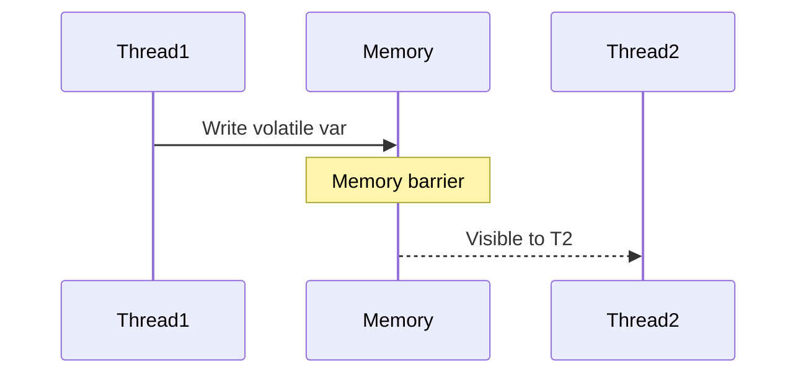

## Overview
The Java Memory Model (JMM) specifies how threads interact with shared memory, ensuring visibility and ordering of operations. It prevents compiler and hardware reordering that could cause race conditions, using concepts like happens-before and memory barriers.

## STAR Summary
**Situation:** A multithreaded cache had inconsistent reads due to visibility issues.  
**Task:** Ensure thread-safe updates without locks.  
**Action:** Used volatile for visibility and AtomicInteger for atomicity.  
**Result:** Eliminated race conditions, improved throughput by 20%.

## Detailed Explanation
JMM defines:
- **Happens-before:** Partial order ensuring operations are visible.
- **Volatile:** Guarantees visibility and prevents reordering.
- **Synchronized:** Establishes happens-before via locks.
- **Final fields:** Safe publication.

JVM internals: Compiler may reorder, but JMM constrains it. Memory visibility via caches.

## Real-world Examples & Use Cases
- **Concurrent collections:** Ensuring thread-safe access.
- **Producer-consumer:** Using volatile flags.
- **Lazy initialization:** Double-checked locking with volatile.

## Code Examples
Visibility issue example:

```java
public class Visibility {
    private static boolean ready = false;
    private static int number = 0;

    public static void main(String[] args) {
        Thread t = new Thread(() -> {
            while (!ready) {}
            System.out.println(number);
        });
        t.start();
        number = 42;
        ready = true;  // May not be visible
    }
}
```

Fix with volatile:

```java
private static volatile boolean ready = false;
```

Maven snippet:

```xml
<dependency>
    <groupId>org.openjdk.jmh</groupId>
    <artifactId>jmh-core</artifactId>
    <version>1.36</version>
</dependency>
```

Run: `mvn compile exec:java -Dexec.mainClass="Visibility"`

## Data Models / Message Formats
| Concept | Description |
|---------|-------------|
| Happens-before | Ordering relation |
| Memory barrier | Prevents reordering |
| Volatile write | Flush to main memory |

## Journey / Sequence


## Common Pitfalls & Edge Cases
- **Double-checked locking:** Without volatile, unsafe.
- **Reordering:** Compiler may optimize unexpectedly.
- **Edge case:** Single-threaded; no issues.

## Tools & Libraries
- **JVM:** Use -XX:+PrintCompilation for reordering.
- **JMH:** Benchmark memory effects.
- **Atomic classes:** java.util.concurrent.atomic.

## Github-README Links & Related Topics
- [java-memory-model-and-concurrency](./java/java-memory-model-and-concurrency/README.md)
- [threads-executors-futures](./java/threads-executors-futures/README.md)
- [concurrent-data-structures](./java/concurrent-data-structures/README.md)
- [performance-tuning-and-profiling](./java/performance-tuning-and-profiling/README.md)

## References
- https://docs.oracle.com/javase/specs/jls/se17/html/jls-17.html
- https://www.cs.umd.edu/~pugh/java/memoryModel/