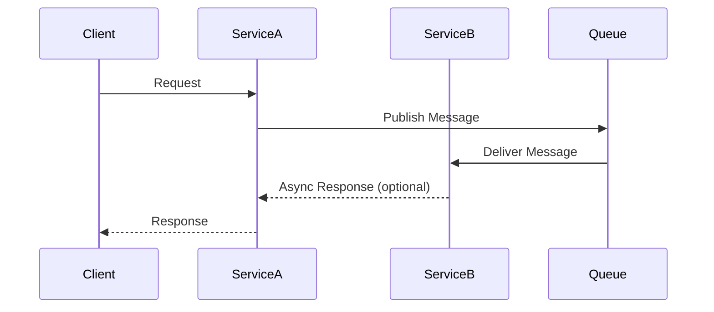
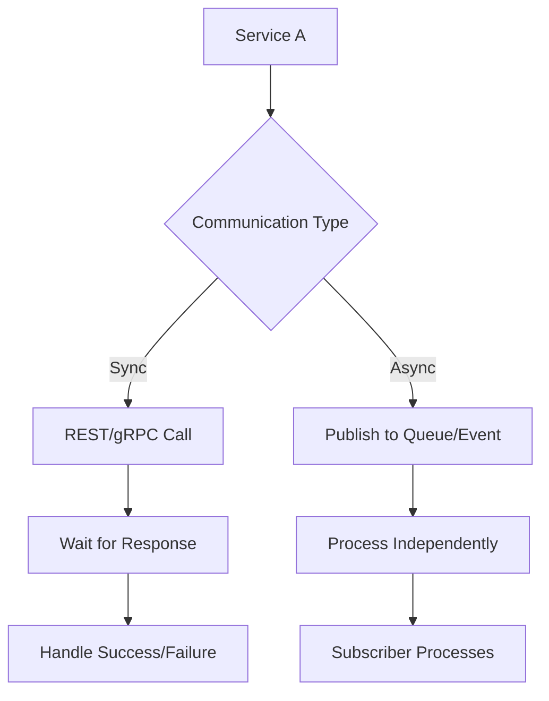

## Overview

Microservices communication patterns define how individual services interact in a distributed architecture. Unlike monolithic applications where components communicate via in-process calls, microservices rely on network-based communication, introducing challenges like latency, failure handling, and coupling. Key patterns include synchronous (e.g., REST, gRPC) and asynchronous (e.g., messaging queues, event-driven) approaches. The choice depends on factors like responsiveness, decoupling, and scalability. Effective communication ensures services remain autonomous, resilient, and maintainable, often leveraging tools like service meshes for observability and reliability.

## Detailed Explanation

Microservices communicate via well-defined interfaces, emphasizing "smart endpoints and dumb pipes" as described by Martin Fowler. Endpoints handle business logic, while infrastructure manages routing and reliability.

### Synchronous Communication
Services interact in real-time, with the caller waiting for a response. Common protocols include HTTP/REST and gRPC.

- **REST APIs**: Use HTTP methods (GET, POST) over JSON/XML. Ideal for CRUD operations and external clients.
- **gRPC**: Uses Protocol Buffers for efficient, typed communication. Supports bidirectional streaming and is language-agnostic.

| Pattern | Pros | Cons | Use Case |
|---------|------|------|----------|
| REST | Simple, stateless, cacheable | Higher latency, no built-in streaming | Public APIs, web services |
| gRPC | High performance, strong typing | Requires code generation, less human-readable | Internal service calls, high-throughput |

### Asynchronous Communication
Services send messages without waiting, decoupling producers and consumers.

- **Message Queues**: Use brokers like RabbitMQ or Amazon SQS for point-to-point or pub/sub.
- **Event-Driven**: Services publish events (e.g., via Kafka), allowing multiple subscribers.

Asynchronous patterns reduce coupling but add complexity in error handling and ordering.

### Challenges and Solutions
- **Resiliency**: Use retry, circuit breakers, and timeouts. Service meshes like Istio or Linkerd automate this.
- **Load Balancing**: Distribute requests across instances; Kubernetes Services provide basic, meshes offer advanced (e.g., latency-based).
- **Distributed Tracing**: Tools like Jaeger or AWS X-Ray correlate requests across services.
- **Versioning**: Use semantic versioning and backward-compatible changes to avoid breaking APIs.



## Real-world Examples & Use Cases

- **Netflix**: Uses asynchronous messaging for video recommendations and user data sync, enabling scalability during peak loads. Synchronous APIs handle real-time playback controls.
- **Amazon**: Employs event-driven patterns for order processing, where services like inventory and shipping react to events without tight coupling.
- **Uber**: gRPC for internal communications between ride-matching and payment services, ensuring low-latency interactions.
- **E-commerce Platforms**: REST for user-facing APIs, message queues for inventory updates to prevent stock discrepancies.

In the Drone Delivery example (Azure), ingestion uses Event Hubs for async load leveling, while scheduler calls REST APIs synchronously for orchestration, with a supervisor handling failures via compensating transactions.

## Code Examples

### Synchronous: REST API in Spring Boot (Java)
```java
@RestController
public class OrderController {
    @Autowired
    private RestTemplate restTemplate;

    @PostMapping("/orders")
    public ResponseEntity<Order> createOrder(@RequestBody OrderRequest request) {
        // Call inventory service synchronously
        ResponseEntity<InventoryResponse> inventoryResponse = restTemplate.postForEntity(
            "http://inventory-service/check", request, InventoryResponse.class);
        
        if (inventoryResponse.getStatusCode() == HttpStatus.OK) {
            // Proceed with order creation
            return ResponseEntity.ok(new Order());
        }
        return ResponseEntity.badRequest().build();
    }
}
```

### Synchronous: gRPC in Python
```python
import grpc
from inventory_pb2 import InventoryRequest
from inventory_pb2_grpc import InventoryStub

def check_inventory():
    with grpc.insecure_channel('inventory-service:50051') as channel:
        stub = InventoryStub(channel)
        response = stub.CheckInventory(InventoryRequest(item_id='123'))
        return response.available
```

### Asynchronous: Message Queue with RabbitMQ (Node.js)
```javascript
const amqp = require('amqplib');

async function sendMessage() {
    const connection = await amqp.connect('amqp://localhost');
    const channel = await connection.createChannel();
    const queue = 'order_queue';

    await channel.assertQueue(queue, { durable: true });
    channel.sendToQueue(queue, Buffer.from(JSON.stringify({ orderId: '123' })));
    console.log('Message sent');
    await channel.close();
    await connection.close();
}
```

### Asynchronous: Event-Driven with Kafka (Java)
```java
import org.apache.kafka.clients.producer.KafkaProducer;
import org.apache.kafka.clients.producer.ProducerRecord;

Properties props = new Properties();
props.put("bootstrap.servers", "localhost:9092");
props.put("key.serializer", "org.apache.kafka.common.serialization.StringSerializer");
props.put("value.serializer", "org.apache.kafka.common.serialization.StringSerializer");

KafkaProducer<String, String> producer = new KafkaProducer<>(props);
producer.send(new ProducerRecord<>("order-events", "order-created", "{\"id\":\"123\"}"));
producer.close();
```

## References

- [Microservices: a definition of this new architectural term](https://martinfowler.com/articles/microservices.html) - Martin Fowler
- [What are Microservices?](https://aws.amazon.com/microservices/) - AWS
- [Interservice communication in microservices](https://learn.microsoft.com/en-us/azure/architecture/microservices/design/interservice-communication) - Microsoft Learn
- [Microservices on AWS Whitepaper](https://d1.awsstatic.com/whitepapers/microservices-on-aws.pdf) - AWS
- [Building Microservices](https://www.amazon.com/Building-Microservices-Designing-Fine-Grained-Systems/dp/1491950358) - Sam Newman

## Github-README Links & Related Topics

- [Microservices Architecture](../microservices-architecture/README.md)
- [API Gateway Design](../api-gateway-design/README.md)
- [Event-Driven Systems](../event-driven-systems/README.md)
- [Load Balancing and Strategies](../load-balancing-and-strategies/README.md)
- [Monitoring and Logging](../monitoring-and-logging/README.md)

## STAR Summary

**Situation**: In a microservices architecture, services must communicate efficiently across networks, unlike monolithic apps.

**Task**: Choose and implement communication patterns (sync/async) to ensure reliability, scalability, and decoupling.

**Action**: Use REST/gRPC for sync needs, queues/events for async. Implement resiliency with retries, circuit breakers, and service meshes.

**Result**: Improved fault tolerance, reduced latency, and easier scaling, as seen in Netflix and Amazon deployments.

## Journey / Sequence

1. **Identify Requirements**: Assess if real-time responses or decoupling is needed.
2. **Choose Pattern**: Sync for tight coupling, async for resilience.
3. **Implement Infrastructure**: Set up APIs, queues, or events with monitoring.
4. **Handle Failures**: Add retries, timeouts, and compensating transactions.
5. **Monitor and Evolve**: Use tracing and metrics to refine patterns.



## Data Models / Message Formats

- **JSON**: Human-readable, flexible for REST APIs.
- **Protocol Buffers**: Efficient, schema-based for gRPC.
- **Avro/Thrift**: Compact for messaging, with schema evolution.

Example Message Format (JSON):
```json
{
  "eventType": "OrderCreated",
  "orderId": "12345",
  "items": [{"id": "item1", "quantity": 2}],
  "timestamp": "2025-09-25T10:00:00Z"
}
```

## Common Pitfalls & Edge Cases

- **Chatty Communications**: Avoid excessive sync calls; use batching or async.
- **Idempotency Issues**: Ensure operations handle duplicates in async scenarios.
- **Network Partitions**: Design for eventual consistency; avoid distributed transactions.
- **Version Mismatches**: Test API changes; use canary deployments.
- **Over-Reliance on Queues**: Monitor for bottlenecks; consider event streams for high volume.

## Tools & Libraries

- **Service Meshes**: Istio, Linkerd (for routing, retries, tracing).
- **Messaging**: RabbitMQ, Apache Kafka, Amazon SQS/SNS.
- **APIs**: Spring Boot (Java), Flask (Python), Express (Node.js).
- **Monitoring**: Prometheus, Jaeger, AWS X-Ray.
- **Containers**: Docker, Kubernetes for deployment.