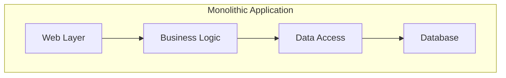
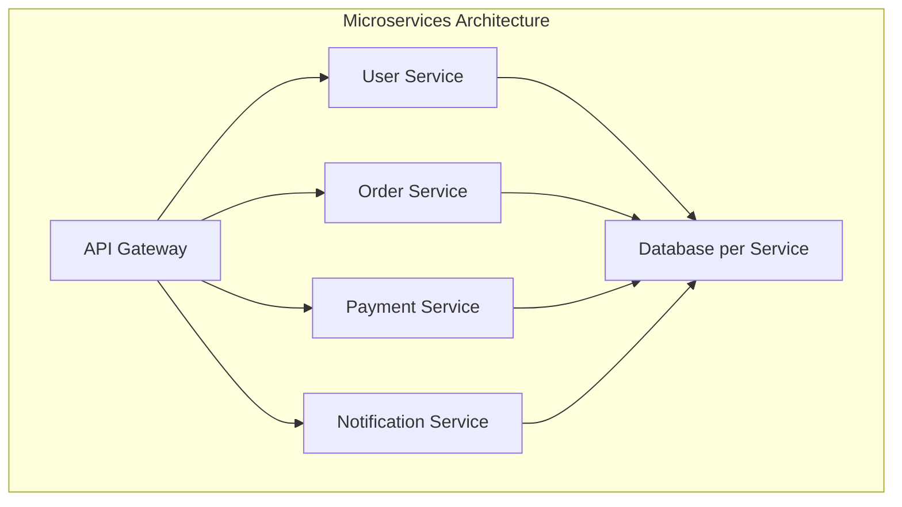

## Overview

The debate between microservices and monolithic architectures represents a fundamental choice in system design. Monolithic applications are built as single, unified units where all components are tightly coupled, while microservices decompose applications into small, independently deployable services that communicate over networks.

Understanding the trade-offs between these approaches is crucial for making informed architectural decisions that align with business needs, team structure, and scalability requirements.

## Detailed Explanation

### Monolithic Architecture

A monolithic application is a single, self-contained unit that contains all the business logic, data access, and presentation layers:



**Characteristics:**
- Single codebase and deployment unit
- Shared memory and database
- Tight coupling between components
- Simple development and deployment initially

### Microservices Architecture

Microservices decompose applications into small, independent services that communicate via APIs:



**Characteristics:**
- Independent deployment and scaling
- Service-specific databases
- Loose coupling via APIs
- Complex distributed system management

## Real-world Examples & Use Cases

### E-commerce Platform Migration

**Monolithic Approach:**
```java
public class EcommerceApplication {
    public void processOrder(Order order) {
        // Validate user
        if (!userService.validateUser(order.getUserId())) {
            throw new IllegalArgumentException("Invalid user");
        }
        
        // Check inventory
        if (!inventoryService.checkStock(order.getItems())) {
            throw new IllegalArgumentException("Out of stock");
        }
        
        // Process payment
        PaymentResult payment = paymentService.processPayment(order);
        
        // Update inventory
        inventoryService.updateStock(order.getItems());
        
        // Send notification
        notificationService.sendOrderConfirmation(order);
    }
}
```

**Microservices Approach:**
```java
@Service
public class OrderService {
    @Autowired
    private UserClient userClient;
    @Autowired
    private InventoryClient inventoryClient;
    @Autowired
    private PaymentClient paymentClient;
    @Autowired
    private NotificationClient notificationClient;
    
    @Transactional
    public Order processOrder(OrderRequest request) {
        // Validate user via service call
        User user = userClient.getUser(request.getUserId());
        
        // Reserve inventory
        inventoryClient.reserveItems(request.getItems());
        
        // Process payment
        PaymentResult payment = paymentClient.charge(user.getPaymentMethod(), request.getTotal());
        
        // Create order
        Order order = orderRepository.save(new Order(user, request.getItems(), payment));
        
        // Send notification asynchronously
        notificationClient.sendOrderConfirmation(order);
        
        return order;
    }
}
```

### Netflix Architecture Evolution

Netflix started as a monolithic DVD rental system and evolved to microservices:

- **Monolithic Era**: Single application handling DVD catalog, recommendations, and shipping
- **Microservices Migration**: Decomposed into 700+ services handling streaming, recommendations, billing, etc.
- **Benefits Achieved**: Independent scaling, faster deployments, technology diversity

### Banking System Comparison

**Monolithic Bank:**
- Single database for accounts, transactions, customers
- Batch processing for end-of-day reconciliation
- Difficult to introduce new features like mobile banking

**Microservices Bank:**
- Account service, Transaction service, Customer service
- Real-time event streaming for consistency
- Independent deployment of mobile features

## Code Examples

### Monolithic Application Structure

```
monolithic-app/
├── src/
│   ├── main/
│   │   ├── java/
│   │   │   ├── com/example/
│   │   │   │   ├── controller/
│   │   │   │   ├── service/
│   │   │   │   ├── repository/
│   │   │   │   └── model/
│   │   └── resources/
│   └── test/
├── pom.xml
└── Dockerfile
```

```java
@SpringBootApplication
public class MonolithicEcommerceApplication {
    public static void main(String[] args) {
        SpringApplication.run(MonolithicEcommerceApplication.class, args);
    }
}

@RestController
@RequestMapping("/orders")
public class OrderController {
    @Autowired
    private OrderService orderService;
    
    @PostMapping
    public Order createOrder(@RequestBody OrderRequest request) {
        return orderService.createOrder(request);
    }
}

@Service
public class OrderService {
    @Autowired
    private UserRepository userRepository;
    @Autowired
    private ProductRepository productRepository;
    @Autowired
    private OrderRepository orderRepository;
    
    public Order createOrder(OrderRequest request) {
        // All logic in one service
        User user = userRepository.findById(request.getUserId());
        List<Product> products = productRepository.findAllById(request.getProductIds());
        // ... business logic
        return orderRepository.save(order);
    }
}
```

### Microservices Application Structure

```
microservices-app/
├── order-service/
│   ├── src/main/java/com/example/order/
│   ├── pom.xml
│   └── Dockerfile
├── user-service/
│   ├── src/main/java/com/example/user/
│   ├── pom.xml
│   └── Dockerfile
├── product-service/
│   ├── src/main/java/com/example/product/
│   ├── pom.xml
│   └── Dockerfile
├── api-gateway/
│   ├── src/main/java/com/example/gateway/
│   ├── pom.xml
│   └── Dockerfile
├── docker-compose.yml
└── kubernetes/
    ├── order-deployment.yml
    ├── user-deployment.yml
    └── gateway-deployment.yml
```

```java
// Order Service
@SpringBootApplication
public class OrderServiceApplication {
    public static void main(String[] args) {
        SpringApplication.run(OrderServiceApplication.class, args);
    }
}

@RestController
@RequestMapping("/orders")
public class OrderController {
    @Autowired
    private OrderService orderService;
    
    @PostMapping
    public Order createOrder(@RequestBody OrderRequest request) {
        return orderService.createOrder(request);
    }
}

@Service
public class OrderService {
    @Autowired
    private UserClient userClient;
    @Autowired
    private ProductClient productClient;
    @Autowired
    private OrderRepository orderRepository;
    
    @Transactional
    public Order createOrder(OrderRequest request) {
        User user = userClient.getUser(request.getUserId());
        List<Product> products = productClient.getProducts(request.getProductIds());
        
        // Validate and create order
        Order order = new Order(user, products, request.getTotal());
        return orderRepository.save(order);
    }
}

// Feign Client for inter-service communication
@FeignClient("user-service")
public interface UserClient {
    @GetMapping("/users/{id}")
    User getUser(@PathVariable String id);
}
```

## Common Pitfalls & Edge Cases

### Distributed Transactions

Microservices lack ACID transactions across services:

```java
// Problematic: Distributed transaction
@Transactional
public void processOrder(Order order) {
    inventoryService.reserveItems(order.getItems()); // Service 1
    paymentService.charge(order.getTotal());         // Service 2
    shippingService.scheduleDelivery(order);         // Service 3
    // If any fails, rollback all
}
```

**Solution**: Use Saga pattern or event-driven compensation.

### Service Discovery Complexity

```java
// Hardcoded URLs (bad)
@RestController
public class OrderController {
    @Autowired
    private RestTemplate restTemplate;
    
    public User getUser(String userId) {
        return restTemplate.getForObject("http://localhost:8081/users/" + userId, User.class);
    }
}

// Service discovery (good)
@FeignClient("user-service")
public interface UserClient {
    @GetMapping("/users/{id}")
    User getUser(@PathVariable String id);
}
```

### Data Consistency Challenges

Eventual consistency vs immediate consistency:

```java
// Immediate consistency (monolith)
@Transactional
public void transferMoney(Account from, Account to, BigDecimal amount) {
    from.debit(amount);
    to.credit(amount);
}

// Eventual consistency (microservices)
public void transferMoney(String fromId, String toId, BigDecimal amount) {
    eventPublisher.publish(new MoneyTransferRequested(fromId, toId, amount));
    // Account services react to events asynchronously
}
```

## Tools & Libraries

### Microservices Frameworks

- **Spring Cloud**: Complete microservices toolkit
- **Micronaut**: Cloud-native microservices framework
- **Quarkus**: Kubernetes-native Java framework

### Service Communication

- **Spring Cloud OpenFeign**: Declarative REST client
- **gRPC**: High-performance RPC framework
- **Apache Kafka**: Event-driven communication

### Infrastructure

- **Kubernetes**: Container orchestration
- **Docker**: Containerization
- **Istio**: Service mesh for observability and traffic management

### Monitoring & Observability

- **Spring Cloud Sleuth**: Distributed tracing
- **Micrometer**: Metrics collection
- **ELK Stack**: Centralized logging

## References

- [Microservices vs Monolithic Architecture](https://martinfowler.com/articles/microservices.html)
- [Building Microservices](https://samnewman.io/books/building_microservices/)
- [Monolith to Microservices](https://www.nginx.com/blog/refactoring-a-monolith-into-microservices/)
- [Netflix Technology Blog](https://netflixtechblog.com/)

## Github-README Links & Related Topics

- [microservices-architecture](microservices-architecture/README.md)
- [system-design-basics](system-design-basics/README.md)
- [api-gateway-design](api-gateway-design/README.md)
- [event-driven-architecture](event-driven-architecture/README.md)
