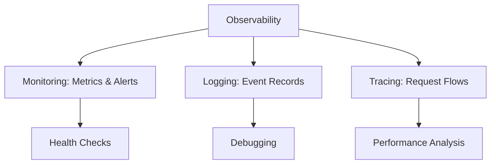

# Monitoring and Logging

## Overview

Monitoring tracks system health, performance, and errors. Logging records events for debugging and auditing. Together, they enable observability, helping detect issues, optimize performance, and ensure reliability.

## Detailed Explanation

### Monitoring

- **Metrics**: CPU, memory, latency, throughput.
- **Types**: Infrastructure, application, business metrics.
- **Tools**: Prometheus, Grafana, Nagios.

### Logging

- **Levels**: DEBUG, INFO, WARN, ERROR.
- **Structured Logging**: JSON format for searchability.
- **Aggregation**: ELK Stack (Elasticsearch, Logstash, Kibana).

### Best Practices

- **Alerting**: Threshold-based notifications.
- **Dashboards**: Visualize metrics.
- **Tracing**: Distributed tracing with Jaeger.



## Real-world Examples & Use Cases

- **E-commerce**: Monitor checkout latency, log failed payments.
- **Microservices**: Trace requests across services.

## Code Examples

### Logging (Java with SLF4J)

```java
import org.slf4j.Logger;
import org.slf4j.LoggerFactory;

public class Example {
    private static final Logger logger = LoggerFactory.getLogger(Example.class);

    public void process() {
        logger.info("Processing started");
        try {
            // Logic
            logger.debug("Step completed");
        } catch (Exception e) {
            logger.error("Error occurred", e);
        }
    }
}
```

### Metrics (Micrometer)

```java
import io.micrometer.core.instrument.MeterRegistry;

public class MetricsExample {
    private final MeterRegistry registry;

    public void recordLatency(long latency) {
        registry.timer("request.latency").record(latency, TimeUnit.MILLISECONDS);
    }
}
```

## Common Pitfalls & Edge Cases

- **Log Noise**: Filter irrelevant logs.
- **Metric Overload**: Focus on key indicators.
- **Security**: Sanitize logs for PII.

## Tools & Libraries

- **Logging**: Logback, Log4j.
- **Monitoring**: Prometheus, Grafana.
- **Tracing**: Zipkin, Jaeger.

## References

- [Observability Best Practices](https://opentelemetry.io/)
- [ELK Stack](https://www.elastic.co/what-is/elk-stack)

## Github-README Links & Related Topics

- [Infrastructure Monitoring](../infrastructure-monitoring/)
- [Distributed Tracing](../distributed-tracing/)
- [Fault Tolerance](../fault-tolerance-in-distributed-systems/)