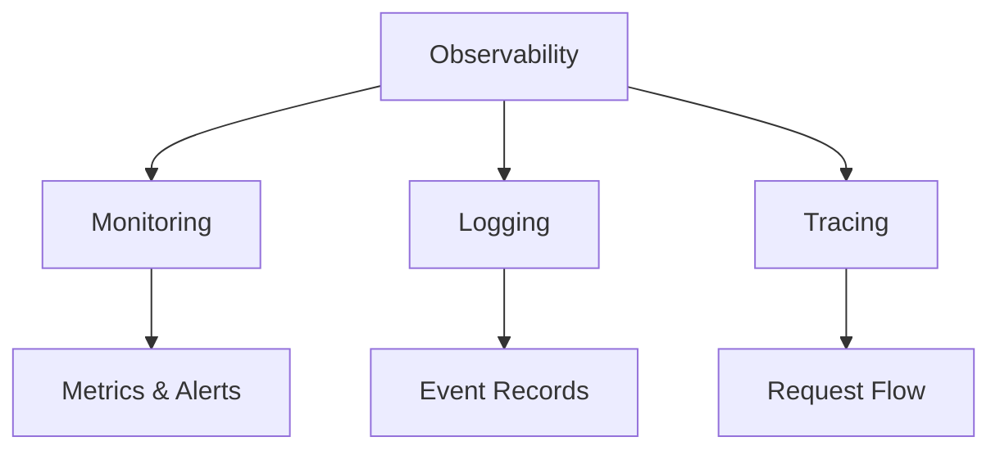

## Overview

Monitoring and logging are essential practices in system design and DevOps for ensuring system reliability, performance, and troubleshooting. Monitoring involves collecting, analyzing, and alerting on metrics from systems in real-time, while logging captures detailed records of events and errors for post-mortem analysis. Together, they form the foundation of observability, enabling teams to understand system behavior, detect issues early, and maintain high availability.

## Detailed Explanation

### Monitoring

Monitoring tracks the health, performance, and behavior of systems through metrics collection.

#### Key Components:
- **Metrics**: Quantitative measurements (e.g., CPU usage, response time, error rates)
- **Alerts**: Notifications when metrics exceed thresholds
- **Dashboards**: Visual representations of system state
- **Anomaly Detection**: Identifying unusual patterns automatically

#### Types of Monitoring:
- **Infrastructure Monitoring**: Server health, resource utilization
- **Application Monitoring**: Code performance, error rates
- **Business Monitoring**: User behavior, revenue metrics
- **Synthetic Monitoring**: Simulated user interactions

### Logging

Logging records events, errors, and debug information for analysis.

#### Log Levels:
- **DEBUG**: Detailed diagnostic information
- **INFO**: General information about operations
- **WARN**: Potentially harmful situations
- **ERROR**: Error conditions
- **FATAL**: Severe errors causing program termination

#### Structured Logging:
- Consistent format with key-value pairs
- Easier parsing and querying
- Better for distributed systems

### Observability

The combination of monitoring, logging, and tracing to understand system internals.



## Real-world Examples & Use Cases

- **E-commerce Platform**: Monitor checkout latency; log failed transactions for fraud detection
- **Microservices**: Centralized logging across services; monitor inter-service communication
- **Cloud Infrastructure**: Auto-scale based on CPU metrics; log security events
- **Mobile App**: Track user engagement metrics; log crashes for debugging
- **Financial Systems**: Real-time monitoring for compliance; audit logs for regulatory requirements

## Code Examples

### Structured Logging with SLF4J (Java)

```java
import org.slf4j.Logger;
import org.slf4j.LoggerFactory;

public class PaymentService {
    private static final Logger logger = LoggerFactory.getLogger(PaymentService.class);

    public void processPayment(String userId, double amount) {
        logger.info("Processing payment for user {} with amount {}", userId, amount);

        try {
            // Payment logic
            logger.debug("Validating payment details");
            validatePayment(userId, amount);

            logger.debug("Charging credit card");
            chargeCard(userId, amount);

            logger.info("Payment successful for user {}", userId);
        } catch (Exception e) {
            logger.error("Payment failed for user {}: {}", userId, e.getMessage(), e);
            throw e;
        }
    }
}
```

### Metrics Collection with Micrometer

```java
import io.micrometer.core.instrument.Counter;
import io.micrometer.core.instrument.MeterRegistry;
import io.micrometer.core.instrument.Timer;

public class OrderService {
    private final Counter orderCounter;
    private final Timer orderTimer;

    public OrderService(MeterRegistry registry) {
        this.orderCounter = Counter.builder("orders_total")
                .description("Total number of orders")
                .register(registry);

        this.orderTimer = Timer.builder("order_processing_time")
                .description("Time taken to process orders")
                .register(registry);
    }

    public void createOrder(Order order) {
        orderTimer.record(() -> {
            // Order processing logic
            processOrder(order);
            orderCounter.increment();
        });
    }
}
```

### Log Aggregation with ELK Stack (Conceptual)

```python
# Sending logs to Elasticsearch
import logging
from elasticsearch import Elasticsearch

es = Elasticsearch(['localhost:9200'])

class ElasticsearchHandler(logging.Handler):
    def emit(self, record):
        log_entry = {
            'timestamp': record.created,
            'level': record.levelname,
            'message': record.getMessage(),
            'service': 'my-service'
        }
        es.index(index='logs', body=log_entry)

logger = logging.getLogger('my-service')
logger.addHandler(ElasticsearchHandler())
logger.info('Service started')
```

## Common Pitfalls & Edge Cases

- **Log Noise**: Over-logging leading to storage costs and analysis difficulty
- **Alert Fatigue**: Too many alerts causing important ones to be ignored
- **Data Loss**: Logs not persisted during crashes; use async logging with buffering
- **Distributed Tracing Gaps**: Missing spans in microservices communication
- **Metric Cardinality Explosion**: High-cardinality metrics causing performance issues
- **Time Zone Issues**: Inconsistent timestamps across distributed systems

## Tools & Libraries

- **Monitoring**: Prometheus, Grafana, Datadog, New Relic
- **Logging**: ELK Stack (Elasticsearch, Logstash, Kibana), Splunk, Fluentd
- **Tracing**: Jaeger, Zipkin, OpenTelemetry
- **Metrics**: Micrometer, StatsD, Dropwizard Metrics
- **Alerting**: PagerDuty, Opsgenie, Alertmanager

## References

- [Observability Best Practices](https://opentelemetry.io/docs/concepts/observability-principles/)
- [Google SRE Book: Monitoring](https://sre.google/sre-book/monitoring-distributed-systems/)
- [The Art of Monitoring](https://artofmonitoring.com/)
- [Logging Best Practices](https://www.thoughtworks.com/insights/blog/logging-best-practices)

## Github-README Links & Related Topics

- [Observability Patterns](system-design/observability-patterns/)
- [Distributed Tracing](distributed-tracing/)
- [Infrastructure Monitoring](infrastructure-monitoring/)
- [Logging with ELK Stack](logging-with-elk-stack/)
- [Async Logging](async-logging/)