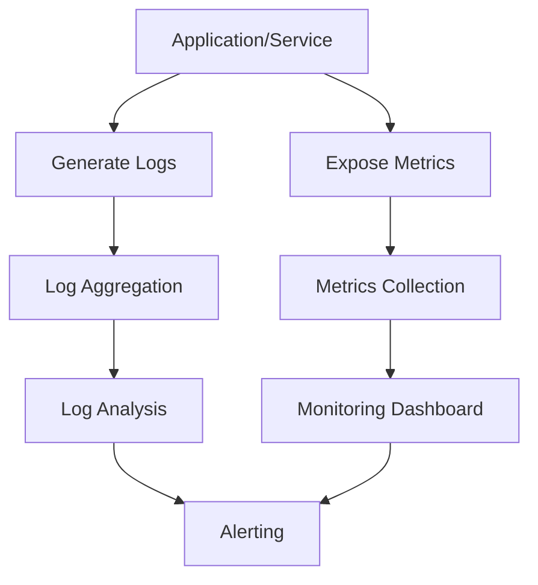

## Overview

Monitoring and logging are essential practices for maintaining reliable, performant, and secure systems. Monitoring provides real-time insights into system health, performance metrics, and potential issues, while logging captures detailed records of events and transactions for debugging, auditing, and analysis. Together, they form the foundation of observability in modern distributed systems.

## Detailed Explanation

### Monitoring Types

| Type | Description | Tools | Metrics |
|------|-------------|-------|---------|
| Infrastructure | Hardware and OS metrics | Prometheus, Nagios | CPU, memory, disk, network |
| Application | Code-level performance | APM tools (New Relic, Datadog) | Response time, error rates, throughput |
| Business | User-facing KPIs | Custom dashboards | Conversion rates, user engagement |
| Security | Threat detection and compliance | SIEM systems | Failed logins, anomalies |

### Logging Levels

- **DEBUG**: Detailed diagnostic information for development
- **INFO**: General information about application operation
- **WARN**: Potentially harmful situations
- **ERROR**: Error conditions that don't stop execution
- **FATAL**: Severe errors that cause application termination

### Key Components

- **Metrics**: Quantitative measurements (counters, gauges, histograms)
- **Logs**: Structured or unstructured event records
- **Traces**: Request flow across distributed services
- **Alerts**: Automated notifications based on thresholds



### Best Practices

- **Structured Logging**: Use consistent formats (JSON) for better searchability
- **Log Rotation**: Prevent disk space issues with automatic log rotation
- **Centralized Logging**: Aggregate logs from multiple sources
- **Monitoring as Code**: Define monitoring configurations in version control
- **Alert Fatigue Prevention**: Set meaningful thresholds and avoid false positives

## Real-world Examples & Use Cases

### E-commerce Platform
- Monitor checkout flow latency and success rates
- Log user authentication attempts for security auditing
- Alert on inventory discrepancies or payment failures

### Microservices Architecture
- Distributed tracing for request flows across services
- Centralized logging with correlation IDs
- Service mesh metrics for traffic patterns

### Cloud Infrastructure
- Auto-scaling based on CPU/memory metrics
- Log analysis for compliance and forensics
- Real-time dashboards for DevOps teams

### IoT Systems
- Device health monitoring with heartbeat signals
- Anomaly detection in sensor data streams
- Log aggregation from edge devices to central systems

## Code Examples

### Java Logging with SLF4J

```java
import org.slf4j.Logger;
import org.slf4j.LoggerFactory;

public class UserService {
    private static final Logger logger = LoggerFactory.getLogger(UserService.class);

    public User getUserById(String id) {
        logger.debug("Fetching user with ID: {}", id);

        try {
            User user = userRepository.findById(id);
            logger.info("Successfully retrieved user: {}", user.getUsername());
            return user;
        } catch (Exception e) {
            logger.error("Failed to retrieve user with ID: {}", id, e);
            throw e;
        }
    }
}
```

### Python Metrics with Prometheus Client

```python
from prometheus_client import Counter, Histogram, generate_latest
import time

REQUEST_COUNT = Counter('http_requests_total', 'Total HTTP requests', ['method', 'endpoint'])
REQUEST_LATENCY = Histogram('http_request_duration_seconds', 'HTTP request latency', ['method', 'endpoint'])

def handle_request(method, endpoint):
    start_time = time.time()

    REQUEST_COUNT.labels(method=method, endpoint=endpoint).inc()

    # Simulate request processing
    time.sleep(0.1)

    REQUEST_LATENCY.labels(method=method, endpoint=endpoint).observe(time.time() - start_time)

    return "Response"

# Expose metrics endpoint
def metrics():
    return generate_latest()
```

### Structured Logging in Node.js

```javascript
const winston = require('winston');

const logger = winston.createLogger({
  level: 'info',
  format: winston.format.combine(
    winston.format.timestamp(),
    winston.format.json()
  ),
  transports: [
    new winston.transports.File({ filename: 'error.log', level: 'error' }),
    new winston.transports.File({ filename: 'combined.log' })
  ]
});

class OrderService {
  async processOrder(orderData) {
    logger.info('Processing order', {
      orderId: orderData.id,
      userId: orderData.userId,
      amount: orderData.amount,
      timestamp: new Date().toISOString()
    });

    try {
      // Process order logic
      await this.validateOrder(orderData);
      await this.chargePayment(orderData);
      await this.updateInventory(orderData);

      logger.info('Order processed successfully', { orderId: orderData.id });
      return { success: true };
    } catch (error) {
      logger.error('Order processing failed', {
        orderId: orderData.id,
        error: error.message,
        stack: error.stack
      });
      throw error;
    }
  }
}
```

## References

- [Monitoring and Observability Guide - Google Cloud](https://cloud.google.com/monitoring)
- [The Art of Monitoring - James Turnbull](https://www.artofmonitoring.com/)
- [Logging Best Practices - 12 Factor App](https://12factor.net/logs)
- [Prometheus Monitoring](https://prometheus.io/docs/introduction/overview/)
- [ELK Stack Documentation](https://www.elastic.co/guide/index.html)

## Github-README Links & Related Topics

- [Distributed Tracing](../distributed-tracing/README.md)
- [Fault Tolerance in Distributed Systems](../fault-tolerance-in-distributed-systems/README.md)
- [DevOps & Infrastructure as Code](../devops-and-infrastructure-as-code/README.md)
- [Async Logging](../async-logging/README.md)
- [Infrastructure Monitoring](../infrastructure-monitoring/README.md)
