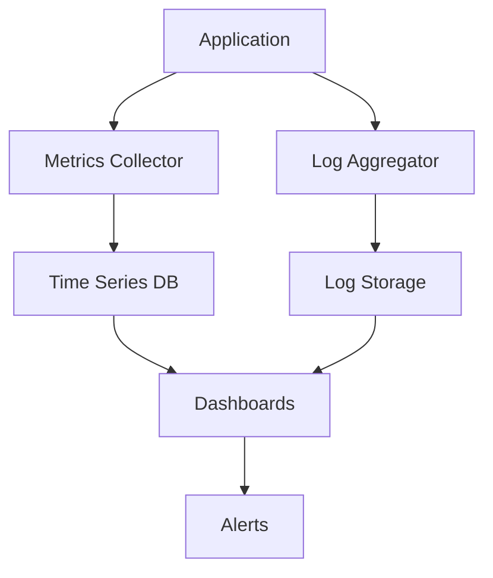

# Overview

Monitoring and logging are critical components of system observability, enabling engineers to maintain, troubleshoot, and optimize software systems. Monitoring focuses on real-time data collection for system health and performance, while logging provides historical records of events and errors for analysis and debugging.

# Detailed Explanation

## Monitoring

Monitoring involves collecting, processing, and analyzing metrics to understand system behavior. Key aspects include:

- **Metrics Collection**: Gathering quantitative data like CPU usage, memory consumption, response times, and throughput.
- **Alerting**: Setting thresholds to notify teams of anomalies or failures.
- **Visualization**: Using dashboards to display metrics in real-time.

## Logging

Logging captures qualitative data about system events, providing context for issues:

- **Log Levels**: DEBUG, INFO, WARN, ERROR, FATAL.
- **Structured Logging**: Using JSON format for better searchability.
- **Log Aggregation**: Centralizing logs from multiple sources.

## Key Concepts

| Concept | Description | Example |
|---------|-------------|---------|
| Metrics | Quantitative measurements | Response time: 200ms |
| Logs | Event records | "User login failed: invalid credentials" |
| Tracing | Request path tracking | Distributed tracing with Jaeger |
| Alerting | Notification of issues | Email/SMS when CPU > 90% |



# Real-world Examples & Use Cases

### E-commerce Platform Monitoring
- Track order processing latency during peak sales.
- Monitor inventory levels and alert on low stock.
- Log payment failures for fraud detection.

### Microservices Architecture
- Distributed tracing for request flows across services.
- Centralized logging for debugging inter-service issues.
- Metrics on API response times and error rates.

### Cloud Infrastructure
- Auto-scaling based on CPU/memory metrics.
- Logging access patterns for security audits.
- Monitoring network traffic for DDoS detection.

# Code Examples

### Java with SLF4J and Micrometer

```java
import org.slf4j.Logger;
import org.slf4j.LoggerFactory;
import io.micrometer.core.instrument.MeterRegistry;
import io.micrometer.core.instrument.Counter;
import io.micrometer.core.instrument.Timer;

public class OrderService {
    private static final Logger logger = LoggerFactory.getLogger(OrderService.class);
    private final Counter ordersProcessed;
    private final Timer orderProcessingTime;

    public OrderService(MeterRegistry registry) {
        this.ordersProcessed = Counter.builder("orders.processed")
                .description("Number of orders processed")
                .register(registry);
        this.orderProcessingTime = Timer.builder("orders.processing.time")
                .description("Time taken to process orders")
                .register(registry);
    }

    public void processOrder(Order order) {
        logger.info("Processing order for user: {}", order.getUserId());
        Timer.Sample sample = Timer.start();

        try {
            // Business logic
            validateOrder(order);
            saveOrder(order);
            sendConfirmation(order);

            ordersProcessed.increment();
            logger.info("Order processed successfully: {}", order.getId());
        } catch (Exception e) {
            logger.error("Failed to process order: {}", order.getId(), e);
            throw e;
        } finally {
            sample.stop(orderProcessingTime);
        }
    }
}
```

### Python with Logging and Prometheus Client

```python
import logging
import time
from prometheus_client import Counter, Histogram, start_http_server

# Configure logging
logging.basicConfig(level=logging.INFO, format='%(asctime)s - %(name)s - %(levelname)s - %(message)s')
logger = logging.getLogger(__name__)

# Prometheus metrics
REQUEST_COUNT = Counter('http_requests_total', 'Total HTTP requests', ['method', 'endpoint'])
REQUEST_LATENCY = Histogram('http_request_duration_seconds', 'HTTP request latency', ['method', 'endpoint'])

def process_request(method, endpoint):
    REQUEST_COUNT.labels(method=method, endpoint=endpoint).inc()
    start_time = time.time()

    logger.info(f"Processing {method} request to {endpoint}")

    try:
        # Simulate processing
        time.sleep(0.1)
        logger.info(f"Request to {endpoint} completed successfully")
    except Exception as e:
        logger.error(f"Error processing request to {endpoint}: {str(e)}")
        raise
    finally:
        REQUEST_LATENCY.labels(method=method, endpoint=endpoint).observe(time.time() - start_time)

if __name__ == '__main__':
    start_http_server(8000)
    process_request('GET', '/api/orders')
```

### Go with Zap Logger and Metrics

```go
package main

import (
    "time"
    "github.com/gin-gonic/gin"
    "go.uber.org/zap"
    "github.com/prometheus/client_golang/prometheus"
    "github.com/prometheus/client_golang/prometheus/promhttp"
)

var (
    requestsTotal = prometheus.NewCounterVec(
        prometheus.CounterOpts{
            Name: "http_requests_total",
            Help: "Total number of HTTP requests",
        },
        []string{"method", "endpoint"},
    )
    requestDuration = prometheus.NewHistogramVec(
        prometheus.HistogramOpts{
            Name: "http_request_duration_seconds",
            Help: "HTTP request duration",
        },
        []string{"method", "endpoint"},
    )
)

func init() {
    prometheus.MustRegister(requestsTotal)
    prometheus.MustRegister(requestDuration)
}

func main() {
    logger, _ := zap.NewProduction()
    defer logger.Sync()

    r := gin.New()

    r.Use(func(c *gin.Context) {
        start := time.Now()
        path := c.Request.URL.Path
        method := c.Request.Method

        logger.Info("Request started",
            zap.String("method", method),
            zap.String("path", path),
        )

        c.Next()

        duration := time.Since(start)
        requestsTotal.WithLabelValues(method, path).Inc()
        requestDuration.WithLabelValues(method, path).Observe(duration.Seconds())

        logger.Info("Request completed",
            zap.String("method", method),
            zap.String("path", path),
            zap.Duration("duration", duration),
            zap.Int("status", c.Writer.Status()),
        )
    })

    r.GET("/metrics", gin.WrapH(promhttp.Handler()))
    r.GET("/api/users", func(c *gin.Context) {
        c.JSON(200, gin.H{"message": "Users endpoint"})
    })

    r.Run(":8080")
}
```

# Tools & Libraries

| Category | Tools/Libraries | Description |
|----------|-----------------|-------------|
| **Monitoring** | Prometheus | Time-series database and monitoring system |
| | Grafana | Visualization and dashboarding |
| | Datadog | Cloud monitoring and analytics |
| | New Relic | Application performance monitoring |
| **Logging** | ELK Stack (Elasticsearch, Logstash, Kibana) | Log aggregation and analysis |
| | Splunk | Enterprise logging and monitoring |
| | Fluentd | Log collection and aggregation |
| | Loki | Log aggregation for Kubernetes |
| **Tracing** | Jaeger | Distributed tracing |
| | Zipkin | Distributed tracing system |
| | OpenTelemetry | Observability framework |

# Common Pitfalls & Edge Cases

- **Log Noise**: Excessive logging leading to storage costs and analysis difficulty. Solution: Use appropriate log levels and sampling.
- **Metrics Cardinality**: High-cardinality metrics causing performance issues. Avoid unbounded label values.
- **Alert Fatigue**: Too many alerts leading to ignored notifications. Implement alert hierarchies and auto-silencing.
- **Distributed Tracing Overhead**: Tracing all requests impacting performance. Use sampling rates.
- **Log Data Privacy**: Sensitive information in logs. Implement log sanitization and masking.
- **Time Zone Issues**: Inconsistent timestamps across services. Use UTC and include timezone info.

# References

- [Monitoring and Observability Guide](https://opentelemetry.io/docs/concepts/observability-principles/)
- [Prometheus Documentation](https://prometheus.io/docs/introduction/overview/)
- [ELK Stack Tutorial](https://www.elastic.co/guide/en/elastic-stack-get-started/current/get-started-elastic-stack.html)
- [Logging Best Practices](https://12factor.net/logs)
- [Google SRE Book - Monitoring](https://sre.google/sre-book/monitoring-distributed-systems/)

# Github-README Links & Related Topics

- [Async Logging](./async-logging/README.md)
- [DevOps & Infrastructure as Code](./devops-and-infrastructure-as-code/README.md)
- [Distributed Tracing](./distributed-tracing/README.md)
- [Infrastructure Monitoring](./infrastructure-monitoring/README.md)
- [Monitoring Dashboards](./monitoring-dashboards/README.md)
