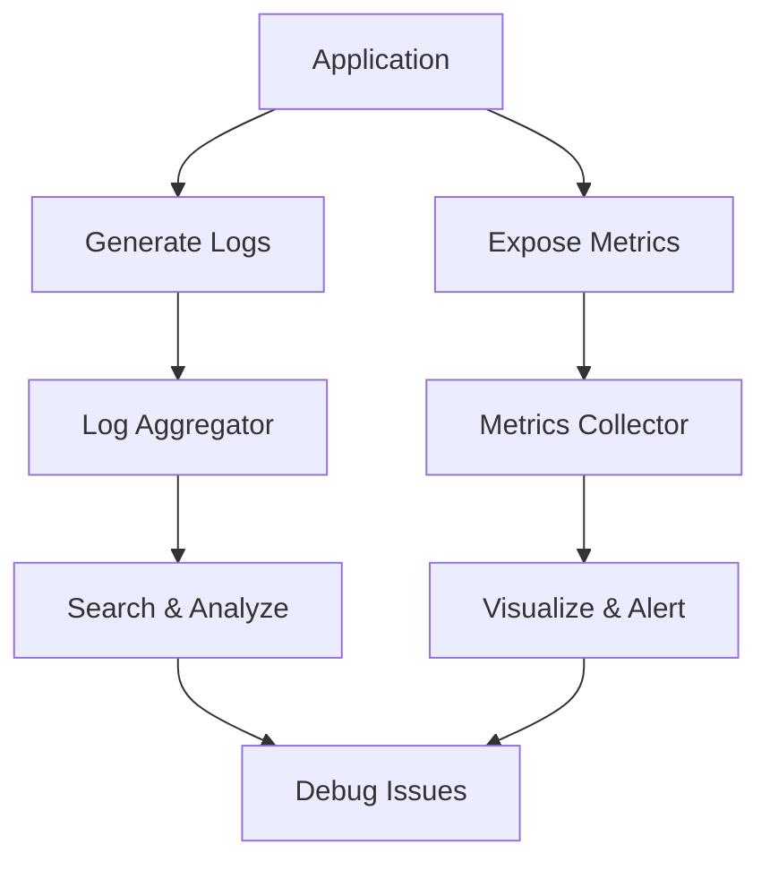

# Overview

Monitoring and logging are essential practices for maintaining the health, performance, and reliability of software systems. Monitoring involves collecting and analyzing metrics, logs, and traces in real-time to detect issues and ensure optimal operation. Logging captures detailed records of events, errors, and activities for debugging, auditing, and compliance. Together, they form the foundation of observability, enabling proactive issue resolution and informed decision-making.

# Detailed Explanation

## Monitoring

Monitoring tracks system behavior through key metrics:
- **Infrastructure Metrics**: CPU, memory, disk, network usage.
- **Application Metrics**: Response times, error rates, throughput.
- **Business Metrics**: User activity, revenue indicators.

Tools: Prometheus, Grafana, Nagios, DataDog.

Approaches:
- **White-box Monitoring**: Insights from inside the system (e.g., application logs).
- **Black-box Monitoring**: External checks (e.g., synthetic transactions).
- **Alerting**: Threshold-based notifications for anomalies.

## Logging

Logging records events with structured data:
- **Levels**: DEBUG, INFO, WARN, ERROR, FATAL.
- **Structured Logging**: JSON format for easy parsing.
- **Centralized Logging**: Aggregates logs from distributed systems.

Tools: ELK Stack (Elasticsearch, Logstash, Kibana), Splunk, Fluentd.

Best Practices:
- Log rotation to prevent disk fill.
- Sensitive data masking.
- Correlation IDs for tracing requests.

## Integration

Monitoring and logging complement each other:
- Logs provide context for metrics anomalies.
- Metrics guide log analysis.



# Real-world Examples & Use Cases

- **E-commerce**: Monitor cart abandonment rates; log user sessions for fraud detection.
- **Microservices**: Distributed tracing with tools like Jaeger; alert on service failures.
- **Cloud Services**: AWS CloudWatch monitors EC2 instances; logs API calls for security audits.
- **DevOps Pipelines**: CI/CD monitoring for build failures; logs for deployment issues.

# Code Examples

## Prometheus Metrics in Python (Flask App)

```python
from flask import Flask
from prometheus_client import Counter, Histogram, generate_latest

app = Flask(__name__)

REQUEST_COUNT = Counter('http_requests_total', 'Total HTTP requests', ['method', 'endpoint'])
REQUEST_LATENCY = Histogram('http_request_duration_seconds', 'Request latency', ['method', 'endpoint'])

@app.route('/api/data')
def get_data():
    REQUEST_COUNT.labels(method='GET', endpoint='/api/data').inc()
    with REQUEST_LATENCY.labels(method='GET', endpoint='/api/data').time():
        # Simulate work
        return {'data': 'example'}

@app.route('/metrics')
def metrics():
    return generate_latest()
```

## Structured Logging in Java (Logback)

```java
import org.slf4j.Logger;
import org.slf4j.LoggerFactory;

public class ExampleService {
    private static final Logger logger = LoggerFactory.getLogger(ExampleService.class);

    public void processRequest(String userId) {
        logger.info("Processing request for user {}", userId);
        try {
            // Business logic
            logger.debug("Request details: {}", getDetails());
        } catch (Exception e) {
            logger.error("Error processing request for user {}: {}", userId, e.getMessage(), e);
        }
    }
}
```

# References

- [Monitoring - Wikipedia](https://en.wikipedia.org/wiki/Monitoring_(computing))
- [Logging - Wikipedia](https://en.wikipedia.org/wiki/Computer_logging)
- [Prometheus Documentation](https://prometheus.io/docs/)
- [ELK Stack](https://www.elastic.co/what-is/elk-stack)