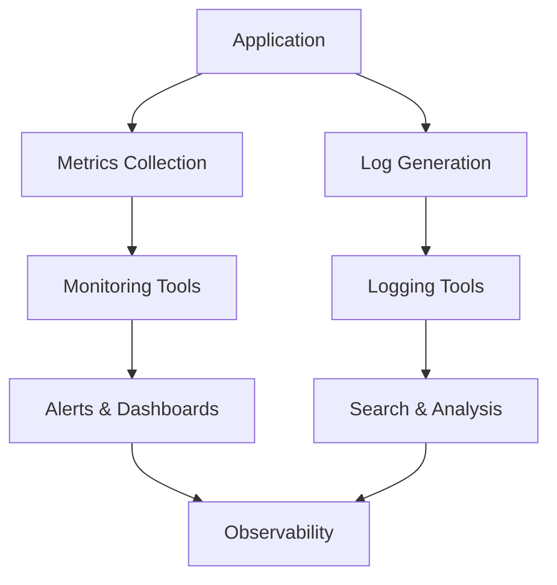

## Overview

Monitoring and logging are essential components of observability in system design, enabling teams to track system health, diagnose issues, and ensure reliability. Monitoring involves collecting and analyzing metrics, events, and performance data in real-time, while logging captures detailed records of events, errors, and transactions for auditing and debugging. Together, they provide insights into system behavior, support proactive maintenance, and facilitate troubleshooting in distributed systems like microservices and cloud-native applications.

## Detailed Explanation

### Monitoring
Monitoring tracks the performance and health of systems by collecting metrics such as CPU usage, memory consumption, disk I/O, network traffic, and application-specific KPIs. It includes:

- **Metrics**: Quantitative data aggregated over time (e.g., request latency, error rates).
- **Alerts**: Notifications triggered when metrics exceed thresholds (e.g., high CPU usage).
- **Tools**: Prometheus for metrics collection, Grafana for visualization, Nagios or Zabbix for alerting.

Monitoring can be software-based (e.g., using agents) or hardware-based (e.g., sensors on motherboards). In distributed systems, it ensures reliability by detecting anomalies early.

### Logging
Logging records events in a system, providing a chronological history for analysis. Key aspects include:

- **Log Levels**: DEBUG, INFO, WARN, ERROR, FATAL.
- **Formats**: Structured (e.g., JSON) or unstructured (plain text).
- **Types**:
  - Event logs: Record system activities.
  - Transaction logs: Track database changes.
  - Server logs: Capture web server requests.
- **Standards**: Syslog (RFC 5424) for standardized logging.
- **Tools**: ELK Stack (Elasticsearch, Logstash, Kibana), Splunk, or cloud services like AWS CloudWatch.

Logs are crucial for debugging, auditing, and compliance but must be managed to avoid performance overhead.

### Relationship to Observability
Monitoring and logging contribute to observability by providing metrics, logs, and traces. In microservices, they enable end-to-end visibility.

| Aspect | Monitoring | Logging |
|--------|------------|---------|
| Data Type | Metrics (numeric) | Events (textual) |
| Purpose | Real-time health | Historical analysis |
| Tools | Prometheus, Grafana | ELK, Splunk |
| Example | CPU usage alert | Error stack trace |



## Real-world Examples & Use Cases

- **E-commerce Platform**: Monitoring tracks order processing latency; logging captures failed payments for fraud detection.
- **Social Media App**: Logs user interactions for content moderation; monitors API response times to handle traffic spikes.
- **Microservices Architecture**: Centralized logging aggregates logs from services; monitoring detects cascading failures.
- **Cloud Infrastructure**: Tools like AWS CloudWatch monitor EC2 instances and log Lambda executions.

In high-traffic systems like Netflix or Uber, monitoring prevents outages, while logging aids in post-mortem analysis.

## Code Examples

### Logging in Java (using SLF4J)
```java
import org.slf4j.Logger;
import org.slf4j.LoggerFactory;

public class ExampleService {
    private static final Logger logger = LoggerFactory.getLogger(ExampleService.class);

    public void processRequest(String request) {
        logger.info("Processing request: {}", request);
        try {
            // Business logic
        } catch (Exception e) {
            logger.error("Error processing request", e);
        }
    }
}
```

### Monitoring with Prometheus (Java Metrics)
```java
import io.prometheus.client.Counter;
import io.prometheus.client.Histogram;

public class MetricsExample {
    private static final Counter requests = Counter.build()
        .name("requests_total").help("Total requests.").register();
    private static final Histogram requestLatency = Histogram.build()
        .name("request_latency_seconds").help("Request latency.").register();

    public void handleRequest() {
        requests.inc();
        Histogram.Timer timer = requestLatency.startTimer();
        try {
            // Process request
        } finally {
            timer.observeDuration();
        }
    }
}
```

## References

- [OpenTelemetry Observability Primer](https://opentelemetry.io/docs/concepts/observability-primer/)
- [Logging (computing) - Wikipedia](https://en.wikipedia.org/wiki/Logging_(computing))
- [System monitor - Wikipedia](https://en.wikipedia.org/wiki/System_monitor)

## Github-README Links & Related Topics

- [observability-logs-metrics-traces](./observability-logs-metrics-traces/)
- [logging-with-elk-stack](./logging-with-elk-stack/)
- [infrastructure-monitoring](./infrastructure-monitoring/)
- [distributed-tracing-and-observability](./distributed-tracing-and-observability/)
- [observability-patterns](./observability-patterns/)