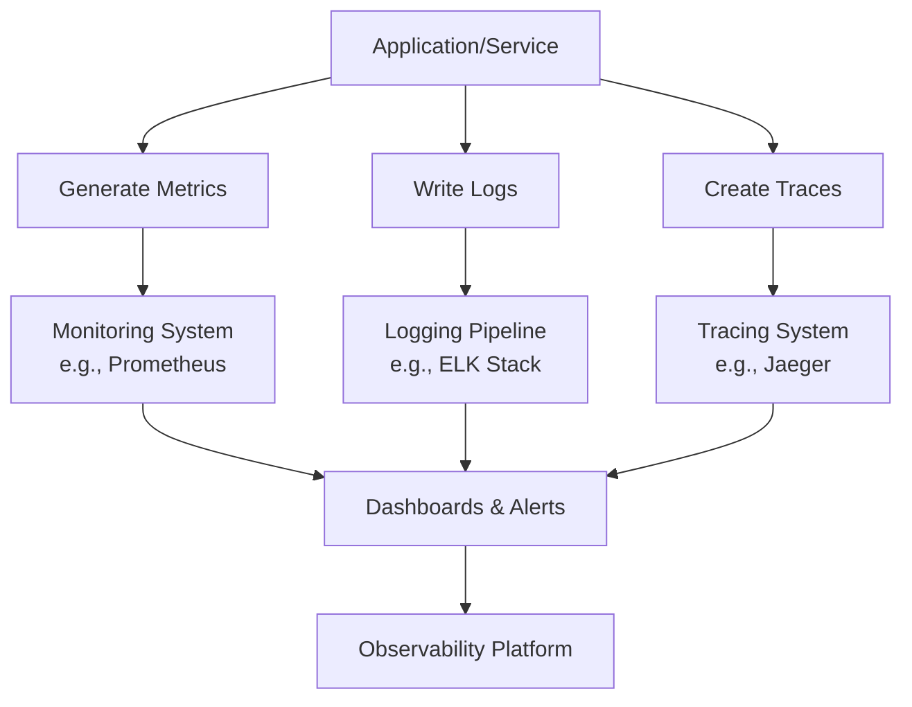

## Overview

Monitoring and logging are critical components of DevOps and system design, enabling teams to maintain reliable, performant, and secure applications. Monitoring involves continuous tracking of system metrics and health indicators, while logging captures detailed event records for analysis and debugging. Together, they form the foundation of observability, allowing proactive issue detection and post-mortem investigations.

## Detailed Explanation

### Monitoring Fundamentals

Monitoring collects quantitative data (metrics) about system performance, such as CPU utilization, memory usage, network throughput, and application response times. It provides real-time insights into system health and triggers alerts when predefined thresholds are breached.

### Logging Essentials

Logging records qualitative data about events, errors, and informational messages. Logs can be structured (e.g., JSON format) or unstructured and are essential for troubleshooting, compliance auditing, and understanding user behavior.

### Observability Components

- **Metrics**: Numerical measurements (counters, gauges, histograms) for quantitative analysis.
- **Logs**: Timestamped records of events, often with severity levels (INFO, WARN, ERROR).
- **Traces**: Distributed request paths showing how requests flow through microservices.

### Integration and Differences

Monitoring excels at real-time alerting and dashboards, while logging supports historical analysis. Modern observability combines all three for comprehensive system visibility.



## Real-world Examples & Use Cases

### E-commerce Platform Monitoring

Track order processing metrics and log failed transactions to detect payment gateway issues.

### Microservices Health Checks

Monitor service availability and use distributed tracing to identify bottlenecks in request chains.

### Cloud Infrastructure Scaling

Log auto-scaling events and monitor resource utilization to optimize costs and prevent outages.

| Scenario | Monitoring Focus | Logging Focus |
|----------|------------------|---------------|
| Performance Degradation | Response time histograms | Error stack traces |
| Security Breach | Failed authentication attempts | Access logs with IP addresses |
| Database Issues | Query execution times | Slow query logs |
| Network Problems | Packet loss rates | Connection timeout errors |

## Code Examples

### Python Application with Prometheus Metrics

```python
from prometheus_client import start_http_server, Counter, Histogram
import time
import random

# Define metrics
REQUEST_COUNT = Counter('http_requests_total', 'Total HTTP requests', ['method', 'endpoint'])
REQUEST_LATENCY = Histogram('http_request_duration_seconds', 'HTTP request latency', ['method', 'endpoint'])

def handle_request(method, endpoint):
    REQUEST_COUNT.labels(method=method, endpoint=endpoint).inc()
    with REQUEST_LATENCY.labels(method=method, endpoint=endpoint).time():
        # Simulate processing
        time.sleep(random.uniform(0.1, 1.0))

if __name__ == '__main__':
    start_http_server(8000)
    while True:
        handle_request('GET', '/api/users')
        time.sleep(1)
```

### Java Logging with Logback

```java
import org.slf4j.Logger;
import org.slf4j.LoggerFactory;

public class UserService {
    private static final Logger logger = LoggerFactory.getLogger(UserService.class);

    public User getUserById(String userId) {
        logger.info("Fetching user with ID: {}", userId);
        try {
            // Database query logic
            User user = database.findUser(userId);
            logger.debug("User found: {}", user);
            return user;
        } catch (Exception e) {
            logger.error("Error fetching user {}: {}", userId, e.getMessage(), e);
            throw e;
        }
    }
}
```

### Node.js with Winston for Structured Logging

```javascript
const winston = require('winston');

const logger = winston.createLogger({
  level: 'info',
  format: winston.format.json(),
  transports: [
    new winston.transports.File({ filename: 'error.log', level: 'error' }),
    new winston.transports.File({ filename: 'combined.log' }),
  ],
});

logger.info('Application started', { service: 'user-service', version: '1.0.0' });
logger.error('Database connection failed', { error: 'Connection timeout', retryCount: 3 });
```

## Tools & Libraries

### Monitoring Tools
- **Prometheus**: Open-source monitoring and alerting toolkit
- **Grafana**: Visualization and dashboard platform
- **Datadog**: Cloud-based monitoring and analytics
- **New Relic**: Application performance monitoring

### Logging Tools
- **ELK Stack**: Elasticsearch, Logstash, Kibana for log aggregation and analysis
- **Splunk**: Enterprise log management and analytics
- **Fluentd**: Open-source data collector for unified logging
- **Loki**: Log aggregation system designed for Kubernetes

### Tracing Tools
- **Jaeger**: Open-source distributed tracing system
- **Zipkin**: Distributed tracing system for microservices
- **OpenTelemetry**: Observability framework with tracing capabilities

| Language | Logging Library | Monitoring Library |
|----------|-----------------|---------------------|
| Java | Logback, Log4j | Micrometer |
| Python | Logging, Loguru | Prometheus Client |
| JavaScript | Winston, Bunyan | Prometheus Client |
| Go | Zap, Logrus | Prometheus Client |

## Common Pitfalls & Edge Cases

### Alert Fatigue
Over-configured alerts lead to constant notifications, causing teams to ignore critical issues. Solution: Implement alert hierarchies and use machine learning for anomaly detection.

### Log Data Explosion
Uncontrolled logging can consume excessive storage. Mitigate with log rotation, compression, and selective logging levels.

### Sensitive Data Leakage
Logs containing personally identifiable information (PII) or secrets. Use log sanitization and encryption.

### Distributed System Correlation
Difficulty tracing requests across multiple services. Implement correlation IDs and use distributed tracing.

### Time Zone and Clock Skew Issues
Inconsistent timestamps across systems. Standardize on UTC and use NTP for clock synchronization.

### High-Cardinality Metrics
Metrics with too many label combinations (e.g., user IDs) can overwhelm storage. Limit cardinality and use aggregations.

## References

- [Prometheus Documentation](https://prometheus.io/docs/introduction/overview/)
- [ELK Stack Getting Started](https://www.elastic.co/guide/en/elastic-stack-get-started/current/get-started-elastic-stack.html)
- [OpenTelemetry Observability](https://opentelemetry.io/docs/concepts/observability-primer/)
- [CNCF Observability Landscape](https://landscape.cncf.io/card-mode?category=observability&grouping=category)
- [Google SRE Book - Monitoring](https://sre.google/sre-book/monitoring-distributed-systems/)
- [AWS Observability Best Practices](https://aws.amazon.com/architecture/observability/)

# Github-README Links & Related Topics

- [Infrastructure Monitoring](../infrastructure-monitoring/README.md)
- [Distributed Tracing](../distributed-tracing/README.md)
- [Distributed Tracing with OpenTelemetry](../distributed-tracing-with-opentelemetry/README.md)
- [Event-Driven Architecture](../event-driven-architecture/README.md)
- [Fault Tolerance in Distributed Systems](../fault-tolerance-in-distributed-systems/README.md)
- [CI/CD Pipelines](../ci-cd-pipelines/README.md)
- [DevOps and Infrastructure as Code](../devops-and-infrastructure-as-code/README.md)