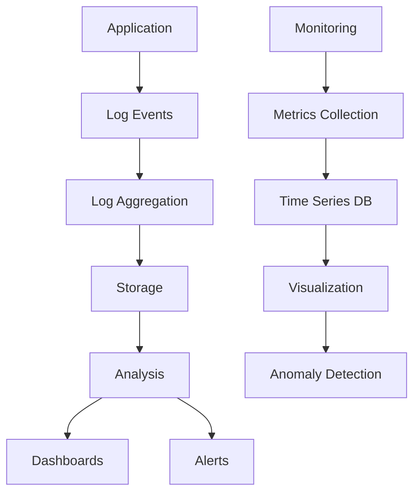

## Overview

Monitoring and logging are essential practices for maintaining system health, troubleshooting issues, and ensuring reliability. Monitoring provides real-time insights into system performance, while logging captures historical data for analysis and debugging.

## Detailed Explanation

### Monitoring
Monitoring involves collecting, analyzing, and alerting on system metrics.

**Types:**
- **Infrastructure Monitoring**: CPU, memory, disk, network
- **Application Monitoring**: Response times, error rates, throughput
- **Business Monitoring**: User behavior, revenue metrics
- **Synthetic Monitoring**: Simulated user interactions

**Key Metrics:**
- **Availability**: Uptime percentage
- **Latency**: Response time percentiles (P50, P95, P99)
- **Error Rate**: Percentage of failed requests
- **Throughput**: Requests per second
- **Resource Utilization**: CPU, memory, disk usage

### Logging
Logging captures events and messages for debugging and analysis.

**Log Levels:**
- **DEBUG**: Detailed diagnostic information
- **INFO**: General information about application operation
- **WARN**: Potentially harmful situations
- **ERROR**: Error conditions
- **FATAL**: Severe errors causing application termination

**Log Formats:**
- **Structured Logging**: JSON format with key-value pairs
- **Unstructured**: Plain text messages
- **Binary**: Compressed or encoded formats



### Observability Pillars
- **Logs**: Record of events
- **Metrics**: Quantitative measurements
- **Traces**: Request flow through system

## Real-world Examples & Use Cases

### E-commerce Platform
- **Monitor**: Cart abandonment rates, payment failures
- **Log**: User actions, transaction details
- **Alert**: On high error rates or latency spikes

### Microservices Architecture
- **Service Mesh**: Istio for traffic monitoring
- **Distributed Tracing**: Jaeger for request tracking
- **Centralized Logging**: ELK stack for log aggregation

### Cloud Infrastructure
- **AWS CloudWatch**: Metrics and logs for EC2, Lambda
- **Google Cloud Monitoring**: Application and infrastructure metrics
- **Azure Monitor**: Comprehensive monitoring solution

### DevOps Pipelines
- **CI/CD Monitoring**: Build times, deployment success rates
- **Infrastructure as Code**: Terraform state monitoring
- **Security Monitoring**: Intrusion detection and compliance

## Code Examples

### Structured Logging (Python)
```python
import logging
import json
import sys

class StructuredFormatter(logging.Formatter):
    def format(self, record):
        log_entry = {
            'timestamp': self.formatTime(record),
            'level': record.levelname,
            'message': record.getMessage(),
            'module': record.module,
            'function': record.funcName,
            'line': record.lineno
        }
        
        if hasattr(record, 'extra_data'):
            log_entry.update(record.extra_data)
            
        return json.dumps(log_entry)

# Setup logger
logger = logging.getLogger('my_app')
handler = logging.StreamHandler(sys.stdout)
handler.setFormatter(StructuredFormatter())
logger.addHandler(handler)
logger.setLevel(logging.INFO)

# Usage
logger.info('User login successful', extra={'extra_data': {'user_id': 123, 'ip': '192.168.1.1'}})
```

### Metrics Collection (Java with Micrometer)
```java
import io.micrometer.core.instrument.MeterRegistry;
import io.micrometer.core.instrument.Counter;
import io.micrometer.core.instrument.Timer;
import org.springframework.stereotype.Service;

@Service
public class OrderService {
    
    private final Counter orderCounter;
    private final Timer orderProcessingTimer;
    
    public OrderService(MeterRegistry registry) {
        this.orderCounter = Counter.builder("orders_total")
                .description("Total number of orders")
                .register(registry);
                
        this.orderProcessingTimer = Timer.builder("order_processing_time")
                .description("Time taken to process orders")
                .register(registry);
    }
    
    public void processOrder(Order order) {
        orderCounter.increment();
        
        orderProcessingTimer.record(() -> {
            // Order processing logic
            validateOrder(order);
            saveOrder(order);
            sendConfirmation(order);
        });
    }
}
```

### Log Aggregation with ELK (Docker Compose)
```yaml
version: '3.8'
services:
  elasticsearch:
    image: docker.elastic.co/elasticsearch/elasticsearch:7.10.0
    environment:
      - discovery.type=single-node
    ports:
      - "9200:9200"
      
  logstash:
    image: docker.elastic.co/logstash/logstash:7.10.0
    volumes:
      - ./logstash.conf:/usr/share/logstash/pipeline/logstash.conf
    ports:
      - "5044:5044"
      
  kibana:
    image: docker.elastic.co/kibana/kibana:7.10.0
    ports:
      - "5601:5601"
```

## Common Pitfalls & Edge Cases

- **Log Noise**: Too many irrelevant log messages
- **Metric Cardinality**: High number of unique metric combinations
- **Alert Fatigue**: Too many false positive alerts
- **Data Retention**: Balancing storage costs with analysis needs
- **Distributed Tracing Complexity**: Overhead in microservices

## Tools & Libraries

- **ELK Stack**: Elasticsearch, Logstash, Kibana
- **Prometheus**: Metrics collection and alerting
- **Grafana**: Visualization and dashboards
- **Jaeger**: Distributed tracing
- **Datadog**: Full-stack monitoring
- **New Relic**: Application performance monitoring

## References

- [Observability Best Practices](https://www.oreilly.com/library/view/distributed-systems-observability/9781492033431/)
- [Monitoring Microservices](https://microservices.io/patterns/observability/)
- [Logging Best Practices](https://12factor.net/logs)
- [Site Reliability Engineering](https://sre.google/sre-book/monitoring-distributed-systems/)

## Github-README Links & Related Topics

- [async-logging](../async-logging/)
- [infrastructure-monitoring](../infrastructure-monitoring/)
- [distributed-tracing](../distributed-tracing/)
- [grafana-dashboards](../grafana-dashboards/)