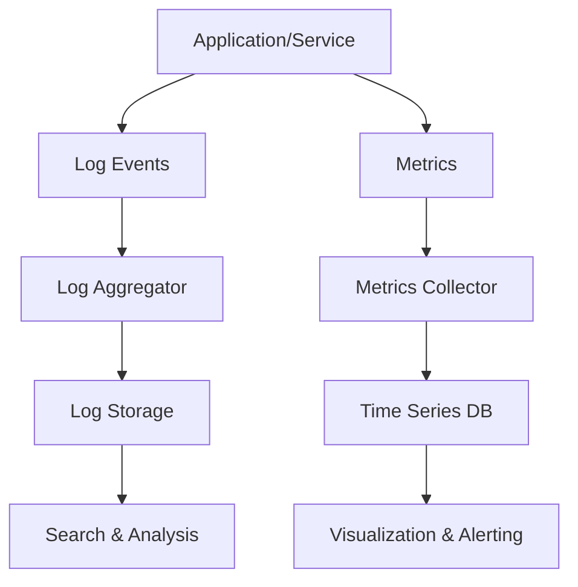

# Monitoring and Logging

## Overview

Monitoring and logging are critical for maintaining reliable, performant systems. Monitoring provides real-time insights into system health and performance, while logging captures historical data for debugging and auditing.

## Detailed Explanation

### Monitoring

Monitoring tracks key metrics such as CPU utilization, memory usage, disk I/O, network traffic, and application-specific KPIs like response times and error rates.

- **Types of Monitoring**:
  - Infrastructure: Hardware and OS metrics.
  - Application: Code-level performance.
  - Business: User engagement and revenue.

- **Tools**: Prometheus for metrics collection, Grafana for visualization, Nagios for alerting.

### Logging

Logging involves recording events with context, including timestamps, severity levels (DEBUG, INFO, WARN, ERROR, FATAL), and structured data.

- **Best Practices**:
  - Use structured logging (JSON format).
  - Implement log rotation to manage disk space.
  - Centralize logs for distributed systems.

- **Tools**: ELK Stack (Elasticsearch, Logstash, Kibana), Splunk, Fluentd.

### Monitoring vs Logging

| Aspect | Monitoring | Logging |
|--------|------------|---------|
| Purpose | Real-time health check | Historical event recording |
| Data Type | Metrics (numbers) | Messages (text) |
| Use Case | Alerting on thresholds | Debugging issues |



## Real-world Examples & Use Cases

- **Web Application**: Monitor API response times and log user authentication failures to detect security breaches.
- **Microservices Architecture**: Use distributed tracing (e.g., Jaeger) combined with logging to trace requests across services.
- **Cloud Infrastructure**: Leverage AWS CloudWatch or Azure Monitor for automated scaling based on metrics and centralized logging.

## Code Examples

### Java: Structured Logging with Logback

```java
import org.slf4j.Logger;
import org.slf4j.LoggerFactory;

public class UserService {
    private static final Logger logger = LoggerFactory.getLogger(UserService.class);

    public void authenticateUser(String username) {
        logger.info("Authenticating user: {}", username);
        try {
            // Authentication logic
            logger.debug("User {} authenticated successfully", username);
        } catch (Exception e) {
            logger.error("Authentication failed for user: {}", username, e);
        }
    }
}
```

### Python: Logging with Metrics

```python
import logging
import time

logger = logging.getLogger(__name__)

def process_request(request_id):
    start_time = time.time()
    logger.info("Processing request %s", request_id)
    # Simulate processing
    time.sleep(0.1)
    duration = time.time() - start_time
    logger.info("Request %s processed in %.2f seconds", request_id, duration)
    # In a real system, send duration to metrics system like Prometheus
```

## References

- [Prometheus: Monitoring and Alerting](https://prometheus.io/)
- [ELK Stack Documentation](https://www.elastic.co/elastic-stack)
- [Logging Best Practices](https://12factor.net/logs)

## Github-README Links & Related Topics

- [Async Logging](../async-logging/README.md)
- [Infrastructure Monitoring](../infrastructure-monitoring/README.md)
- [Logging Frameworks](../logging-frameworks/README.md)
- [DevOps & Infrastructure as Code](../devops-infrastructure-as-code/README.md)
