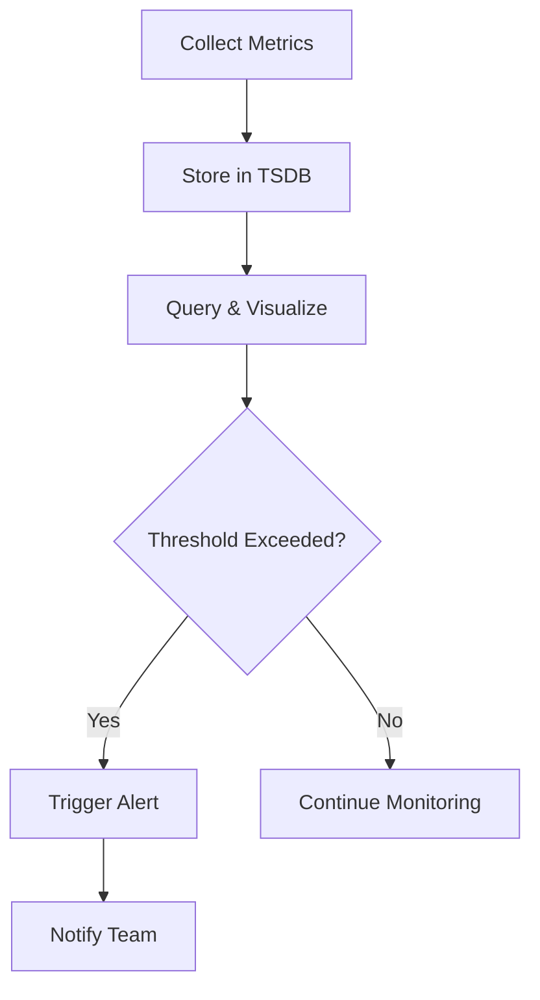
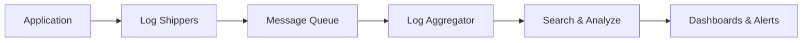

# Overview

Monitoring and logging are essential practices in system design and operations for ensuring reliability, performance, and maintainability of software systems. Monitoring involves collecting, analyzing, and alerting on metrics and health indicators of systems in real-time. Logging captures detailed records of events, errors, and transactions for debugging, auditing, and analysis. Together, they form the foundation of observability, enabling teams to understand system behavior, detect issues proactively, and respond to incidents effectively. As systems scale, robust monitoring and logging become critical to maintain service level objectives (SLOs) and service level agreements (SLAs).

# Detailed Explanation

## Monitoring

Monitoring tracks the health, performance, and availability of systems through quantitative measurements called metrics. Key aspects include:

### Types of Monitoring
- **Infrastructure Monitoring**: CPU, memory, disk, network usage.
- **Application Monitoring**: Response times, error rates, throughput.
- **Business Monitoring**: User engagement, revenue metrics.
- **Synthetic Monitoring**: Simulated user interactions to test availability.

### Key Metrics
| Metric Type | Examples | Tools |
|-------------|----------|-------|
| Counters | Request count, error count | Prometheus |
| Gauges | Current CPU usage, queue length | Grafana |
| Histograms | Request latency distribution | StatsD |
| Summaries | Request duration percentiles | New Relic |

### Alerting
Alerts notify operators of anomalies. Effective alerting uses thresholds, anomaly detection, and escalation policies to avoid alert fatigue.



## Logging

Logging records discrete events and messages from applications and systems. Logs provide context for debugging and forensic analysis.

### Logging Levels
- **DEBUG**: Detailed information for development.
- **INFO**: General information about operations.
- **WARN**: Potentially harmful situations.
- **ERROR**: Error conditions.
- **FATAL**: Severe errors causing termination.

### Structured Logging
Modern logging uses structured formats (JSON) for better searchability and analysis.

### Log Aggregation
Centralized log collection and storage for distributed systems.



## Observability Pillars
Monitoring and logging contribute to the three pillars of observability:
- **Metrics**: Quantitative data (monitoring).
- **Logs**: Qualitative data (logging).
- **Traces**: Request flow across services.

## Challenges
- **Data Volume**: Managing high-volume logs and metrics.
- **Cost**: Storage and processing costs for large-scale systems.
- **Privacy**: Ensuring logs don't contain sensitive data.
- **Correlation**: Linking metrics, logs, and traces for root cause analysis.

# Real-world Examples & Use Cases

| System | Monitoring Tool | Logging Tool | Use Case |
|--------|-----------------|--------------|----------|
| Netflix | Atlas (metrics) | ELK Stack | Real-time performance monitoring for streaming |
| Amazon | CloudWatch | AWS CloudTrail | Infrastructure and application monitoring |
| Google | Borgmon | Stackdriver | Large-scale cluster monitoring |
| Uber | M3 (metrics) | Kafka + Elasticsearch | Ride-sharing platform observability |
| Twitter | Metrics Dashboard | Scribe | Social media analytics and incident response |

## Case Study: E-commerce Platform
An e-commerce site uses Prometheus for metrics (order rates, payment failures), ELK for logs (user actions, errors), and Jaeger for traces (checkout flow). This setup enables quick detection of payment gateway issues and user experience degradation.

# Code Examples

## Structured Logging in Python

```python
import logging
import json
import sys

# Configure structured logging
logging.basicConfig(
    level=logging.INFO,
    format='%(asctime)s %(levelname)s %(message)s',
    handlers=[logging.StreamHandler(sys.stdout)]
)

logger = logging.getLogger(__name__)

def process_order(order_id, user_id):
    logger.info("Processing order", extra={
        "order_id": order_id,
        "user_id": user_id,
        "action": "start"
    })
    try:
        # Simulate processing
        result = "success"
        logger.info("Order processed successfully", extra={
            "order_id": order_id,
            "result": result
        })
    except Exception as e:
        logger.error("Order processing failed", extra={
            "order_id": order_id,
            "error": str(e)
        })

# Usage
process_order("12345", "user_678")
```

## Metrics Collection with Prometheus Client in Java

```java
import io.prometheus.client.Counter;
import io.prometheus.client.Histogram;
import io.prometheus.client.exporter.HTTPServer;

public class MetricsExample {
    private static final Counter requests = Counter.build()
            .name("http_requests_total")
            .help("Total number of HTTP requests")
            .labelNames("method", "endpoint")
            .register();

    private static final Histogram requestLatency = Histogram.build()
            .name("http_request_duration_seconds")
            .help("HTTP request duration in seconds")
            .labelNames("method", "endpoint")
            .register();

    public static void main(String[] args) throws Exception {
        HTTPServer server = new HTTPServer(8080);

        // Simulate request handling
        handleRequest("GET", "/api/users");

        // Keep server running
        Thread.currentThread().join();
    }

    private static void handleRequest(String method, String endpoint) {
        requests.labels(method, endpoint).inc();

        Histogram.Timer timer = requestLatency.labels(method, endpoint).startTimer();
        try {
            // Simulate work
            Thread.sleep(100);
        } catch (InterruptedException e) {
            Thread.currentThread().interrupt();
        } finally {
            timer.observeDuration();
        }
    }
}
```

## Log Aggregation with Filebeat and Elasticsearch

```yaml
# filebeat.yml configuration
filebeat.inputs:
- type: log
  paths:
    - /var/log/application/*.log
  json.keys_under_root: true

output.elasticsearch:
  hosts: ["localhost:9200"]
  index: "app-logs-%{+yyyy.MM.dd}"
```

# References

- [Observability - Wikipedia](https://en.wikipedia.org/wiki/Observability)
- [Monitoring and Logging - AWS Well-Architected Framework](https://aws.amazon.com/architecture/well-architected-framework/)
- [Prometheus Documentation](https://prometheus.io/docs/)
- [ELK Stack Guide](https://www.elastic.co/guide/en/elastic-stack/current/elastic-stack.html)
- [Google SRE Book: Monitoring](https://sre.google/sre-book/monitoring/)
- [CNCF Observability Landscape](https://landscape.cncf.io/card-mode?category=observability-and-analysis)

# Github-README Links & Related Topics

- [Observability Logs Metrics Traces](../observability-logs-metrics-traces/README.md)
- [Distributed Tracing and Observability](../distributed-tracing-and-observability/README.md)
- [Logging and Monitoring](../logging-and-monitoring/README.md)
- [Async Logging](../async-logging/README.md)
- [Fault Tolerance Patterns](../fault-tolerance-patterns/README.md)
- [Performance Tuning and Profiling](../../java/performance-tuning-and-profiling/README.md)