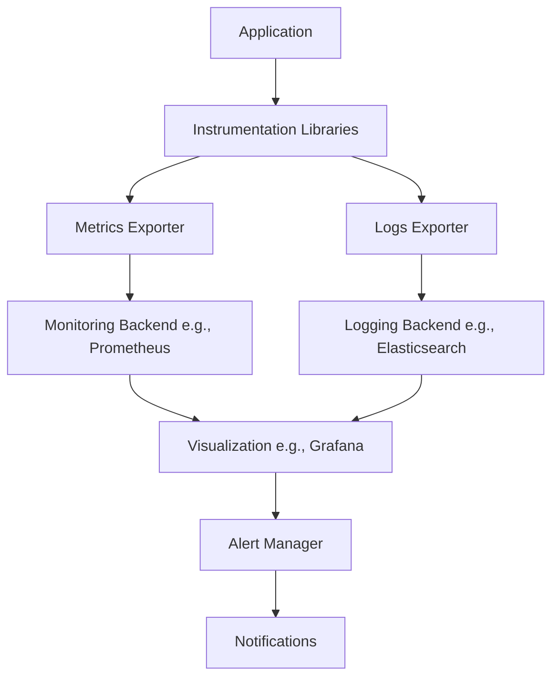
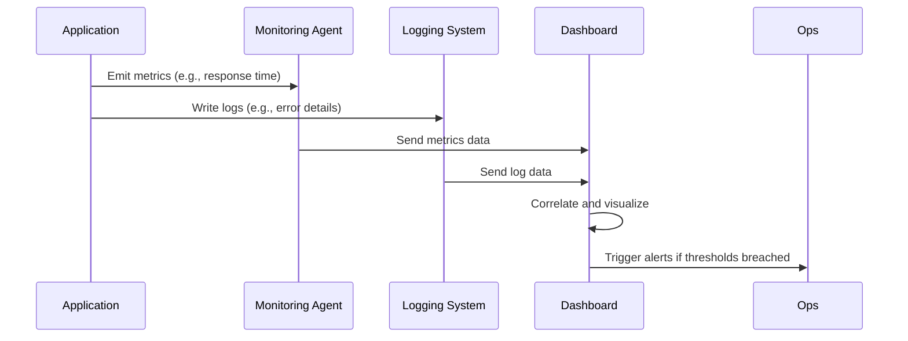

# Overview

Monitoring and logging are essential practices in system design and DevOps for ensuring reliability, performance, and observability of applications and infrastructure. Monitoring involves collecting, analyzing, and visualizing metrics to track system health, while logging captures events, errors, and operational data for debugging and auditing. Together, they enable proactive issue detection, root cause analysis, and informed decision-making.

# Detailed Explanation

## Monitoring

Monitoring focuses on quantitative data about system behavior. Key components include:

- **Metrics**: Numerical measurements collected over time, such as CPU usage, response times, or error rates.
- **Alerting**: Automated notifications when metrics exceed thresholds, enabling rapid response to issues.
- **Visualization**: Dashboards and graphs for real-time and historical data analysis.

Monitoring can be application-level (e.g., request latency) or infrastructure-level (e.g., server uptime).

## Logging

Logging records qualitative events and messages. Key aspects include:

- **Log Levels**: Hierarchical severity indicators (e.g., DEBUG, INFO, WARN, ERROR) to filter and prioritize messages.
- **Structured vs. Unstructured**: Structured logs use consistent formats like JSON for easier parsing; unstructured logs are free-form text.
- **Correlation**: Linking logs with traces and metrics for end-to-end observability.

Logging supports debugging, compliance, and performance analysis.

## Integration

Monitoring and logging complement each other: metrics provide high-level insights, while logs offer detailed context. Tools like OpenTelemetry enable unified collection and correlation.

## Architecture



# Real-world Examples & Use Cases

- **E-commerce Platform**: Monitor API response times and error rates to detect bottlenecks during peak traffic. Log user authentication events for security audits.
- **Microservices Architecture**: Use distributed tracing with logs to track requests across services, identifying failures in payment processing.
- **Cloud Infrastructure**: Monitor server CPU and memory usage with alerts for scaling. Log deployment events for change tracking.
- **IoT Platform**: Monitor device connectivity and battery levels. Log sensor data anomalies for predictive maintenance.

# Code Examples

## Python Logging with Structured Output

```python
import logging
import json

# Configure structured logging
logging.basicConfig(level=logging.INFO, format='%(asctime)s - %(name)s - %(levelname)s - %(message)s')

logger = logging.getLogger(__name__)

# Log structured data
logger.info(json.dumps({
    "event": "user_login",
    "user_id": 12345,
    "timestamp": "2025-09-26T10:00:00Z",
    "ip": "192.168.1.1"
}))
```

## Java Metrics with Micrometer

```java
import io.micrometer.core.instrument.Counter;
import io.micrometer.core.instrument.MeterRegistry;
import org.springframework.stereotype.Service;

@Service
public class UserService {
    private final Counter loginAttempts;

    public UserService(MeterRegistry registry) {
        this.loginAttempts = Counter.builder("user_login_attempts")
                .description("Number of login attempts")
                .register(registry);
    }

    public void login(String username) {
        loginAttempts.increment();
        // Login logic
    }
}
```

## Node.js Logging with Winston

```javascript
const winston = require('winston');

const logger = winston.createLogger({
  level: 'info',
  format: winston.format.json(),
  transports: [
    new winston.transports.Console(),
    new winston.transports.File({ filename: 'error.log', level: 'error' }),
  ],
});

logger.info('User login attempt', { userId: 12345, ip: '192.168.1.1' });
```

# References

- [OpenTelemetry Observability Primer](https://opentelemetry.io/docs/concepts/observability-primer/)
- [OpenTelemetry Logs](https://opentelemetry.io/docs/concepts/signals/logs/)
- [Prometheus Overview](https://prometheus.io/docs/introduction/overview/)
- [ELK Stack Documentation](https://www.elastic.co/guide/en/elastic-stack/current/elastic-stack.html)
- [CNCF Observability Landscape](https://landscape.cncf.io/card-mode?category=observability-and-analysis&grouping=category)
- [AWS CloudWatch Documentation](https://docs.aws.amazon.com/cloudwatch/)
- [Google Cloud Monitoring](https://cloud.google.com/monitoring)

# Github-README Links & Related Topics

- [Infrastructure Monitoring](./infrastructure-monitoring/)
- [Async Logging](./async-logging/)
- [Distributed Tracing](./distributed-tracing/)
- [CI/CD Pipelines](./ci-cd-pipelines/)

# Tools & Libraries

| Tool/Library | Purpose | Key Features |
|--------------|---------|--------------|
| Prometheus | Metrics collection and alerting | Time-series database, PromQL queries, service discovery |
| Grafana | Visualization | Dashboards, alerting, data source integration |
| ELK Stack (Elasticsearch, Logstash, Kibana) | Log aggregation and analysis | Full-text search, real-time indexing, visualizations |
| OpenTelemetry | Unified observability | Instrumentation, correlation of logs/metrics/traces |
| Micrometer | Application metrics | Vendor-neutral facade for metrics libraries |

# Common Pitfalls & Edge Cases

- **Over-logging**: Excessive logs can impact performance and storage; use appropriate levels and sampling.
- **Missing Metrics**: Failing to monitor critical KPIs leads to undetected issues; define SLIs/SLOs early.
- **Log Format Inconsistency**: Mixed structured/unstructured logs complicate parsing; standardize on JSON.
- **Alert Fatigue**: Too many false positives; tune thresholds and use anomaly detection.
- **Data Retention**: Logs and metrics accumulate; implement rotation and archiving policies.

# Journey / Sequence



1. Instrument code with metrics and logging libraries.
2. Configure collectors (e.g., Prometheus, OpenTelemetry Collector).
3. Set up storage and visualization (e.g., Grafana).
4. Define alerts and dashboards.
5. Monitor, iterate, and scale.

# Data Models / Message Formats

## Log Formats

- **JSON**: `{"timestamp": "2025-09-26T10:00:00Z", "level": "INFO", "message": "User logged in", "user_id": 12345}`
- **Syslog**: `<priority>timestamp hostname app: message`
- **CLF**: `127.0.0.1 - user [timestamp] "GET /path HTTP/1.1" 200 1234`

## Log Levels

| Level | Description | Use Case |
|-------|-------------|----------|
| DEBUG | Detailed diagnostic information | Development and troubleshooting |
| INFO | General information about application operation | Normal operations |
| WARN | Potentially harmful situations | Non-critical issues |
| ERROR | Error conditions | Failures that don't stop the application |
| FATAL | Severe errors causing application termination | Critical failures |

## Metric Types

| Type | Description | Example |
|------|-------------|---------|
| Counter | Monotonically increasing value | HTTP requests served |
| Gauge | Value that can go up or down | Current CPU usage |
| Histogram | Distribution of values | Request latency percentiles |
| Summary | Similar to histogram, with quantiles | Response time quantiles |

# STAR Summary

**Situation**: In a high-traffic e-commerce site, response times spiked during a sale event, leading to user complaints.

**Task**: Identify and resolve the performance bottleneck using monitoring and logging.

**Action**: Reviewed metrics in Grafana showing high database query latency. Correlated with logs in Kibana revealing slow SQL queries. Optimized queries and added database indexes.

**Result**: Response times improved by 40%, reducing complaints and increasing sales conversion. Established ongoing monitoring for proactive alerts.