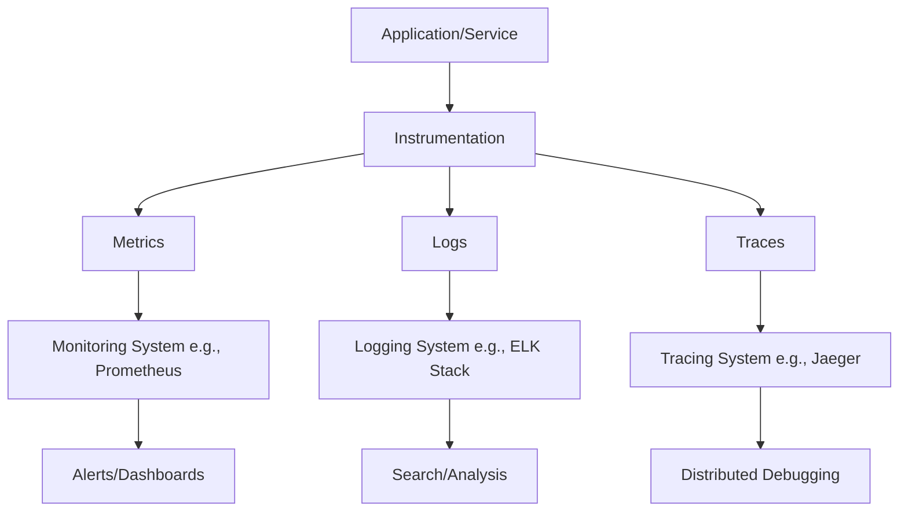
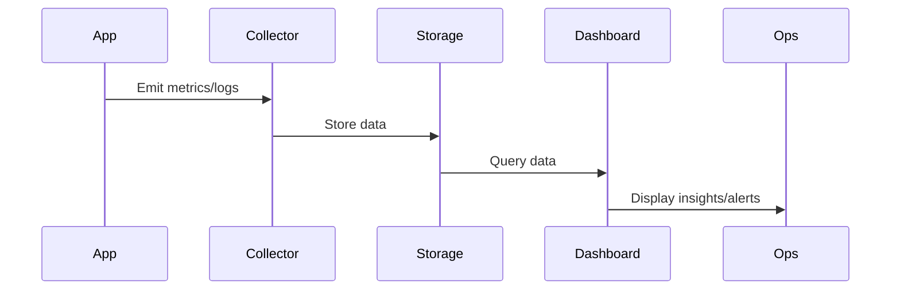

## Overview

Monitoring and logging are fundamental practices in system design and DevOps, enabling observability—the ability to understand a system's internal state from its external outputs. Monitoring involves tracking system performance, health, and behavior through metrics, alerts, and dashboards. Logging captures detailed records of events, errors, and transactions for debugging, auditing, and analysis. Together, they ensure reliability, facilitate troubleshooting, and support proactive maintenance in distributed systems.

## Detailed Explanation

### Monitoring

Monitoring collects and analyzes data about system performance and health. Key components include:

- **Metrics**: Numerical measurements (e.g., CPU usage, request latency, error rates) collected over time.
- **Alerts**: Notifications triggered when metrics exceed thresholds, enabling rapid response to issues.
- **Dashboards**: Visual representations of metrics for real-time insights.

Monitoring helps answer questions like "Is the system performing as expected?" and "Where are the bottlenecks?"

### Logging

Logging records events occurring in a system, providing a chronological audit trail. Types include:

- **Event Logs**: Record system activities, errors, and user interactions for debugging and analysis.
- **Transaction Logs**: Track database changes for recovery and consistency.
- **Message Logs**: Capture communications in chat systems or multiplayer games.
- **Server Logs**: Document web server requests, including IP addresses, timestamps, and HTTP codes.

Logs are stored in files, databases, or dedicated systems like ELK Stack.

### Relationship to Observability

Observability encompasses monitoring, logging, and tracing to provide a holistic view. OpenTelemetry standardizes signals (metrics, logs, traces) for vendor-neutral instrumentation.



## Real-world Examples & Use Cases

1. **E-commerce Platform**: Monitor API response times with Prometheus; log user transactions for fraud detection.
2. **Microservices Architecture**: Use centralized logging (e.g., ELK) to correlate events across services during outages.
3. **Database Systems**: Transaction logs ensure data consistency; event logs track query performance.
4. **Web Servers**: Server logs analyze traffic patterns; metrics alert on high error rates.
5. **IoT Systems**: Log sensor data; monitor device connectivity and battery levels.

| Use Case | Monitoring Focus | Logging Focus |
|----------|------------------|---------------|
| Web Application | Latency, throughput | Request errors, user actions |
| Database | Query performance, locks | Transaction commits, rollbacks |
| Network | Bandwidth, packet loss | Connection attempts, failures |
| Security | Failed logins, anomalies | Audit trails, intrusion attempts |

## Code Examples

### Java Logging with SLF4J

```java
import org.slf4j.Logger;
import org.slf4j.LoggerFactory;

public class ExampleService {
    private static final Logger logger = LoggerFactory.getLogger(ExampleService.class);

    public void processRequest(String request) {
        logger.info("Processing request: {}", request);
        try {
            // Business logic
            logger.debug("Request processed successfully");
        } catch (Exception e) {
            logger.error("Error processing request", e);
        }
    }
}
```

### Python Logging

```python
import logging

logging.basicConfig(level=logging.INFO, format='%(asctime)s - %(levelname)s - %(message)s')
logger = logging.getLogger(__name__)

def handle_request(request):
    logger.info(f"Handling request: {request}")
    try:
        # Process request
        logger.debug("Request handled successfully")
    except Exception as e:
        logger.error(f"Error handling request: {e}")
```

### Prometheus Metrics in Java (Micrometer)

```java
import io.micrometer.core.instrument.MeterRegistry;
import io.micrometer.core.instrument.Counter;
import io.micrometer.core.instrument.Timer;

public class MetricsExample {
    private final Counter requestsTotal;
    private final Timer requestTimer;

    public MetricsExample(MeterRegistry registry) {
        this.requestsTotal = registry.counter("http_requests_total", "method", "GET");
        this.requestTimer = registry.timer("http_request_duration");
    }

    public void handleRequest() {
        requestsTotal.increment();
        requestTimer.record(() -> {
            // Simulate request processing
            try {
                Thread.sleep(100);
            } catch (InterruptedException e) {
                Thread.currentThread().interrupt();
            }
        });
    }
}
```

## STAR Summary

- **Situation**: System experiencing intermittent slowdowns.
- **Task**: Implement monitoring and logging to identify root causes.
- **Action**: Deploy Prometheus for metrics, ELK Stack for logs; instrument code with OpenTelemetry.
- **Result**: Reduced downtime by 50%; proactive alerts prevented outages.

## Journey / Sequence

1. **Instrument Application**: Add logging and metrics collection.
2. **Collect Data**: Use agents/exporters to gather metrics and logs.
3. **Store and Process**: Send to monitoring/logging systems (e.g., Prometheus, Elasticsearch).
4. **Analyze and Alert**: Query data, set up dashboards and alerts.
5. **Iterate**: Refine based on insights; automate responses.



## Data Models / Message Formats

- **Metrics**: Time-series data with labels (e.g., Prometheus format: `metric_name{label="value"} value timestamp`).
- **Logs**: Structured entries (e.g., JSON: `{"timestamp": "2023-01-01T00:00:00Z", "level": "INFO", "message": "Request processed", "service": "web"}`).
- **Traces**: Spans with attributes (e.g., OpenTelemetry span: ID, parent ID, start/end time, tags).

## Common Pitfalls & Edge Cases

- **Over-logging**: Excessive logs impact performance; use log levels (DEBUG, INFO, WARN, ERROR).
- **Metric Cardinality**: High label combinations cause storage issues; limit dynamic labels.
- **Log Rotation**: Unmanaged logs fill disks; implement rotation and retention policies.
- **Distributed Tracing Gaps**: Missing instrumentation in microservices leads to incomplete traces.
- **Security**: Logs may contain sensitive data; redact or encrypt.
- **Alert Fatigue**: Too many false positives; tune thresholds carefully.

## Tools & Libraries

| Category | Tools/Libraries | Description |
|----------|-----------------|-------------|
| Monitoring | Prometheus, Grafana, Datadog | Metrics collection, visualization, alerting |
| Logging | ELK Stack (Elasticsearch, Logstash, Kibana), Splunk | Log aggregation, search, analysis |
| Tracing | Jaeger, Zipkin, OpenTelemetry | Distributed tracing |
| Libraries | Micrometer (Java), logging (Python), Winston (Node.js) | Instrumentation helpers |
| Alerting | Alertmanager, PagerDuty | Notification management |

## References

- [OpenTelemetry Observability Primer](https://opentelemetry.io/docs/concepts/observability-primer/)
- [Prometheus Overview](https://prometheus.io/docs/introduction/overview/)
- [Elastic Stack Get Started](https://www.elastic.co/guide/en/elastic-stack-get-started/current/get-started-elastic-stack.html)
- [Monitoring (computing) - Wikipedia](https://en.wikipedia.org/wiki/Monitoring_(computing))
- [Computer data logging - Wikipedia](https://en.wikipedia.org/wiki/Computer_data_logging)

## Github-README Links & Related Topics

- [Async Logging](async-logging/README.md)
- [Logging with ELK Stack](logging-with-elk-stack/README.md)
- [Distributed Tracing](distributed-tracing/README.md)
- [Infrastructure Monitoring](infrastructure-monitoring/README.md)
- [CI/CD Pipelines](ci-cd-pipelines/README.md)
- [Chaos Engineering](chaos-engineering/README.md)