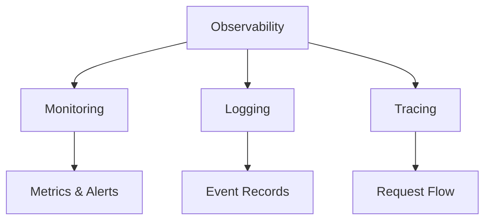

## Overview

Monitoring and logging are critical components of system observability, enabling teams to track system health, diagnose issues, and ensure reliable operation. Monitoring provides real-time insights into system performance and behavior, while logging captures detailed records of events and errors for analysis and debugging.

## Detailed Explanation

### Monitoring

Monitoring involves collecting, analyzing, and alerting on metrics from systems, applications, and infrastructure to ensure optimal performance and availability.

**Types of Monitoring:**
- **Infrastructure Monitoring**: CPU, memory, disk, network usage
- **Application Monitoring**: Response times, error rates, throughput
- **Business Monitoring**: User engagement, revenue metrics, conversion rates
- **Synthetic Monitoring**: Simulated user interactions to test availability

**Key Metrics:**
- **Availability**: Uptime percentage, SLA compliance
- **Performance**: Latency, throughput, error rates
- **Resource Utilization**: CPU, memory, disk, network
- **Business KPIs**: Conversion rates, user satisfaction

### Logging

Logging involves recording events, errors, and operational information to provide audit trails and debugging capabilities.

**Logging Levels:**
- **DEBUG**: Detailed diagnostic information
- **INFO**: General information about application operation
- **WARN**: Potentially harmful situations
- **ERROR**: Error conditions that don't stop execution
- **FATAL**: Severe errors that cause application termination

**Logging Best Practices:**
- **Structured Logging**: Consistent format with key-value pairs
- **Log Aggregation**: Centralized collection from multiple sources
- **Log Rotation**: Automatic archiving and cleanup
- **Contextual Information**: Include request IDs, user IDs, timestamps

### Observability

Observability combines monitoring, logging, and tracing to provide comprehensive system visibility.

**Three Pillars:**
- **Metrics**: Quantitative measurements
- **Logs**: Qualitative event records
- **Traces**: Request flow through distributed systems



## Real-world Examples & Use Cases

- **E-commerce Platform**: Monitor checkout flow latency, log failed transactions, alert on high error rates during peak traffic.
- **Microservices Architecture**: Distributed tracing for request flows, centralized logging for debugging inter-service issues.
- **Cloud Infrastructure**: Auto-scaling based on CPU metrics, log analysis for security incidents.
- **Financial Services**: Real-time monitoring of transaction processing, audit logging for compliance.

## Code Examples

### Java Logging with SLF4J

```java
import org.slf4j.Logger;
import org.slf4j.LoggerFactory;

public class UserService {
    private static final Logger logger = LoggerFactory.getLogger(UserService.class);

    public User getUser(String userId) {
        logger.debug("Fetching user with ID: {}", userId);

        try {
            User user = userRepository.findById(userId);
            logger.info("Successfully retrieved user: {}", user.getUsername());
            return user;
        } catch (Exception e) {
            logger.error("Failed to retrieve user {}: {}", userId, e.getMessage(), e);
            throw e;
        }
    }
}
```

### Spring Boot Actuator for Monitoring

```java
// application.properties
management.endpoints.web.exposure.include=health,metrics,info
management.endpoint.health.show-details=always

// Custom metrics
@Service
public class OrderService {
    private final MeterRegistry meterRegistry;

    public OrderService(MeterRegistry meterRegistry) {
        this.meterRegistry = meterRegistry;
    }

    public void processOrder(Order order) {
        Counter.builder("orders_processed")
            .tag("status", "success")
            .register(meterRegistry)
            .increment();

        Timer.Sample sample = Timer.start(meterRegistry);
        // Process order
        sample.stop(Timer.builder("order_processing_time").register(meterRegistry));
    }
}
```

### ELK Stack Log Aggregation (Logstash Configuration)

```ruby
input {
  file {
    path => "/var/log/application/*.log"
    start_position => "beginning"
  }
}

filter {
  grok {
    match => { "message" => "%{TIMESTAMP_ISO8601:timestamp} %{LOGLEVEL:level} %{DATA:class} - %{GREEDYDATA:message}" }
  }
  date {
    match => ["timestamp", "ISO8601"]
  }
}

output {
  elasticsearch {
    hosts => ["localhost:9200"]
    index => "application-logs-%{+YYYY.MM.dd}"
  }
}
```

### Prometheus Metrics Collection

```yaml
# prometheus.yml
global:
  scrape_interval: 15s

scrape_configs:
  - job_name: 'spring-boot-app'
    static_configs:
      - targets: ['localhost:8080']
    metrics_path: '/actuator/prometheus'
```

## Common Pitfalls & Edge Cases

- **Log Noise**: Excessive logging overwhelming systems; use appropriate log levels.
- **Metric Cardinality**: High-cardinality metrics causing performance issues; avoid unbounded tags.
- **Alert Fatigue**: Too many alerts leading to ignored warnings; define clear alert thresholds.
- **Distributed Tracing Complexity**: Overhead in highly distributed systems; sample requests strategically.
- **Edge Case**: Log loss during system crashes; implement durable logging with buffering.

## Tools & Libraries

- **Monitoring**: Prometheus, Grafana, Nagios, Zabbix
- **Logging**: ELK Stack (Elasticsearch, Logstash, Kibana), Splunk, Fluentd
- **Tracing**: Jaeger, Zipkin, OpenTelemetry
- **Application Metrics**: Micrometer, Dropwizard Metrics, StatsD

## References

- [Monitoring Distributed Systems](https://www.oreilly.com/library/view/monitoring-distributed-systems/9781492035147/)
- [Site Reliability Engineering](https://sre.google/sre-book/table-of-contents/)
- [The Three Pillars of Observability](https://www.oreilly.com/library/view/distributed-systems-observability/9781492033433/)
- [Prometheus Documentation](https://prometheus.io/docs/)
- [ELK Stack Guide](https://www.elastic.co/guide/en/elastic-stack-get-started/current/get-started-elastic-stack.html)

## Github-README Links & Related Topics

- [Infrastructure Monitoring](infrastructure-monitoring/README.md)
- [Distributed Tracing](distributed-tracing/README.md)
- [Logging Frameworks](logging-frameworks/README.md)
- [Async Logging](async-logging/README.md)
- [Fault Tolerance in Distributed Systems](fault-tolerance-in-distributed-systems/README.md)
