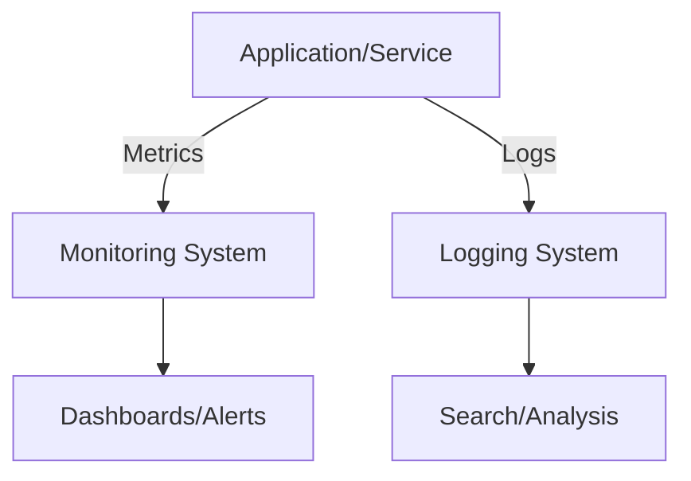

## Overview

Monitoring and logging are essential practices for maintaining, troubleshooting, and optimizing software systems. Monitoring involves collecting metrics and health data in real-time, while logging captures detailed records of events for analysis. Together, they provide visibility into system behavior, performance, and issues.

## Detailed Explanation

### Monitoring

Monitoring tracks system health through metrics like CPU usage, memory, response times, and error rates. It uses tools to collect, aggregate, and visualize data, enabling proactive issue detection.

Types:
- **Infrastructure Monitoring**: Server resources, network traffic.
- **Application Monitoring**: Code performance, user interactions.
- **Business Monitoring**: Revenue, user engagement.

### Logging

Logging records events with timestamps, levels (INFO, WARN, ERROR), and context. Logs help debug issues, audit actions, and analyze trends.

Best Practices:
- Structured logging (JSON format) for searchability.
- Log levels to control verbosity.
- Centralized logging for distributed systems.



## Real-world Examples & Use Cases

- **E-commerce Platform**: Monitor checkout latency; log failed transactions for fraud detection.
- **Microservices Architecture**: Centralized logging across services; monitor inter-service calls.
- **Cloud Infrastructure**: Auto-scale based on metrics; log security events.
- **IoT Systems**: Monitor device health; log sensor data anomalies.

## Code Examples

### Prometheus Metrics (Java)

```java
import io.prometheus.client.Counter;
import io.prometheus.client.Histogram;

public class MonitoringExample {
    static final Counter requests = Counter.build()
        .name("http_requests_total")
        .help("Total requests.")
        .register();

    static final Histogram requestLatency = Histogram.build()
        .name("http_request_duration_seconds")
        .help("Request latency in seconds.")
        .register();

    public void handleRequest() {
        requests.inc();
        Histogram.Timer timer = requestLatency.startTimer();
        // Process request
        timer.observeDuration();
    }
}
```

### Log4j2 Logging (Java)

```java
import org.apache.logging.log4j.LogManager;
import org.apache.logging.log4j.Logger;

public class LoggingExample {
    private static final Logger logger = LogManager.getLogger(LoggingExample.class);

    public void processData(String data) {
        logger.info("Processing data: {}", data);
        try {
            // Business logic
            logger.debug("Data processed successfully");
        } catch (Exception e) {
            logger.error("Error processing data", e);
        }
    }
}
```

## STAR Summary

- **Situation**: Systems fail without visibility.
- **Task**: Implement monitoring and logging.
- **Action**: Deploy tools like Prometheus and ELK stack.
- **Result**: Faster issue resolution and improved reliability.

## Journey / Sequence

1. Define metrics and log formats.
2. Instrument code with monitoring libraries.
3. Set up collection and storage (e.g., Elasticsearch).
4. Create dashboards and alerts.
5. Analyze logs for patterns and optimize.

## Data Models / Message Formats

### Log Entry (JSON)

```json
{
  "timestamp": "2023-09-26T10:00:00Z",
  "level": "INFO",
  "service": "web-server",
  "message": "User login successful",
  "user_id": 12345,
  "ip": "192.168.1.1"
}
```

### Metric (Prometheus)

```
http_requests_total{method="GET",status="200"} 1024
```

## Common Pitfalls & Edge Cases

- **Log Flooding**: Excessive logs overwhelm storage; use sampling.
- **Metric Cardinality**: High unique label combinations cause performance issues.
- **Sensitive Data**: Avoid logging PII; sanitize logs.
- **Distributed Tracing**: Correlate logs across services.
- **Alert Fatigue**: Tune thresholds to reduce false positives.

## Tools & Libraries

| Tool | Purpose | Example |
|------|---------|---------|
| Prometheus | Metrics collection | Time-series DB |
| Grafana | Visualization | Dashboards |
| ELK Stack | Logging | Elasticsearch, Logstash, Kibana |
| Jaeger | Tracing | Distributed tracing |
| Splunk | Enterprise logging | Search and analytics |

## References

- [Monitoring Best Practices](https://www.datadoghq.com/blog/monitoring-best-practices/)
- [Logging Best Practices](https://12factor.net/logs)
- [Prometheus Docs](https://prometheus.io/docs/)
- [ELK Stack Guide](https://www.elastic.co/guide/en/elastic-stack-get-started/current/get-started-elastic-stack.html)

## Github-README Links & Related Topics

- [DevOps & Infrastructure as Code](./devops-and-infrastructure-as-code/)
- [Distributed Tracing](./distributed-tracing/)
- [Fault Tolerance](./fault-tolerance-in-distributed-systems/)
- [Async Logging](./async-logging/)