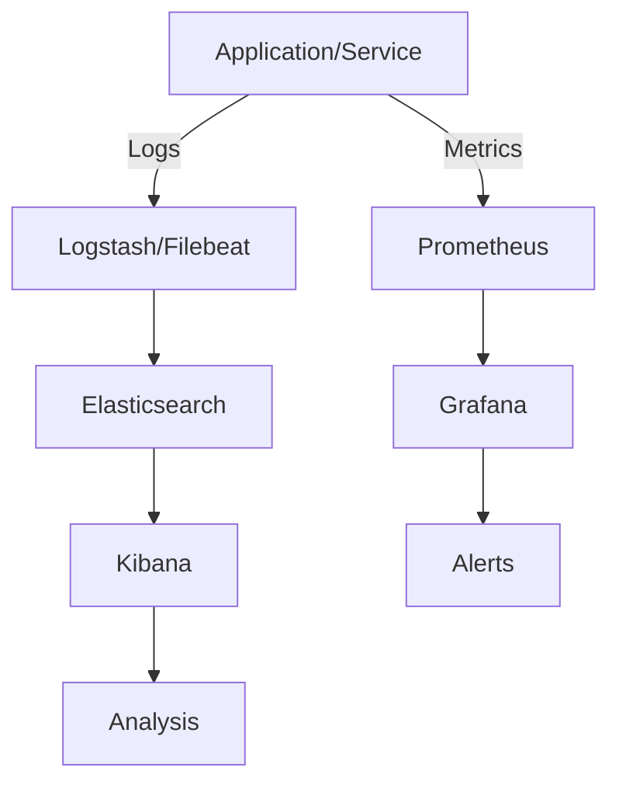
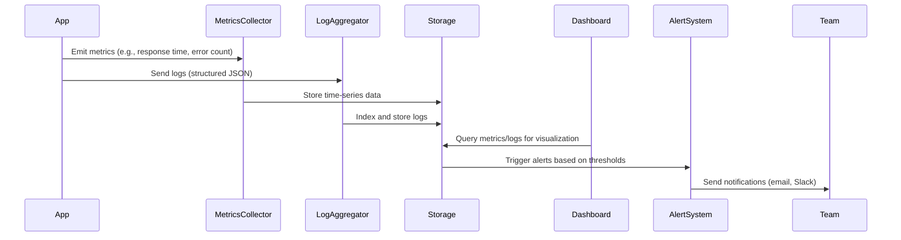

# Monitoring and Logging

## Overview

Monitoring and logging are critical components of system observability, enabling teams to track performance, diagnose issues, and maintain reliability in software systems. Monitoring focuses on real-time metrics and alerts, while logging provides historical records of events and errors.

## Detailed Explanation

### Monitoring

Monitoring involves collecting, analyzing, and visualizing key performance indicators (KPIs) such as CPU usage, memory consumption, network traffic, response times, and error rates. It helps in proactive issue detection and capacity planning.

Key components:
- **Metrics Collection**: Tools like Prometheus scrape metrics from applications.
- **Alerting**: Systems like Alertmanager notify teams of anomalies.
- **Visualization**: Dashboards in Grafana display trends and anomalies.

### Logging

Logging captures discrete events, messages, and errors generated by applications. Logs are categorized by severity levels (DEBUG, INFO, WARN, ERROR) and can be structured (e.g., JSON) for better searchability.

Best practices:
- Use structured logging for consistency.
- Centralize logs using aggregators like ELK (Elasticsearch, Logstash, Kibana).
- Implement log rotation to manage storage.



## STAR Summary

**Situation**: A high-traffic e-commerce website experiences intermittent slowdowns during peak hours, leading to customer complaints and lost revenue.

**Task**: Implement comprehensive monitoring and logging to identify performance bottlenecks and ensure 99.9% uptime.

**Action**: Deploy Prometheus for metrics collection, Grafana for visualization, and ELK stack for centralized logging. Configure alerts for CPU > 80%, response time > 500ms, and error rates > 1%. Implement structured logging in application code and set up log aggregation pipelines.

**Result**: Reduced mean time to resolution (MTTR) by 60%, achieved 99.95% uptime, and identified a database connection pool exhaustion issue that was causing slowdowns.

## Journey / Sequence



## Data Models / Message Formats

### Log Entry (JSON Format)
```json
{
  "timestamp": "2023-09-26T10:30:00Z",
  "level": "ERROR",
  "service": "payment-service",
  "trace_id": "abc123",
  "message": "Payment processing failed",
  "user_id": "user456",
  "error_code": "PAYMENT_DECLINED",
  "stack_trace": "..."
}
```

### Metrics Format (Prometheus Exposition)
```
# HELP http_requests_total Total number of HTTP requests
# TYPE http_requests_total counter
http_requests_total{method="GET",endpoint="/api/orders",status="200"} 1024
```

## Common Pitfalls & Edge Cases

| Pitfall | Description | Mitigation |
|---------|-------------|------------|
| Log Spamming | Excessive logging floods storage and obscures issues | Use appropriate log levels; implement log sampling |
| Metric Cardinality Explosion | High-dimensional metrics cause performance issues | Limit label combinations; use histograms instead of counters |
| Alert Fatigue | Too many false positives lead to ignored alerts | Fine-tune thresholds; use alert grouping and silencing |
| Distributed Tracing Gaps | Incomplete traces in microservices | Ensure trace propagation across all services |
| Log Data Privacy | Sensitive data in logs violates compliance | Implement log sanitization and masking |

## Tools & Libraries

| Category | Tool/Library | Description | Language/Framework |
|----------|--------------|-------------|-------------------|
| Monitoring | Prometheus | Time-series database and monitoring system | Go |
| Monitoring | Grafana | Visualization and dashboard tool | - |
| Logging | Elasticsearch | Search and analytics engine for logs | - |
| Logging | Logstash | Log processing pipeline | - |
| Logging | Kibana | UI for Elasticsearch | - |
| Logging | Fluentd | Unified logging layer | - |
| Application Metrics | Micrometer | Application metrics facade | Java, .NET, etc. |
| Application Logging | SLF4J | Logging facade for Java | Java |
| Application Logging | Winston | Versatile logging library | Node.js |
| Distributed Tracing | Jaeger | End-to-end distributed tracing | - |
| Distributed Tracing | Zipkin | Distributed tracing system | - |

## Real-world Examples & Use Cases

- **E-commerce Platform**: Monitor transaction throughput and latency; log failed payments for fraud detection.
- **Microservices Architecture**: Centralized logging across services to trace distributed requests and identify bottlenecks.
- **Cloud Infrastructure**: Use monitoring to auto-scale resources based on load metrics.

## Code Examples

### Java Logging with SLF4J

```java
import org.slf4j.Logger;
import org.slf4j.LoggerFactory;

public class PaymentService {
    private static final Logger logger = LoggerFactory.getLogger(PaymentService.class);

    public void processPayment(PaymentRequest request) {
        logger.info("Processing payment for user: {}", request.getUserId());
        try {
            // Payment logic
            logger.debug("Payment processed successfully");
        } catch (Exception e) {
            logger.error("Payment failed for user: {}", request.getUserId(), e);
        }
    }
}
```

### Monitoring with Micrometer (Spring Boot)

```java
import io.micrometer.core.instrument.MeterRegistry;
import io.micrometer.core.instrument.Counter;
import io.micrometer.core.instrument.Timer;
import org.springframework.stereotype.Service;

@Service
public class OrderService {
    private final Counter orderCounter;
    private final Timer orderTimer;

    public OrderService(MeterRegistry registry) {
        this.orderCounter = registry.counter("orders.total");
        this.orderTimer = registry.timer("orders.processing.time");
    }

    public void createOrder(Order order) {
        orderTimer.record(() -> {
            // Order creation logic
            orderCounter.increment();
        });
    }
}
```

## References

- [Prometheus Documentation](https://prometheus.io/docs/)
- [Grafana Guides](https://grafana.com/docs/)
- [ELK Stack Overview](https://www.elastic.co/guide/en/elastic-stack/current/elastic-stack.html)
- [SLF4J Manual](http://www.slf4j.org/manual.html)
- [Micrometer Documentation](https://micrometer.io/docs)

## Github-README Links & Related Topics

- [async-logging](async-logging/)
- [distributed-tracing](distributed-tracing/)
- [infrastructure-monitoring](infrastructure-monitoring/)
- [event-driven-architecture](event-driven-architecture/)