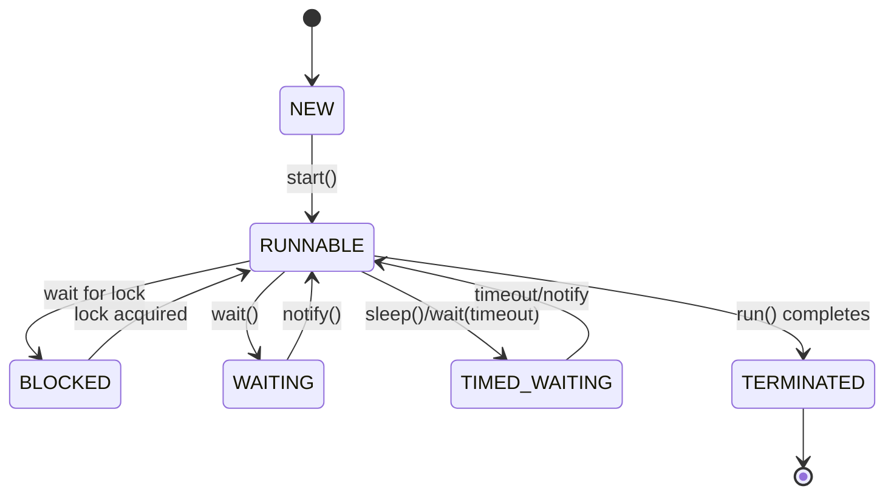

# Multithreading & Concurrency in Java

## Overview

Multithreading in Java enables concurrent execution of multiple threads within a single process, allowing programs to perform multiple tasks simultaneously. The Java concurrency utilities provide high-level abstractions for thread management, synchronization, and communication, making concurrent programming safer and more efficient.

## Detailed Explanation

### Thread Fundamentals

A thread is the smallest unit of execution within a process. Java threads can be created by:

- Extending the `Thread` class
- Implementing the `Runnable` interface (preferred)
- Using `Callable` for tasks that return results

#### Thread States

| State | Description |
|-------|-------------|
| NEW | Thread created but not started |
| RUNNABLE | Executing or ready to execute |
| BLOCKED | Waiting for monitor lock |
| WAITING | Waiting indefinitely for another thread |
| TIMED_WAITING | Waiting for specified time |
| TERMINATED | Execution completed |

### Synchronization Mechanisms

- **synchronized keyword**: Provides mutual exclusion and visibility guarantees
- **Lock interface**: More flexible locking with `ReentrantLock`
- **Atomic variables**: Lock-free thread-safe operations
- **Volatile keyword**: Ensures visibility of changes across threads

### Concurrency Utilities

The `java.util.concurrent` package provides:

- **ExecutorService**: Manages thread pools
- **Future/Callable**: Asynchronous computation with results
- **CountDownLatch**: Synchronization aid for waiting
- **CyclicBarrier**: Synchronization for fixed number of threads
- **Semaphore**: Controlling access to resources
- **Concurrent Collections**: Thread-safe collections



## Real-world Examples & Use Cases

- **Web Servers**: Handling multiple HTTP requests concurrently (e.g., Tomcat, Jetty)
- **GUI Applications**: Keeping UI responsive while performing background tasks
- **Data Processing**: Parallel processing of large datasets in big data applications
- **Game Development**: Separate threads for rendering, physics, and user input
- **Financial Systems**: Concurrent transaction processing with proper synchronization

## Code Examples

### Creating and Starting Threads

```java
// Extending Thread class
public class MyThread extends Thread {
    @Override
    public void run() {
        System.out.println("Thread " + Thread.currentThread().getName() + " is running");
    }
    
    public static void main(String[] args) {
        MyThread thread1 = new MyThread();
        MyThread thread2 = new MyThread();
        
        thread1.start(); // Starts thread1
        thread2.start(); // Starts thread2
        
        // Main thread continues
        System.out.println("Main thread finished");
    }
}
```

### Implementing Runnable

```java
public class RunnableExample implements Runnable {
    @Override
    public void run() {
        for (int i = 0; i < 5; i++) {
            System.out.println(Thread.currentThread().getName() + ": " + i);
            try {
                Thread.sleep(100);
            } catch (InterruptedException e) {
                e.printStackTrace();
            }
        }
    }
    
    public static void main(String[] args) {
        RunnableExample task = new RunnableExample();
        Thread thread1 = new Thread(task, "Thread-1");
        Thread thread2 = new Thread(task, "Thread-2");
        
        thread1.start();
        thread2.start();
    }
}
```

### Synchronization with synchronized

```java
public class SynchronizedCounter {
    private int count = 0;
    
    public synchronized void increment() {
        count++;
    }
    
    public synchronized void decrement() {
        count--;
    }
    
    public synchronized int getCount() {
        return count;
    }
    
    public static void main(String[] args) throws InterruptedException {
        SynchronizedCounter counter = new SynchronizedCounter();
        
        Thread t1 = new Thread(() -> {
            for (int i = 0; i < 1000; i++) {
                counter.increment();
            }
        });
        
        Thread t2 = new Thread(() -> {
            for (int i = 0; i < 1000; i++) {
                counter.decrement();
            }
        });
        
        t1.start();
        t2.start();
        t1.join();
        t2.join();
        
        System.out.println("Final count: " + counter.getCount()); // Should be 0
    }
}
```

### Using ExecutorService

```java
import java.util.concurrent.ExecutorService;
import java.util.concurrent.Executors;
import java.util.concurrent.Future;

public class ExecutorExample {
    public static void main(String[] args) {
        ExecutorService executor = Executors.newFixedThreadPool(3);
        
        // Submit Runnable tasks
        for (int i = 0; i < 5; i++) {
            final int taskId = i;
            executor.submit(() -> {
                System.out.println("Task " + taskId + " executed by " + Thread.currentThread().getName());
                try {
                    Thread.sleep(1000);
                } catch (InterruptedException e) {
                    Thread.currentThread().interrupt();
                }
            });
        }
        
        // Submit Callable task
        Future<Integer> future = executor.submit(() -> {
            Thread.sleep(2000);
            return 42;
        });
        
        try {
            System.out.println("Result: " + future.get());
        } catch (Exception e) {
            e.printStackTrace();
        }
        
        executor.shutdown();
        System.out.println("Executor shutdown");
    }
}
```

### Atomic Variables

```java
import java.util.concurrent.atomic.AtomicInteger;

public class AtomicExample {
    private static AtomicInteger counter = new AtomicInteger(0);
    
    public static void main(String[] args) throws InterruptedException {
        Runnable task = () -> {
            for (int i = 0; i < 1000; i++) {
                counter.incrementAndGet();
            }
        };
        
        Thread t1 = new Thread(task);
        Thread t2 = new Thread(task);
        
        t1.start();
        t2.start();
        t1.join();
        t2.join();
        
        System.out.println("Final counter: " + counter.get()); // Should be 2000
    }
}
```

## Common Pitfalls & Edge Cases

- **Race Conditions**: Unprotected access to shared mutable state
- **Deadlocks**: Circular waiting for locks; always acquire locks in consistent order
- **Starvation**: Threads unable to access resources due to other threads holding them
- **Livelocks**: Threads actively preventing each other from progressing
- **Memory Visibility**: Changes not visible across threads without proper synchronization
- **Thread Leaks**: Not properly shutting down thread pools

## Tools & Libraries

- **java.util.concurrent**: Comprehensive concurrency utilities
- **ThreadMXBean**: For monitoring thread information
- **VisualVM/JConsole**: GUI tools for thread monitoring and profiling
- **JMH (Java Microbenchmark Harness)**: For performance testing concurrent code
- **Concurrent Collections**: ConcurrentHashMap, CopyOnWriteArrayList, etc.

## References

- [Oracle Java Tutorials - Concurrency](https://docs.oracle.com/javase/tutorial/essential/concurrency/)
- [Java Concurrency in Practice](https://www.amazon.com/Java-Concurrency-Practice-Brian-Goetz/dp/0321349601)
- [Baeldung - Java Concurrency](https://www.baeldung.com/java-concurrency)
- [GeeksforGeeks - Multithreading in Java](https://www.geeksforgeeks.org/multithreading-in-java/)

## Github-README Links & Related Topics

- [Java Fundamentals](java-fundamentals/README.md)
- [Java ExecutorService](java-executorservice/README.md)
- [Java Synchronized Blocks](java-synchronized-blocks/README.md)
- [Java Atomic Variables](java-atomic-variables/README.md)
- [Java Memory Model](java-memory-model/README.md)