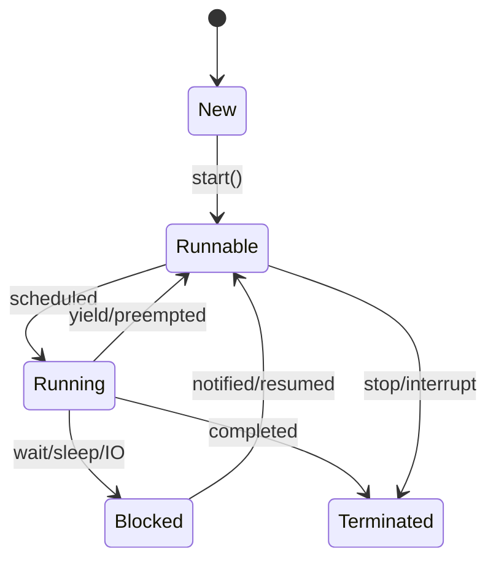

# Multithreading & Concurrency in Java

## Overview

Multithreading and concurrency in Java allow programs to execute multiple threads simultaneously, improving performance and responsiveness. Understanding thread lifecycle, synchronization, and concurrent data structures is crucial for writing safe and efficient concurrent programs.

## Detailed Explanation

### Thread Fundamentals

A thread is the smallest unit of execution within a process. Java provides built-in support for multithreaded programming.

#### Thread Lifecycle



#### Creating Threads

1. **Extending Thread class**
2. **Implementing Runnable interface**
3. **Using Executor framework**

### Synchronization

Synchronization ensures that only one thread can access a shared resource at a time, preventing race conditions.

#### Synchronized Methods and Blocks

```java
public synchronized void synchronizedMethod() {
    // Thread-safe code
}

public void method() {
    synchronized(this) {
        // Thread-safe code
    }
}
```

#### Locks

- **ReentrantLock**: More flexible than synchronized
- **ReadWriteLock**: Allows multiple readers, single writer

### Atomic Variables

Atomic classes provide thread-safe operations without synchronization.

```java
AtomicInteger counter = new AtomicInteger(0);
counter.incrementAndGet();
```

### Concurrent Collections

Thread-safe collections for concurrent access:

- **ConcurrentHashMap**: Thread-safe HashMap
- **CopyOnWriteArrayList**: Thread-safe ArrayList for read-heavy operations
- **BlockingQueue**: Thread-safe queue with blocking operations

### Executor Framework

High-level API for managing thread pools and asynchronous tasks.

```java
ExecutorService executor = Executors.newFixedThreadPool(10);
Future<String> future = executor.submit(() -> "Task result");
```

### Thread Communication

- **wait()**, **notify()**, **notifyAll()**: For inter-thread communication
- **CountDownLatch**: Allows threads to wait for each other
- **CyclicBarrier**: Synchronizes a fixed number of threads
- **Semaphore**: Controls access to a shared resource

## Real-world Examples & Use Cases

1. **Web Server**: Handling multiple client requests concurrently.
2. **Database Connection Pooling**: Managing database connections efficiently.
3. **File Processing**: Parallel processing of large files.
4. **GUI Applications**: Keeping UI responsive while performing background tasks.
5. **Real-time Data Processing**: Processing streaming data with multiple threads.

## Code Examples

### Creating and Starting Threads

```java
// Extending Thread class
public class MyThread extends Thread {
    @Override
    public void run() {
        System.out.println("Thread running: " + Thread.currentThread().getName());
    }
}

// Implementing Runnable
public class MyRunnable implements Runnable {
    @Override
    public void run() {
        System.out.println("Runnable running: " + Thread.currentThread().getName());
    }
}

public class ThreadExample {
    public static void main(String[] args) {
        // Using Thread class
        MyThread thread1 = new MyThread();
        thread1.start();
        
        // Using Runnable
        Thread thread2 = new Thread(new MyRunnable());
        thread2.start();
        
        // Using lambda
        Thread thread3 = new Thread(() -> {
            System.out.println("Lambda thread: " + Thread.currentThread().getName());
        });
        thread3.start();
    }
}
```

### Synchronization Example

```java
public class Counter {
    private int count = 0;
    
    public synchronized void increment() {
        count++;
    }
    
    public synchronized int getCount() {
        return count;
    }
}

public class SynchronizationExample {
    public static void main(String[] args) throws InterruptedException {
        Counter counter = new Counter();
        
        Runnable task = () -> {
            for (int i = 0; i < 1000; i++) {
                counter.increment();
            }
        };
        
        Thread thread1 = new Thread(task);
        Thread thread2 = new Thread(task);
        
        thread1.start();
        thread2.start();
        
        thread1.join();
        thread2.join();
        
        System.out.println("Final count: " + counter.getCount()); // Should be 2000
    }
}
```

### Producer-Consumer Problem

```java
import java.util.LinkedList;
import java.util.Queue;

public class ProducerConsumer {
    private static final int CAPACITY = 5;
    private final Queue<Integer> queue = new LinkedList<>();
    
    public synchronized void produce(int item) throws InterruptedException {
        while (queue.size() == CAPACITY) {
            wait();
        }
        queue.add(item);
        System.out.println("Produced: " + item);
        notifyAll();
    }
    
    public synchronized int consume() throws InterruptedException {
        while (queue.isEmpty()) {
            wait();
        }
        int item = queue.poll();
        System.out.println("Consumed: " + item);
        notifyAll();
        return item;
    }
    
    public static void main(String[] args) {
        ProducerConsumer pc = new ProducerConsumer();
        
        Thread producer = new Thread(() -> {
            for (int i = 0; i < 10; i++) {
                try {
                    pc.produce(i);
                    Thread.sleep(100);
                } catch (InterruptedException e) {
                    Thread.currentThread().interrupt();
                }
            }
        });
        
        Thread consumer = new Thread(() -> {
            for (int i = 0; i < 10; i++) {
                try {
                    pc.consume();
                    Thread.sleep(200);
                } catch (InterruptedException e) {
                    Thread.currentThread().interrupt();
                }
            }
        });
        
        producer.start();
        consumer.start();
    }
}
```

### Using ExecutorService

```java
import java.util.concurrent.ExecutorService;
import java.util.concurrent.Executors;
import java.util.concurrent.Future;

public class ExecutorExample {
    public static void main(String[] args) {
        ExecutorService executor = Executors.newFixedThreadPool(3);
        
        // Submit tasks
        Future<Integer> future1 = executor.submit(() -> {
            Thread.sleep(1000);
            return 1;
        });
        
        Future<Integer> future2 = executor.submit(() -> {
            Thread.sleep(2000);
            return 2;
        });
        
        Future<Integer> future3 = executor.submit(() -> {
            Thread.sleep(3000);
            return 3;
        });
        
        // Get results
        try {
            System.out.println("Result 1: " + future1.get());
            System.out.println("Result 2: " + future2.get());
            System.out.println("Result 3: " + future3.get());
        } catch (Exception e) {
            e.printStackTrace();
        }
        
        executor.shutdown();
    }
}
```

## Common Pitfalls & Edge Cases

1. **Race Conditions**: Multiple threads accessing shared data without proper synchronization.
2. **Deadlocks**: Threads waiting for each other indefinitely.
3. **Starvation**: A thread unable to gain access to shared resources.
4. **Memory Inconsistency**: Changes made by one thread not visible to others.
5. **Improper Exception Handling**: Uncaught exceptions in threads can terminate them silently.

## Tools & Libraries

- **Thread Dump Analysis**: Using jstack or VisualVM.
- **Java Concurrency Utilities**: java.util.concurrent package.
- **JMH (Java Microbenchmark Harness)**: For performance testing.
- **JCStress**: For testing concurrent algorithms.

## References

- [Oracle Concurrency Tutorial](https://docs.oracle.com/javase/tutorial/essential/concurrency/)
- [Java Concurrency in Practice by Brian Goetz](https://www.amazon.com/Java-Concurrency-Practice-Brian-Goetz/dp/0321349601)
- [Concurrent Programming in Java by Doug Lea](https://www.amazon.com/Concurrent-Programming-Java-Principles-Pattern/dp/0201310090)

## Github-README Links & Related Topics

- [Java Fundamentals](../java-fundamentals/README.md)
- [Concurrent Collections](../concurrent-collections/README.md)
- [Java Memory Model and Concurrency](../java-memory-model-and-concurrency/README.md)
- [Distributed Locks](../distributed-locks/README.md)
