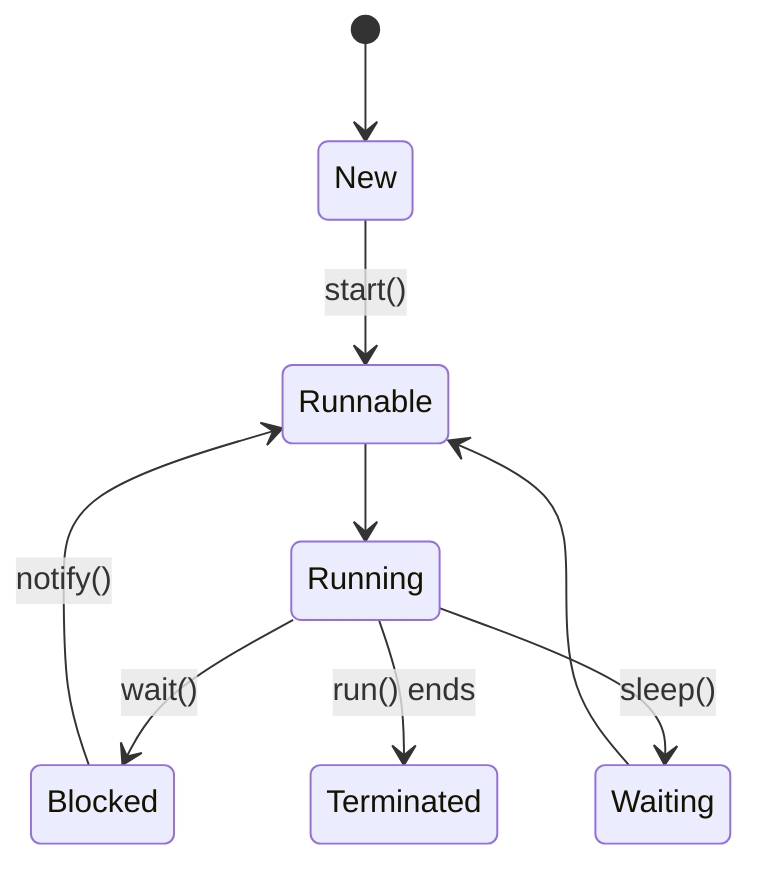

# Overview

Multithreading and concurrency in Java enable programs to perform multiple tasks simultaneously, improving performance and responsiveness. Java provides built-in support through threads, synchronization mechanisms, and concurrent utilities.

# Detailed Explanation

## Threads
- **Creating Threads**: Extend Thread or implement Runnable.
- **Thread Lifecycle**: New, Runnable, Blocked, Waiting, Timed Waiting, Terminated.

## Synchronization
- **Synchronized Blocks/Methods**: Ensure atomicity and visibility.
- **Locks**: ReentrantLock for more control.
- **Atomic Variables**: AtomicInteger, etc., for lock-free operations.

## Concurrent Collections
- **ConcurrentHashMap**: Thread-safe map.
- **CopyOnWriteArrayList**: For read-heavy scenarios.

## Executors and Futures
- **ExecutorService**: Manage thread pools.
- **CompletableFuture**: For asynchronous programming.



# Real-world Examples & Use Cases
- **Web Servers**: Handle multiple client requests concurrently.
- **Data Processing**: Parallel processing of large datasets.
- **GUI Applications**: Keep UI responsive while performing background tasks.

# Code Examples

```java
import java.util.concurrent.ExecutorService;
import java.util.concurrent.Executors;

public class ConcurrencyExample {
    public static void main(String[] args) {
        ExecutorService executor = Executors.newFixedThreadPool(5);
        for (int i = 0; i < 10; i++) {
            executor.submit(() -> {
                System.out.println("Task executed by " + Thread.currentThread().getName());
            });
        }
        executor.shutdown();
    }
}
```

# Common Pitfalls & Edge Cases
- **Race Conditions**: Access shared data without synchronization.
- **Deadlocks**: Circular wait for locks.
- **Thread Safety**: Ensure all shared mutable state is properly synchronized.

# Tools & Libraries
- **JVM Tools**: jstack for thread dumps.
- **Libraries**: JUnit for concurrent testing, Guava for utilities.

# References
- [Java Concurrency in Practice](https://jcip.net/)
- [Oracle Concurrency Tutorial](https://docs.oracle.com/javase/tutorial/essential/concurrency/)

# Github-README Links & Related Topics
- [Threads Executors Futures](../java/threads-executors-futures/README.md)
- [Concurrent Programming Patterns](../concurrent-programming-patterns/README.md)
- [Java Memory Model and Concurrency](../java/java-memory-model-and-concurrency/README.md)