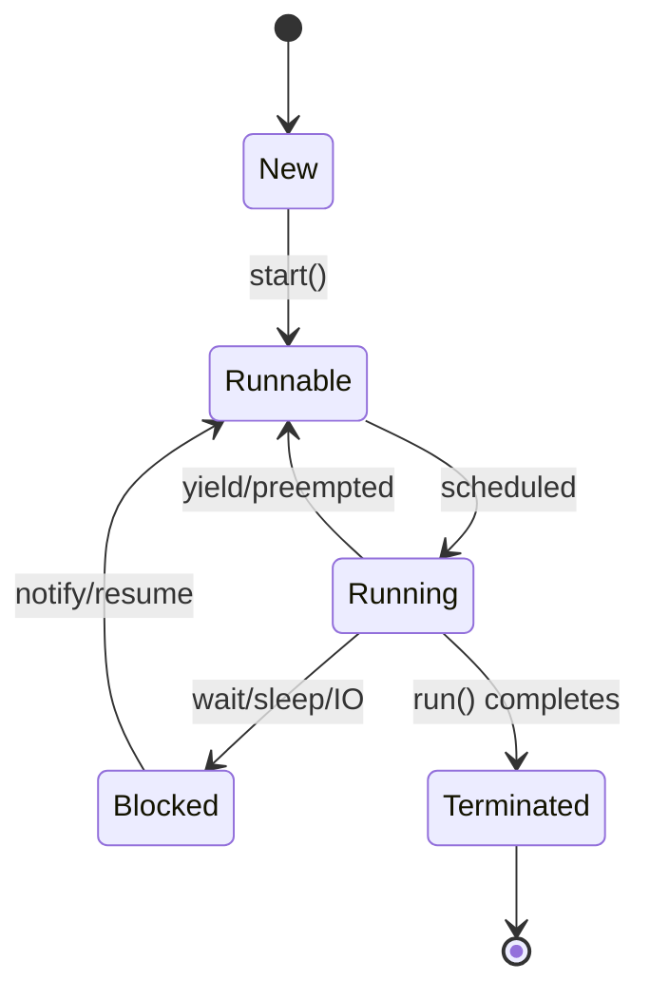

# Multithreading & Concurrency in Java

## Overview

Multithreading in Java allows multiple threads to execute concurrently within a single process, enabling better resource utilization and responsiveness. Understanding concurrency concepts is essential for developing high-performance, thread-safe Java applications.

## Detailed Explanation

### Threads vs Processes

- **Process:** Independent execution unit with its own memory space.
- **Thread:** Lightweight subprocess sharing the same memory space.

### Creating Threads

#### Extending Thread Class

```java
public class MyThread extends Thread {
    @Override
    public void run() {
        System.out.println("Thread running");
    }
}

MyThread thread = new MyThread();
thread.start();
```

#### Implementing Runnable Interface

```java
public class MyRunnable implements Runnable {
    @Override
    public void run() {
        System.out.println("Runnable running");
    }
}

Thread thread = new Thread(new MyRunnable());
thread.start();
```

### Thread Lifecycle



States: New, Runnable, Running, Blocked, Terminated.

### Synchronization

#### Synchronized Methods

```java
public synchronized void synchronizedMethod() {
    // Only one thread can execute at a time
}
```

#### Synchronized Blocks

```java
public void method() {
    synchronized(this) {
        // Critical section
    }
}
```

#### Locks

```java
import java.util.concurrent.locks.Lock;
import java.util.concurrent.locks.ReentrantLock;

Lock lock = new ReentrantLock();
lock.lock();
try {
    // Critical section
} finally {
    lock.unlock();
}
```

### Concurrent Collections

- **ConcurrentHashMap:** Thread-safe hash map.
- **CopyOnWriteArrayList:** Thread-safe list for read-heavy operations.
- **BlockingQueue:** Thread-safe queue with blocking operations.

### Atomic Variables

```java
import java.util.concurrent.atomic.AtomicInteger;

AtomicInteger counter = new AtomicInteger(0);
counter.incrementAndGet(); // Thread-safe increment
```

### Executors

```java
import java.util.concurrent.ExecutorService;
import java.util.concurrent.Executors;

ExecutorService executor = Executors.newFixedThreadPool(10);
executor.submit(() -> {
    // Task
});
executor.shutdown();
```

## Real-world Examples & Use Cases

- **Web Servers:** Handling multiple client requests concurrently.
- **GUI Applications:** Keeping UI responsive while performing background tasks.
- **Data Processing:** Parallel processing of large datasets.
- **Game Development:** Managing game loops, physics, and rendering in separate threads.

## Code Examples

### Producer-Consumer Problem

```java
import java.util.LinkedList;
import java.util.Queue;

public class ProducerConsumer {
    private final Queue<Integer> queue = new LinkedList<>();
    private final int capacity = 10;

    public void produce() throws InterruptedException {
        int value = 0;
        while (true) {
            synchronized (this) {
                while (queue.size() == capacity) {
                    wait();
                }
                System.out.println("Produced: " + value);
                queue.add(value++);
                notify();
                Thread.sleep(1000);
            }
        }
    }

    public void consume() throws InterruptedException {
        while (true) {
            synchronized (this) {
                while (queue.isEmpty()) {
                    wait();
                }
                int val = queue.remove();
                System.out.println("Consumed: " + val);
                notify();
                Thread.sleep(1000);
            }
        }
    }
}
```

### Using ExecutorService

```java
import java.util.concurrent.ExecutorService;
import java.util.concurrent.Executors;
import java.util.concurrent.TimeUnit;

public class ExecutorExample {
    public static void main(String[] args) {
        ExecutorService executor = Executors.newFixedThreadPool(3);
        
        for (int i = 0; i < 5; i++) {
            executor.submit(() -> {
                System.out.println("Task executed by " + Thread.currentThread().getName());
                try {
                    Thread.sleep(1000);
                } catch (InterruptedException e) {
                    Thread.currentThread().interrupt();
                }
            });
        }
        
        executor.shutdown();
        try {
            executor.awaitTermination(10, TimeUnit.SECONDS);
        } catch (InterruptedException e) {
            Thread.currentThread().interrupt();
        }
    }
}
```

## Common Pitfalls & Edge Cases

- **Race Conditions:** Multiple threads accessing shared data without synchronization.
- **Deadlocks:** Threads waiting for each other indefinitely.
- **Starvation:** Some threads never get CPU time.
- **Memory Visibility:** Changes not visible across threads without proper synchronization.

## Tools & Libraries

- **Thread Dump Analysis:** jstack for analyzing thread states.
- **VisualVM:** Monitoring thread activity.
- **Concurrent Utilities:** java.util.concurrent package.

## References

- [Oracle Java Concurrency Tutorial](https://docs.oracle.com/javase/tutorial/essential/concurrency/)
- [Baeldung: Java Concurrency](https://www.baeldung.com/java-concurrency)
- [GeeksforGeeks: Multithreading in Java](https://www.geeksforgeeks.org/multithreading-in-java/)

## Github-README Links & Related Topics

- [Java Atomic Variables](../java-atomic-variables/README.md)
- [Java Locks](../java-locks/README.md)
- [Java ExecutorService](../java-executorservice/README.md)
