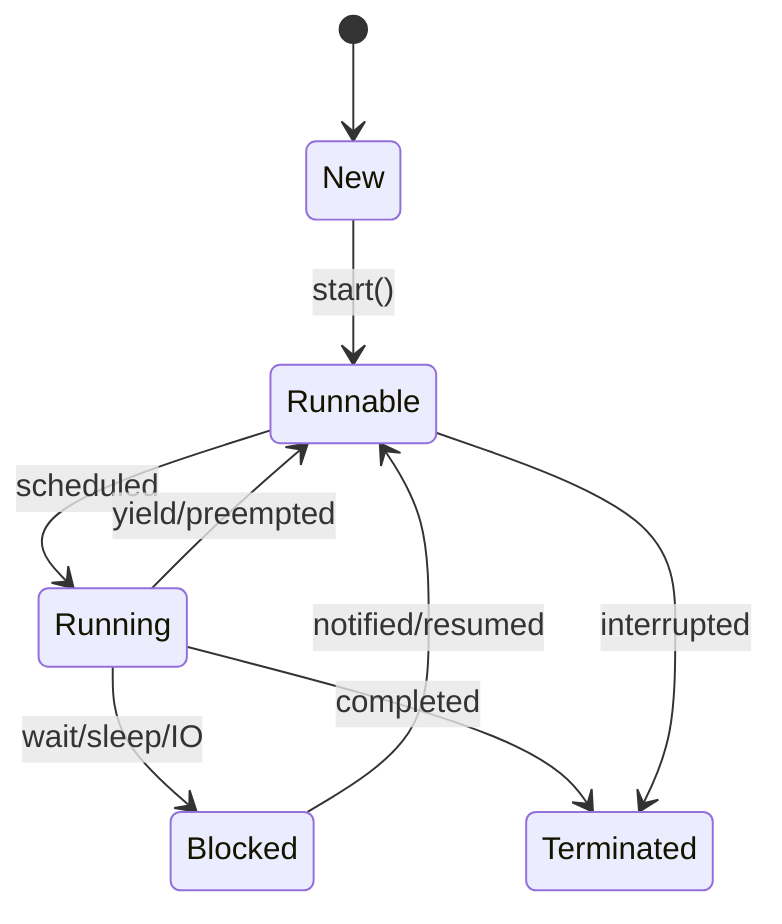

# Multithreading & Concurrency in Java

## Overview

Multithreading and concurrency in Java enable programs to execute multiple threads simultaneously, improving performance and responsiveness. Understanding thread lifecycle, synchronization, and concurrent data structures is essential for writing robust concurrent applications.

## Detailed Explanation

### Thread Lifecycle



### Creating Threads

#### Extending Thread Class

```java
public class MyThread extends Thread {
    @Override
    public void run() {
        System.out.println("Thread running: " + Thread.currentThread().getName());
    }
    
    public static void main(String[] args) {
        MyThread thread = new MyThread();
        thread.start(); // Don't call run() directly
    }
}
```

#### Implementing Runnable Interface

```java
public class MyRunnable implements Runnable {
    @Override
    public void run() {
        System.out.println("Runnable running: " + Thread.currentThread().getName());
    }
    
    public static void main(String[] args) {
        Thread thread = new Thread(new MyRunnable());
        thread.start();
    }
}
```

### Synchronization

#### Synchronized Methods

```java
public class Counter {
    private int count = 0;
    
    public synchronized void increment() {
        count++;
    }
    
    public synchronized int getCount() {
        return count;
    }
}
```

#### Synchronized Blocks

```java
public class Counter {
    private int count = 0;
    private Object lock = new Object();
    
    public void increment() {
        synchronized (lock) {
            count++;
        }
    }
}
```

### Locks and Condition Variables

```java
import java.util.concurrent.locks.*;

public class LockExample {
    private final Lock lock = new ReentrantLock();
    private final Condition condition = lock.newCondition();
    private boolean ready = false;
    
    public void waitForSignal() throws InterruptedException {
        lock.lock();
        try {
            while (!ready) {
                condition.await();
            }
            System.out.println("Received signal");
        } finally {
            lock.unlock();
        }
    }
    
    public void sendSignal() {
        lock.lock();
        try {
            ready = true;
            condition.signal();
        } finally {
            lock.unlock();
        }
    }
}
```

### Concurrent Collections

```java
import java.util.concurrent.*;

public class ConcurrentCollectionsExample {
    public static void main(String[] args) {
        // Thread-safe list
        List<String> list = new CopyOnWriteArrayList<>();
        
        // Thread-safe map
        Map<String, Integer> map = new ConcurrentHashMap<>();
        
        // Thread-safe queue
        Queue<String> queue = new ConcurrentLinkedQueue<>();
        
        // Thread-safe set
        Set<String> set = new ConcurrentSkipListSet<>();
        
        // Atomic variables
        AtomicInteger counter = new AtomicInteger(0);
        counter.incrementAndGet();
    }
}
```

### Executor Framework

```java
import java.util.concurrent.*;

public class ExecutorExample {
    public static void main(String[] args) {
        // Create thread pool
        ExecutorService executor = Executors.newFixedThreadPool(5);
        
        // Submit tasks
        for (int i = 0; i < 10; i++) {
            executor.submit(() -> {
                System.out.println("Task executed by: " + Thread.currentThread().getName());
            });
        }
        
        // Shutdown executor
        executor.shutdown();
        try {
            if (!executor.awaitTermination(60, TimeUnit.SECONDS)) {
                executor.shutdownNow();
            }
        } catch (InterruptedException e) {
            executor.shutdownNow();
        }
    }
}
```

## Real-world Examples & Use Cases

1. **Web Servers**: Handle multiple client requests concurrently
2. **Database Connections**: Pool connections for efficient resource usage
3. **GUI Applications**: Keep UI responsive while performing background tasks
4. **Data Processing**: Parallel processing of large datasets
5. **Game Development**: Separate threads for rendering, physics, and AI

## Code Examples

### Producer-Consumer Problem

```java
import java.util.concurrent.*;

public class ProducerConsumer {
    private final BlockingQueue<Integer> queue = new LinkedBlockingQueue<>(10);
    
    public void produce() throws InterruptedException {
        int value = 0;
        while (true) {
            queue.put(value);
            System.out.println("Produced: " + value);
            value++;
            Thread.sleep(1000);
        }
    }
    
    public void consume() throws InterruptedException {
        while (true) {
            int value = queue.take();
            System.out.println("Consumed: " + value);
            Thread.sleep(2000);
        }
    }
    
    public static void main(String[] args) {
        ProducerConsumer pc = new ProducerConsumer();
        
        Thread producer = new Thread(() -> {
            try {
                pc.produce();
            } catch (InterruptedException e) {
                Thread.currentThread().interrupt();
            }
        });
        
        Thread consumer = new Thread(() -> {
            try {
                pc.consume();
            } catch (InterruptedException e) {
                Thread.currentThread().interrupt();
            }
        });
        
        producer.start();
        consumer.start();
    }
}
```

### Thread-Safe Singleton

```java
public class Singleton {
    private static volatile Singleton instance;
    private static final Object lock = new Object();
    
    private Singleton() {}
    
    public static Singleton getInstance() {
        if (instance == null) {
            synchronized (lock) {
                if (instance == null) {
                    instance = new Singleton();
                }
            }
        }
        return instance;
    }
}
```

## Common Pitfalls & Edge Cases

1. **Race Conditions**: Multiple threads accessing shared data without synchronization
2. **Deadlocks**: Threads waiting for each other indefinitely
3. **Starvation**: Some threads never get CPU time
4. **Memory Visibility**: Changes not visible across threads without proper synchronization
5. **Thread Leaks**: Threads not properly terminated

## Tools & Libraries

- **Thread Dump Analysis**: jstack, VisualVM
- **Concurrent Utilities**: java.util.concurrent package
- **Virtual Threads**: Project Loom (Java 19+)
- **Reactive Programming**: RxJava, Reactor

## References

- [Oracle Concurrency Tutorial](https://docs.oracle.com/javase/tutorial/essential/concurrency/)
- [Java Concurrency in Practice](https://www.amazon.com/Java-Concurrency-Practice-Brian-Goetz/dp/0321349601)
- [Concurrent Programming](https://www.baeldung.com/java-concurrency)

## Github-README Links & Related Topics

- [java-memory-model-and-concurrency/README.md](../java/java-memory-model-and-concurrency/README.md)
- [concurrent-collections/README.md](../java/concurrent-collections/README.md)
- [concurrent-programming-patterns/README.md](../java/concurrent-programming-patterns/README.md)
