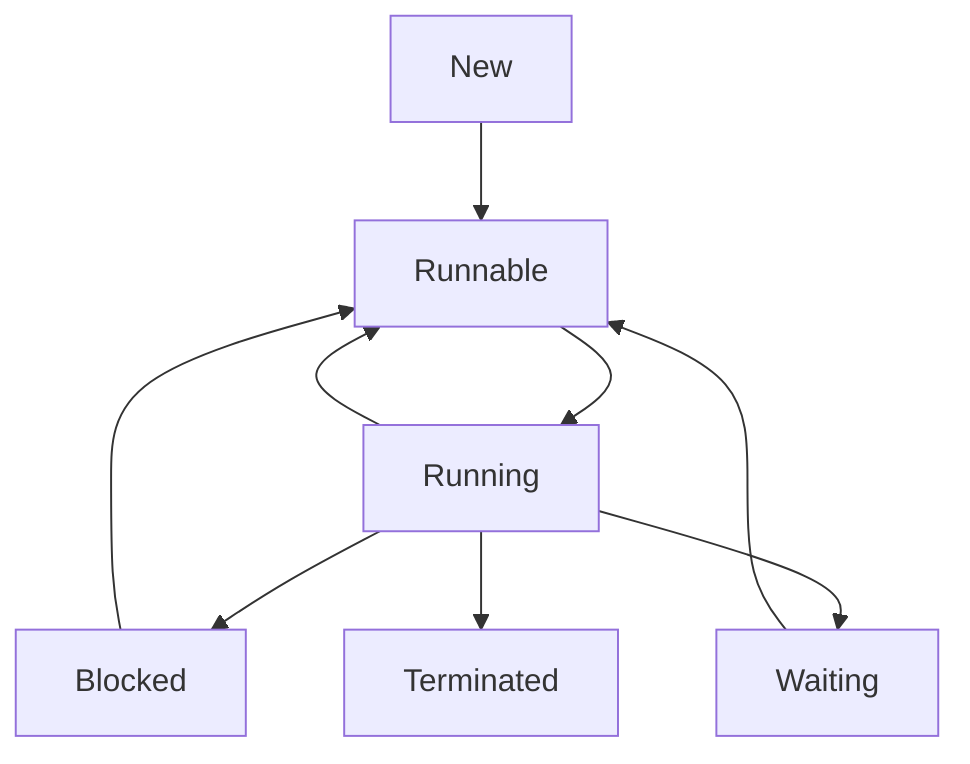

# Multithreading & Concurrency in Java

## Overview

Multithreading and concurrency allow Java programs to perform multiple tasks simultaneously, improving performance and responsiveness. Java provides robust support for concurrent programming through its threading API, synchronization mechanisms, and concurrent utilities. Understanding these concepts is crucial for writing scalable and efficient multi-threaded applications.

## Detailed Explanation

### Thread Lifecycle

A thread goes through several states:

1. **New:** Thread created but not started
2. **Runnable:** Ready to run, waiting for CPU
3. **Running:** Currently executing
4. **Blocked:** Waiting for a resource (I/O, lock)
5. **Waiting/Timed Waiting:** Waiting indefinitely or for a specified time
6. **Terminated:** Execution completed



### Creating Threads

Two ways to create threads:
1. Extend Thread class
2. Implement Runnable interface

### Synchronization

Synchronization ensures thread-safe access to shared resources:

- **Synchronized methods/blocks**
- **Volatile variables**
- **Atomic classes**
- **Locks (ReentrantLock)**

### Concurrent Collections

Thread-safe collections:
- ConcurrentHashMap
- CopyOnWriteArrayList
- BlockingQueue implementations

### Executor Framework

Manages thread pools:
- Executor
- ExecutorService
- ThreadPoolExecutor

## Real-world Examples & Use Cases

- **Web servers:** Handling multiple client requests concurrently
- **Data processing:** Parallel processing of large datasets
- **GUI applications:** Keeping UI responsive while performing background tasks
- **Game development:** Managing game loops, physics, and rendering in separate threads

## Code Examples

### Creating and Starting Threads
```java
// Extending Thread
public class MyThread extends Thread {
    @Override
    public void run() {
        System.out.println("Thread running: " + Thread.currentThread().getName());
    }
}

// Implementing Runnable
public class MyRunnable implements Runnable {
    @Override
    public void run() {
        System.out.println("Runnable running: " + Thread.currentThread().getName());
    }
}

// Usage
public class Main {
    public static void main(String[] args) {
        MyThread thread1 = new MyThread();
        Thread thread2 = new Thread(new MyRunnable());
        
        thread1.start();
        thread2.start();
    }
}
```

### Synchronization Example
```java
public class Counter {
    private int count = 0;
    
    public synchronized void increment() {
        count++;
    }
    
    public synchronized int getCount() {
        return count;
    }
}

public class SynchronizedExample {
    public static void main(String[] args) throws InterruptedException {
        Counter counter = new Counter();
        
        Runnable task = () -> {
            for (int i = 0; i < 1000; i++) {
                counter.increment();
            }
        };
        
        Thread t1 = new Thread(task);
        Thread t2 = new Thread(task);
        
        t1.start();
        t2.start();
        
        t1.join();
        t2.join();
        
        System.out.println("Final count: " + counter.getCount());
    }
}
```

### Producer-Consumer Pattern
```java
import java.util.LinkedList;
import java.util.Queue;

public class ProducerConsumer {
    private static final int CAPACITY = 5;
    private final Queue<Integer> queue = new LinkedList<>();
    
    public synchronized void produce(int value) throws InterruptedException {
        while (queue.size() == CAPACITY) {
            wait();
        }
        queue.add(value);
        System.out.println("Produced: " + value);
        notifyAll();
    }
    
    public synchronized int consume() throws InterruptedException {
        while (queue.isEmpty()) {
            wait();
        }
        int value = queue.poll();
        System.out.println("Consumed: " + value);
        notifyAll();
        return value;
    }
}
```

### Using ExecutorService
```java
import java.util.concurrent.ExecutorService;
import java.util.concurrent.Executors;

public class ExecutorExample {
    public static void main(String[] args) {
        ExecutorService executor = Executors.newFixedThreadPool(3);
        
        for (int i = 0; i < 5; i++) {
            final int taskId = i;
            executor.submit(() -> {
                System.out.println("Task " + taskId + " executed by " + Thread.currentThread().getName());
                try {
                    Thread.sleep(1000);
                } catch (InterruptedException e) {
                    Thread.currentThread().interrupt();
                }
            });
        }
        
        executor.shutdown();
    }
}
```

## Common Pitfalls & Edge Cases

- **Race conditions:** Multiple threads accessing shared data without proper synchronization
- **Deadlocks:** Threads waiting for each other indefinitely
- **Starvation:** A thread unable to gain access to shared resources
- **Memory visibility issues:** Changes made by one thread not visible to others

## Tools & Libraries

- **java.util.concurrent package**
- **Thread dumps** for debugging
- **VisualVM** for monitoring threads
- **JConsole** for thread analysis

## References

- [Oracle Java Concurrency Tutorial](https://docs.oracle.com/javase/tutorial/essential/concurrency/)
- [Java Threading Best Practices](https://www.baeldung.com/java-concurrency)
- [Executor Framework](https://www.baeldung.com/java-executor-service-tutorial)
- [Synchronization in Java](https://www.geeksforgeeks.org/synchronization-in-java/)

## Github-README Links & Related Topics

- [Java Fundamentals](./java-fundamentals/)
- [Java Atomic Variables](./java-atomic-variables/)
- [Java ConcurrentHashMap](./java-concurrenthashmap/)
- [Java ExecutorService](./java-executorservice/)
- [Java Synchronized Blocks](./java-synchronized-blocks/)
- [Java Volatile Keyword](./java-volatile-keyword/)
