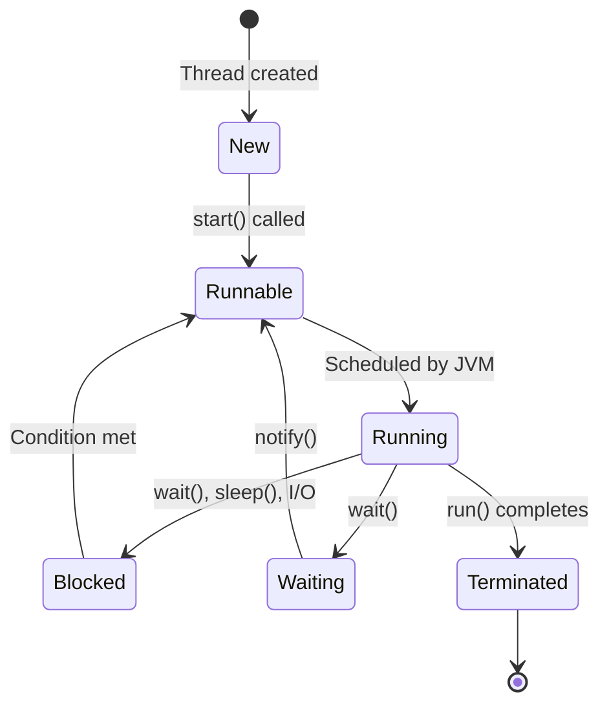

# Overview

Multithreading and concurrency in Java allow programs to execute multiple threads simultaneously, enhancing performance, responsiveness, and resource utilization. Java provides built-in support through the `Thread` class, `Runnable` interface, and the `java.util.concurrent` package. Key concepts include thread creation, synchronization, deadlock prevention, and concurrent data structures. Proper concurrency management prevents issues like race conditions, deadlocks, and memory inconsistencies.

# Detailed Explanation

## Threads and Thread Lifecycle

A thread is the smallest unit of execution within a process. Java threads can be created by extending `Thread` or implementing `Runnable`. The thread lifecycle includes states: New, Runnable, Running, Blocked/Waiting, and Terminated.



## Synchronization and Locks

Synchronization ensures thread-safe access to shared resources. Use `synchronized` keyword for methods or blocks, or explicit locks from `java.util.concurrent.locks`.

- **Intrinsic Locks**: `synchronized` uses object's monitor.
- **Explicit Locks**: `ReentrantLock` for more control.
- **Atomic Variables**: `AtomicInteger`, `AtomicReference` for lock-free operations.

## Memory Model and Happens-Before

Java Memory Model (JMM) defines how threads interact with memory. "Happens-before" relationships ensure visibility and ordering of operations. Volatile variables and synchronized blocks establish happens-before edges.

## Concurrency Utilities

The `java.util.concurrent` package offers high-level constructs for concurrent programming.

| Utility | Purpose | Key Methods |
|---------|---------|-------------|
| ExecutorService | Thread pool management | submit(), shutdown() |
| Future/CompletableFuture | Asynchronous computation results | get(), thenApply() |
| Atomic Variables | Thread-safe primitives | incrementAndGet(), compareAndSet() |
| Concurrent Collections | Thread-safe data structures | ConcurrentHashMap, CopyOnWriteArrayList |
| Semaphore | Resource access control | acquire(), release() |
| CountDownLatch | Coordination of threads | await(), countDown() |
| CyclicBarrier | Synchronization points | await() |

## Advanced Concepts

- **Fork/Join Framework**: For parallel processing using divide-and-conquer.
- **Virtual Threads** (Java 21+): Lightweight threads for high concurrency.
- **Structured Concurrency** (Preview): Simplifies concurrent code management.

# Real-world Examples & Use Cases

- **Web Servers**: Handle multiple HTTP requests concurrently using thread pools.
- **Data Processing Pipelines**: Parallelize ETL operations in big data frameworks like Apache Spark.
- **GUI Applications**: Perform background tasks (e.g., file downloads) without freezing the UI.
- **Gaming Engines**: Simulate physics, AI, and rendering in separate threads.
- **Financial Systems**: Process transactions and risk calculations concurrently.
- **IoT Platforms**: Manage sensor data ingestion and processing from multiple devices.

# Code Examples

## Creating Threads with Runnable

```java
public class RunnableExample {
    public static void main(String[] args) {
        Runnable task = () -> System.out.println("Running in thread: " + Thread.currentThread().getName());
        Thread thread = new Thread(task);
        thread.start();
    }
}
```

## Synchronization with synchronized

```java
public class SynchronizedCounter {
    private int count = 0;

    public synchronized void increment() {
        count++;
    }

    public synchronized int getCount() {
        return count;
    }
}
```

## Using Atomic Variables

```java
import java.util.concurrent.atomic.AtomicInteger;

public class AtomicCounter {
    private AtomicInteger count = new AtomicInteger(0);

    public void increment() {
        count.incrementAndGet();
    }

    public int getCount() {
        return count.get();
    }
}
```

## Producer-Consumer with BlockingQueue

```java
import java.util.concurrent.BlockingQueue;
import java.util.concurrent.LinkedBlockingQueue;

public class ProducerConsumer {
    private static BlockingQueue<Integer> queue = new LinkedBlockingQueue<>(10);

    static class Producer implements Runnable {
        public void run() {
            try {
                for (int i = 0; i < 10; i++) {
                    queue.put(i);
                    System.out.println("Produced: " + i);
                }
            } catch (InterruptedException e) {
                Thread.currentThread().interrupt();
            }
        }
    }

    static class Consumer implements Runnable {
        public void run() {
            try {
                for (int i = 0; i < 10; i++) {
                    int item = queue.take();
                    System.out.println("Consumed: " + item);
                }
            } catch (InterruptedException e) {
                Thread.currentThread().interrupt();
            }
        }
    }

    public static void main(String[] args) {
        Thread producer = new Thread(new Producer());
        Thread consumer = new Thread(new Consumer());
        producer.start();
        consumer.start();
    }
}
```

## ExecutorService Example

```java
import java.util.concurrent.ExecutorService;
import java.util.concurrent.Executors;
import java.util.concurrent.Future;

public class ExecutorExample {
    public static void main(String[] args) {
        ExecutorService executor = Executors.newFixedThreadPool(3);
        Future<Integer> future = executor.submit(() -> {
            Thread.sleep(1000);
            return 42;
        });
        try {
            System.out.println("Result: " + future.get());
        } catch (Exception e) {
            e.printStackTrace();
        }
        executor.shutdown();
    }
}
```

## Volatile for Visibility

```java
public class VolatileExample {
    private volatile boolean flag = false;

    public void setFlag() {
        flag = true;
    }

    public boolean isFlag() {
        return flag;
    }
}
```

## Deadlock Example (Avoid in Practice)

```java
public class DeadlockExample {
    private static final Object lock1 = new Object();
    private static final Object lock2 = new Object();

    public static void main(String[] args) {
        Thread t1 = new Thread(() -> {
            synchronized (lock1) {
                System.out.println("T1: Holding lock1");
                try { Thread.sleep(100); } catch (InterruptedException e) {}
                synchronized (lock2) {
                    System.out.println("T1: Holding lock2");
                }
            }
        });

        Thread t2 = new Thread(() -> {
            synchronized (lock2) {
                System.out.println("T2: Holding lock2");
                try { Thread.sleep(100); } catch (InterruptedException e) {}
                synchronized (lock1) {
                    System.out.println("T2: Holding lock1");
                }
            }
        });

        t1.start();
        t2.start();
    }
}
```

# Common Pitfalls & Edge Cases

- **Race Conditions**: Occur when multiple threads access shared data without synchronization.
- **Deadlocks**: Threads wait indefinitely for resources held by each other.
- **Starvation**: A thread is perpetually denied access to resources.
- **Livelocks**: Threads are active but unable to make progress.
- **Memory Visibility Issues**: Use `volatile` or synchronization to ensure changes are visible across threads.
- **Thread Safety in Collections**: Use concurrent collections or external synchronization.

# References

- [Java Concurrency Tutorial](https://docs.oracle.com/javase/tutorial/essential/concurrency/)
- [java.util.concurrent API](https://docs.oracle.com/en/java/javase/21/docs/api/java.base/java/util/concurrent/package-summary.html)
- [Java Memory Model](https://docs.oracle.com/javase/specs/jls/se21/html/jls-17.html)
- [Concurrency Best Practices](https://www.oracle.com/technetwork/articles/javase/index-140767.html)
- [JSR 133: Java Memory Model and Thread Specification](https://jcp.org/en/jsr/detail?id=133)

# Github-README Links & Related Topics

- [Java Executorservice](./java-executorservice/README.md)
- [Java Locks](./java-locks/README.md)
- [Concurrent Collections](./concurrent-collections/README.md)
- [Java Volatile Keyword](./java-volatile-keyword/README.md)
- [Java Synchronized Blocks](./java-synchronized-blocks/README.md)
- [Java Atomic Variables](./java-atomic-variables/README.md)
- [Java Threadlocal](./java-threadlocal/README.md)
- [Multithreading Patterns](./concurrent-programming-patterns/README.md)