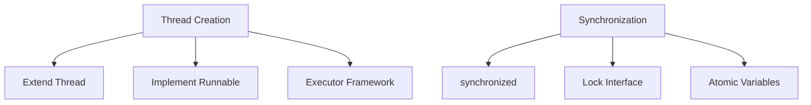

# Multithreading & Concurrency in Java

## Overview

Multithreading and concurrency in Java enable programs to perform multiple tasks simultaneously, improving performance and responsiveness. Java provides built-in support for threads, synchronization, and concurrent data structures to manage shared resources safely.

## Detailed Explanation

## Threads and Thread Lifecycle

A thread is a lightweight process. Thread states: NEW, RUNNABLE, BLOCKED, WAITING, TIMED_WAITING, TERMINATED.

## Creating Threads

- Extend Thread class
- Implement Runnable interface
- Use Executor framework (preferred)

## Synchronization

Prevents race conditions:

- **synchronized** keyword
- Locks (ReentrantLock)
- Atomic variables

## Concurrency Utilities

- **ExecutorService**: Manages thread pools
- **Concurrent Collections**: Thread-safe collections
- **Atomic Classes**: Lock-free operations



## Real-world Examples & Use Cases

- **Web Servers**: Handling multiple HTTP requests concurrently
- **Data Processing**: Parallel processing of large datasets
- **GUI Applications**: Keeping UI responsive during long operations
- **Game Development**: Managing game loops, AI, and rendering threads

## Code Examples

## Creating Threads

```java
// Extending Thread
public class MyThread extends Thread {
    @Override
    public void run() {
        System.out.println("Thread running");
    }
}

// Implementing Runnable
public class MyRunnable implements Runnable {
    @Override
    public void run() {
        System.out.println("Runnable running");
    }
}

// Usage
public class ThreadExample {
    public static void main(String[] args) {
        Thread t1 = new MyThread();
        Thread t2 = new Thread(new MyRunnable());
        
        t1.start();
        t2.start();
    }
}
```

## Synchronization

```java
public class Counter {
    private int count = 0;
    
    public synchronized void increment() {
        count++;
    }
    
    public int getCount() {
        return count;
    }
}

// Using Lock
import java.util.concurrent.locks.Lock;
import java.util.concurrent.locks.ReentrantLock;

public class LockExample {
    private final Lock lock = new ReentrantLock();
    private int count = 0;
    
    public void increment() {
        lock.lock();
        try {
            count++;
        } finally {
            lock.unlock();
        }
    }
}
```

## Executor Framework

```java
import java.util.concurrent.ExecutorService;
import java.util.concurrent.Executors;

public class ExecutorExample {
    public static void main(String[] args) {
        ExecutorService executor = Executors.newFixedThreadPool(5);
        
        for (int i = 0; i < 10; i++) {
            executor.submit(() -> {
                System.out.println("Task executed by " + Thread.currentThread().getName());
            });
        }
        
        executor.shutdown();
    }
}
```

## References

- [Oracle Concurrency Tutorial](https://docs.oracle.com/javase/tutorial/essential/concurrency/)
- [Java Concurrency in Practice](https://jcip.net/)
- [Baeldung Concurrency](https://www.baeldung.com/java-concurrency)

## Github-README Links & Related Topics

- [Java Executors](../java-executorservice/)
- [Concurrent Collections](../concurrent-collections/)
- [Java Locks](../java-reentrantlock/)
