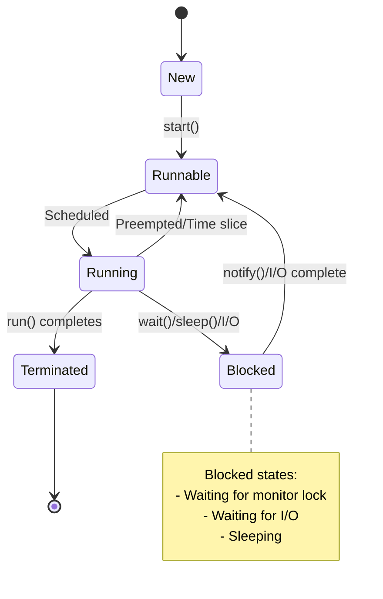

# Overview

Multithreading and concurrency in Java allow programs to execute multiple threads simultaneously, improving performance and responsiveness. Java provides comprehensive support for concurrent programming through its threading API, synchronization mechanisms, and concurrent utilities.

# Detailed Explanation

### Thread Fundamentals

A thread is the smallest unit of execution within a process. Java threads are lightweight compared to OS processes.

#### Thread Lifecycle



#### Thread States

- **NEW**: Thread created but not started
- **RUNNABLE**: Ready to run or running
- **BLOCKED**: Waiting for monitor lock
- **WAITING**: Waiting indefinitely for another thread
- **TIMED_WAITING**: Waiting for specified time
- **TERMINATED**: Execution completed

### Creating Threads

#### Extending Thread Class

```java
public class MyThread extends Thread {
    @Override
    public void run() {
        System.out.println("Thread running: " + Thread.currentThread().getName());
    }
    
    public static void main(String[] args) {
        MyThread thread = new MyThread();
        thread.start(); // Don't call run() directly
    }
}
```

#### Implementing Runnable Interface

```java
public class MyRunnable implements Runnable {
    @Override
    public void run() {
        System.out.println("Runnable running: " + Thread.currentThread().getName());
    }
    
    public static void main(String[] args) {
        Thread thread = new Thread(new MyRunnable());
        thread.start();
    }
}
```

#### Lambda Expression (Java 8+)

```java
public class LambdaThread {
    public static void main(String[] args) {
        Thread thread = new Thread(() -> {
            System.out.println("Lambda thread: " + Thread.currentThread().getName());
        });
        thread.start();
    }
}
```

### Synchronization

Synchronization ensures that only one thread can access a shared resource at a time.

#### Synchronized Methods

```java
public class Counter {
    private int count = 0;
    
    public synchronized void increment() {
        count++;
    }
    
    public synchronized int getCount() {
        return count;
    }
}
```

#### Synchronized Blocks

```java
public class Counter {
    private int count = 0;
    private Object lock = new Object();
    
    public void increment() {
        synchronized (lock) {
            count++;
        }
    }
    
    public int getCount() {
        synchronized (lock) {
            return count;
        }
    }
}
```

### Locks and Concurrent Utilities

#### ReentrantLock

```java
import java.util.concurrent.locks.ReentrantLock;

public class ReentrantLockExample {
    private final ReentrantLock lock = new ReentrantLock();
    private int count = 0;
    
    public void increment() {
        lock.lock();
        try {
            count++;
        } finally {
            lock.unlock();
        }
    }
    
    public int getCount() {
        lock.lock();
        try {
            return count;
        } finally {
            lock.unlock();
        }
    }
}
```

#### ReadWriteLock

```java
import java.util.concurrent.locks.ReadWriteLock;
import java.util.concurrent.locks.ReentrantReadWriteLock;

public class ReadWriteLockExample {
    private final ReadWriteLock lock = new ReentrantReadWriteLock();
    private int data = 0;
    
    public int readData() {
        lock.readLock().lock();
        try {
            return data;
        } finally {
            lock.readLock().unlock();
        }
    }
    
    public void writeData(int newData) {
        lock.writeLock().lock();
        try {
            data = newData;
        } finally {
            lock.writeLock().unlock();
        }
    }
}
```

### Atomic Variables

```java
import java.util.concurrent.atomic.AtomicInteger;

public class AtomicExample {
    private AtomicInteger count = new AtomicInteger(0);
    
    public void increment() {
        count.incrementAndGet();
    }
    
    public int getCount() {
        return count.get();
    }
}
```

### Thread Communication

#### wait(), notify(), notifyAll()

```java
public class ProducerConsumer {
    private final Object lock = new Object();
    private boolean itemAvailable = false;
    
    public void produce() throws InterruptedException {
        synchronized (lock) {
            while (itemAvailable) {
                lock.wait();
            }
            // Produce item
            itemAvailable = true;
            lock.notify();
        }
    }
    
    public void consume() throws InterruptedException {
        synchronized (lock) {
            while (!itemAvailable) {
                lock.wait();
            }
            // Consume item
            itemAvailable = false;
            lock.notify();
        }
    }
}
```

### Executor Framework

The Executor framework provides a higher-level abstraction for thread management.

#### ExecutorService

```java
import java.util.concurrent.ExecutorService;
import java.util.concurrent.Executors;

public class ExecutorExample {
    public static void main(String[] args) {
        ExecutorService executor = Executors.newFixedThreadPool(3);
        
        for (int i = 0; i < 5; i++) {
            executor.submit(() -> {
                System.out.println("Task executed by: " + Thread.currentThread().getName());
                try {
                    Thread.sleep(1000);
                } catch (InterruptedException e) {
                    Thread.currentThread().interrupt();
                }
            });
        }
        
        executor.shutdown();
    }
}
```

#### Callable and Future

```java
import java.util.concurrent.Callable;
import java.util.concurrent.ExecutionException;
import java.util.concurrent.ExecutorService;
import java.util.concurrent.Executors;
import java.util.concurrent.Future;

public class CallableExample {
    public static void main(String[] args) {
        ExecutorService executor = Executors.newSingleThreadExecutor();
        
        Callable<Integer> task = () -> {
            Thread.sleep(2000);
            return 42;
        };
        
        Future<Integer> future = executor.submit(task);
        
        try {
            Integer result = future.get(); // Blocks until result available
            System.out.println("Result: " + result);
        } catch (InterruptedException | ExecutionException e) {
            e.printStackTrace();
        }
        
        executor.shutdown();
    }
}
```

### Concurrent Collections

Java provides thread-safe collection implementations.

```java
import java.util.concurrent.ConcurrentHashMap;
import java.util.concurrent.CopyOnWriteArrayList;

public class ConcurrentCollectionsExample {
    public static void main(String[] args) {
        // Thread-safe HashMap
        ConcurrentHashMap<String, Integer> map = new ConcurrentHashMap<>();
        map.put("key1", 1);
        
        // Thread-safe List
        CopyOnWriteArrayList<String> list = new CopyOnWriteArrayList<>();
        list.add("item1");
    }
}
```

# Real-world Examples & Use Cases

1. **Web Servers**: Handling multiple client requests concurrently
2. **Database Connections**: Connection pooling with multiple threads
3. **File Processing**: Parallel file operations
4. **GUI Applications**: Keeping UI responsive while performing background tasks
5. **Game Development**: Separate threads for rendering, physics, and input
6. **Data Processing**: Parallel computation on large datasets
7. **Network Applications**: Concurrent client handling in servers

# Code Examples

### Producer-Consumer Pattern

```java
import java.util.LinkedList;
import java.util.Queue;

public class ProducerConsumerPattern {
    private final Queue<Integer> queue = new LinkedList<>();
    private final int capacity = 5;
    
    public void produce() throws InterruptedException {
        int value = 0;
        while (true) {
            synchronized (this) {
                while (queue.size() == capacity) {
                    wait();
                }
                
                System.out.println("Produced: " + value);
                queue.add(value++);
                notify();
                
                Thread.sleep(1000);
            }
        }
    }
    
    public void consume() throws InterruptedException {
        while (true) {
            synchronized (this) {
                while (queue.isEmpty()) {
                    wait();
                }
                
                int val = queue.poll();
                System.out.println("Consumed: " + val);
                notify();
                
                Thread.sleep(1000);
            }
        }
    }
    
    public static void main(String[] args) {
        ProducerConsumerPattern pc = new ProducerConsumerPattern();
        
        Thread producer = new Thread(() -> {
            try {
                pc.produce();
            } catch (InterruptedException e) {
                Thread.currentThread().interrupt();
            }
        });
        
        Thread consumer = new Thread(() -> {
            try {
                pc.consume();
            } catch (InterruptedException e) {
                Thread.currentThread().interrupt();
            }
        });
        
        producer.start();
        consumer.start();
    }
}
```

### Thread-Safe Singleton

```java
public class ThreadSafeSingleton {
    private static volatile ThreadSafeSingleton instance;
    private static final Object lock = new Object();
    
    private ThreadSafeSingleton() {}
    
    public static ThreadSafeSingleton getInstance() {
        if (instance == null) {
            synchronized (lock) {
                if (instance == null) {
                    instance = new ThreadSafeSingleton();
                }
            }
        }
        return instance;
    }
    
    public void doSomething() {
        System.out.println("Singleton method called by: " + Thread.currentThread().getName());
    }
}
```

### Deadlock Example and Prevention

```java
public class DeadlockExample {
    private static final Object lock1 = new Object();
    private static final Object lock2 = new Object();
    
    public static void main(String[] args) {
        Thread thread1 = new Thread(() -> {
            synchronized (lock1) {
                System.out.println("Thread 1: Holding lock 1");
                try { Thread.sleep(100); } catch (InterruptedException e) {}
                System.out.println("Thread 1: Waiting for lock 2");
                synchronized (lock2) {
                    System.out.println("Thread 1: Holding lock 1 and 2");
                }
            }
        });
        
        Thread thread2 = new Thread(() -> {
            synchronized (lock2) {
                System.out.println("Thread 2: Holding lock 2");
                try { Thread.sleep(100); } catch (InterruptedException e) {}
                System.out.println("Thread 2: Waiting for lock 1");
                synchronized (lock1) {
                    System.out.println("Thread 2: Holding lock 2 and 1");
                }
            }
        });
        
        thread1.start();
        thread2.start();
    }
}
```

# Common Pitfalls & Edge Cases

1. **Race Conditions**: Multiple threads accessing shared data without synchronization
2. **Deadlocks**: Threads waiting for each other indefinitely
3. **Starvation**: Thread unable to gain access to shared resources
4. **Livelocks**: Threads actively preventing each other from proceeding
5. **Memory Visibility**: Changes not visible across threads without proper synchronization
6. **Thread Leaks**: Threads not properly terminated

# Tools & Libraries

- **VisualVM**: Thread monitoring and profiling
- **jconsole**: JMX monitoring including threads
- **Thread dumps**: Analysis of thread states
- **Java Flight Recorder**: Detailed thread analysis
- **Concurrent Utilities**: java.util.concurrent package

# References

- [Oracle Concurrency Tutorial](https://docs.oracle.com/javase/tutorial/essential/concurrency/)
- [Java Concurrency in Practice](https://www.amazon.com/Java-Concurrency-Practice-Brian-Goetz/dp/0321349601)
- [Baeldung Java Concurrency](https://www.baeldung.com/java-concurrency)
- [JSR 166: Concurrency Utilities](https://jcp.org/en/jsr/detail?id=166)

# Github-README Links & Related Topics

- [java-fundamentals/README.md](../java-fundamentals/README.md)
- [java-concurrenthashmap/README.md](../java-concurrenthashmap/README.md)
- [java-executorservice/README.md](../java-executorservice/README.md)
- [java-volatile-keyword/README.md](../java-volatile-keyword/README.md)
