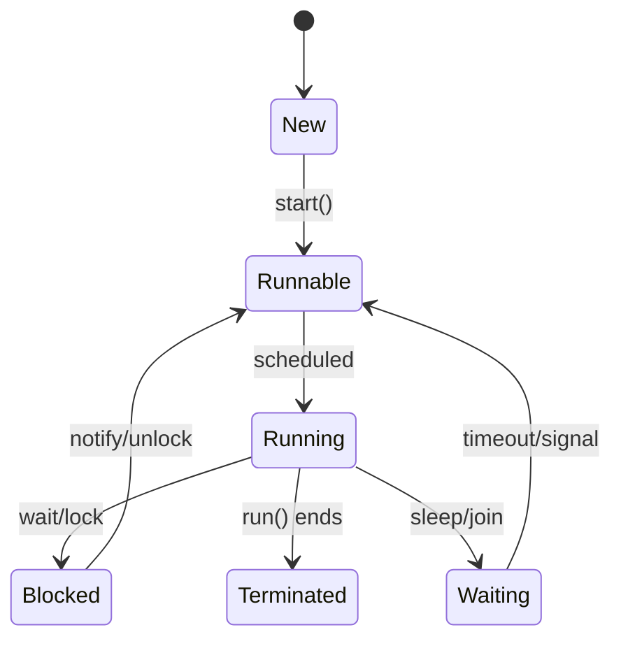

# Overview

Multithreading and concurrency in Java allow multiple threads to execute simultaneously, enhancing performance and responsiveness. Key components include thread lifecycle, synchronization, and concurrent utilities from java.util.concurrent.

# Detailed Explanation

Concurrency involves managing multiple tasks that may run in parallel. Java provides built-in support via threads, with utilities for safe shared state.

| Concept | Description | Key Classes |
|---------|-------------|-------------|
| Threads | Units of execution | Thread, Runnable |
| Synchronization | Preventing race conditions | synchronized, Lock |
| Concurrent Collections | Thread-safe data structures | ConcurrentHashMap, CopyOnWriteArrayList |
| Executors | Thread pool management | ExecutorService, ThreadPoolExecutor |
| Futures/CompletableFuture | Asynchronous results | Future, CompletableFuture |



Challenges: Deadlocks, livelocks, starvation, and visibility issues due to caching.

# Real-world Examples & Use Cases

- **Server Applications**: Tomcat uses thread pools to handle HTTP requests concurrently.
- **Data Pipelines**: Apache Kafka consumers process messages in parallel threads.
- **Gaming**: Game loops run rendering and logic in separate threads.
- **Batch Processing**: Hadoop MapReduce uses threads for parallel data processing.

Example: In a chat server, each client connection runs in its own thread for real-time messaging.

# Code Examples

Basic thread creation:

```java
public class ThreadExample {
    public static void main(String[] args) {
        Thread thread = new Thread(() -> {
            System.out.println("Hello from " + Thread.currentThread().getName());
        });
        thread.start();
        try {
            thread.join();
        } catch (InterruptedException e) {
            e.printStackTrace();
        }
    }
}
```

Synchronization with locks:

```java
import java.util.concurrent.locks.ReentrantLock;

public class Counter {
    private int count = 0;
    private final ReentrantLock lock = new ReentrantLock();

    public void increment() {
        lock.lock();
        try {
            count++;
        } finally {
            lock.unlock();
        }
    }

    public int getCount() {
        return count;
    }
}
```

Producer-Consumer with BlockingQueue:

```java
import java.util.concurrent.BlockingQueue;
import java.util.concurrent.LinkedBlockingQueue;

public class ProducerConsumer {
    private static final BlockingQueue<Integer> queue = new LinkedBlockingQueue<>(10);

    public static void main(String[] args) {
        Thread producer = new Thread(() -> {
            try {
                for (int i = 0; i < 10; i++) {
                    queue.put(i);
                    System.out.println("Produced: " + i);
                }
            } catch (InterruptedException e) {
                Thread.currentThread().interrupt();
            }
        });

        Thread consumer = new Thread(() -> {
            try {
                for (int i = 0; i < 10; i++) {
                    int item = queue.take();
                    System.out.println("Consumed: " + item);
                }
            } catch (InterruptedException e) {
                Thread.currentThread().interrupt();
            }
        });

        producer.start();
        consumer.start();
    }
}
```

Using CompletableFuture:

```java
import java.util.concurrent.CompletableFuture;

public class AsyncExample {
    public static void main(String[] args) {
        CompletableFuture<String> future = CompletableFuture.supplyAsync(() -> {
            // Simulate async task
            return "Result";
        }).thenApply(result -> result + " processed");

        System.out.println(future.join());
    }
}
```

# Common Pitfalls & Edge Cases

- **Deadlocks**: Avoid circular waits; use lock ordering.
- **Race Conditions**: Always synchronize shared mutable state.
- **Memory Visibility**: Use volatile for flags shared across threads.
- **Thread Leaks**: Always shutdown executors properly.
- **Over-threading**: Too many threads can cause context switching overhead.

# Tools & Libraries

- **Debugging**: IntelliJ IDEA debugger for thread inspection.
- **Profiling**: VisualVM, JProfiler for thread dumps.
- **Libraries**: Guava for additional concurrent utilities, RxJava for reactive concurrency.

# References

- [Oracle Java Concurrency Tutorial](https://docs.oracle.com/javase/tutorial/essential/concurrency/)
- [Baeldung Java Concurrency Guide](https://www.baeldung.com/java-concurrency)
- [JSR 166: Concurrency Utilities](https://jcp.org/en/jsr/detail?id=166)

# Github-README Links & Related Topics

- [Java Stream API & Functional Programming](../java-stream-api-and-functional-programming/)
- [Concurrency & Parallelism](../concurrency-parallelism/)
- [Java Virtual Threads](../java-virtual-threads/)