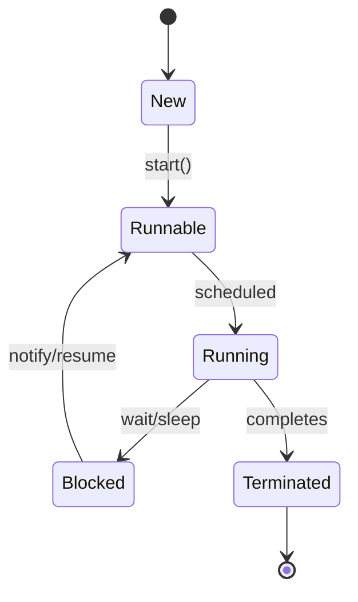

# Multithreading & Concurrency in Java

## Overview

Multithreading and concurrency in Java enable programs to perform multiple tasks simultaneously, improving performance and responsiveness. This topic covers thread creation, synchronization, concurrent data structures, and best practices for writing thread-safe code.

## Detailed Explanation

### Thread Fundamentals

A thread is the smallest unit of execution within a process. Java provides built-in support for multithreading through the `Thread` class and `Runnable` interface.

#### Thread Lifecycle



### Creating Threads

#### Extending Thread Class

```java
public class MyThread extends Thread {
    @Override
    public void run() {
        System.out.println("Thread running");
    }
}
```

#### Implementing Runnable

```java
public class MyRunnable implements Runnable {
    @Override
    public void run() {
        System.out.println("Runnable running");
    }
}
```

### Synchronization

Synchronization ensures that only one thread can access a shared resource at a time.

#### Synchronized Methods

```java
public synchronized void synchronizedMethod() {
    // Critical section
}
```

#### Synchronized Blocks

```java
public void method() {
    synchronized(this) {
        // Critical section
    }
}
```

### Concurrent Collections

Java provides thread-safe collections in `java.util.concurrent`:

| Collection | Description | Best For | Thread Safety Mechanism |
|------------|-------------|----------|-------------------------|
| ConcurrentHashMap | Thread-safe HashMap implementation | High-concurrency read/write operations | Lock striping |
| CopyOnWriteArrayList | Thread-safe ArrayList | Read-heavy operations, infrequent writes | Copy-on-write |
| BlockingQueue | Thread-safe queue with blocking operations | Producer-consumer patterns | Locks and conditions |
| ConcurrentSkipListMap | Concurrent NavigableMap | Sorted key-value storage | Lock-free algorithms |
| ConcurrentLinkedQueue | Concurrent Queue | FIFO operations | CAS (Compare-and-Swap) |

### Thread Lifecycle Journey

1. **Creation**: Instantiate Thread or Runnable
2. **Start**: Call `start()` method (moves to Runnable state)
3. **Scheduling**: JVM schedules thread for execution (Runnable → Running)
4. **Execution**: `run()` method executes
5. **Blocking**: Thread may block on I/O, locks, or `wait()`
6. **Termination**: Thread completes `run()` or is interrupted

### Executors Framework

The Executors framework simplifies thread management:

```java
ExecutorService executor = Executors.newFixedThreadPool(10);
executor.submit(() -> {
    // Task to run
});
executor.shutdown();
```

### Locks and Conditions

`java.util.concurrent.locks` provides more flexible locking:

```java
Lock lock = new ReentrantLock();
lock.lock();
try {
    // Critical section
} finally {
    lock.unlock();
}
```

### Atomic Variables

Atomic classes provide lock-free thread-safe operations:

```java
AtomicInteger counter = new AtomicInteger(0);
counter.incrementAndGet();
```

## Real-world Examples & Use Cases

- **Web Servers**: Handling multiple client requests concurrently
- **Data Processing**: Parallel processing of large datasets
- **GUI Applications**: Keeping UI responsive while performing background tasks
- **Game Development**: Managing game loops, physics, and rendering in separate threads
- **Financial Systems**: Concurrent transaction processing

## Code Examples

### Producer-Consumer Pattern

```java
import java.util.concurrent.BlockingQueue;
import java.util.concurrent.LinkedBlockingQueue;

public class ProducerConsumer {
    private static BlockingQueue<Integer> queue = new LinkedBlockingQueue<>(10);
    
    public static void main(String[] args) {
        Thread producer = new Thread(() -> {
            try {
                for (int i = 0; i < 10; i++) {
                    queue.put(i);
                    System.out.println("Produced: " + i);
                    Thread.sleep(100);
                }
            } catch (InterruptedException e) {
                Thread.currentThread().interrupt();
            }
        });
        
        Thread consumer = new Thread(() -> {
            try {
                for (int i = 0; i < 10; i++) {
                    int item = queue.take();
                    System.out.println("Consumed: " + item);
                    Thread.sleep(200);
                }
            } catch (InterruptedException e) {
                Thread.currentThread().interrupt();
            }
        });
        
        producer.start();
        consumer.start();
    }
}
```

### Thread-Safe Counter

```java
public class ThreadSafeCounter {
    private int count = 0;
    
    public synchronized void increment() {
        count++;
    }
    
    public synchronized int getCount() {
        return count;
    }
    
    public static void main(String[] args) throws InterruptedException {
        ThreadSafeCounter counter = new ThreadSafeCounter();
        
        Thread t1 = new Thread(() -> {
            for (int i = 0; i < 1000; i++) {
                counter.increment();
            }
        });
        
        Thread t2 = new Thread(() -> {
            for (int i = 0; i < 1000; i++) {
                counter.increment();
            }
        });
        
        t1.start();
        t2.start();
        t1.join();
        t2.join();
        
        System.out.println("Final count: " + counter.getCount());
    }
}
```

### Using AtomicInteger

```java
import java.util.concurrent.atomic.AtomicInteger;

public class AtomicCounter {
    private AtomicInteger count = new AtomicInteger(0);
    
    public void increment() {
        count.incrementAndGet();
    }
    
    public int getCount() {
        return count.get();
    }
}
```

## Common Pitfalls & Edge Cases

- **Race Conditions**: When multiple threads access shared data without proper synchronization
- **Deadlocks**: Threads waiting indefinitely for resources held by each other
- **Starvation**: A thread unable to gain access to shared resources
- **Visibility Issues**: Changes made by one thread not visible to others without volatile or synchronization
- **Improper Thread Interruption**: Not handling InterruptedException properly

## Tools & Libraries

- **Thread Dump Analysis**: Using `jstack` or VisualVM
- **Java Concurrency Utilities**: `java.util.concurrent` package
- **CompletableFuture**: For asynchronous programming
- **Fork/Join Framework**: For parallel processing

## References

- [Oracle Concurrency Tutorial](https://docs.oracle.com/javase/tutorial/essential/concurrency/)
- [Java Concurrency in Practice](https://www.amazon.com/Java-Concurrency-Practice-Brian-Goetz/dp/0321349601)
- [Concurrent Programming in Java](https://www.amazon.com/Concurrent-Programming-Java-Principles-Pattern/dp/0201310090)

## Github-README Links & Related Topics

- [Java Fundamentals](../java-fundamentals/README.md)
- [Concurrent Collections](../concurrent-collections/README.md)
- [Java Memory Model](../java-memory-model-and-concurrency/README.md)
- [Threading Executors Futures](../java/threads-executors-futures/README.md)
