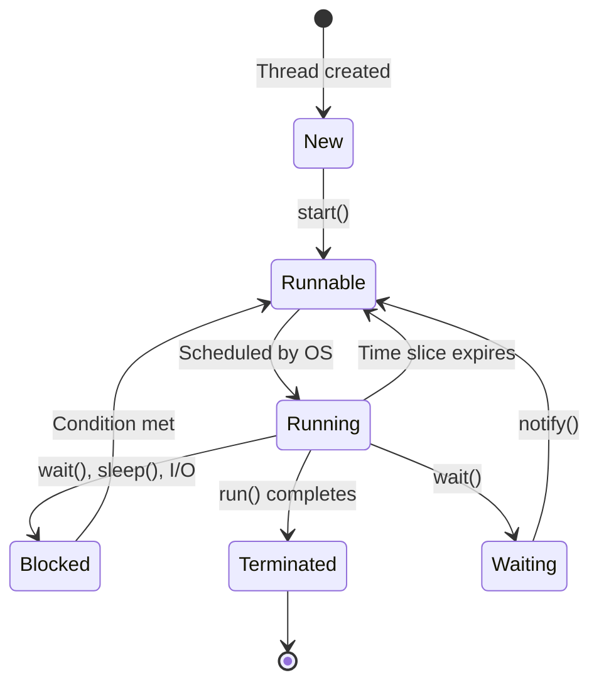

# Multithreading & Concurrency in Java

## Overview

Multithreading and concurrency in Java enable programs to execute multiple threads simultaneously, improving performance and responsiveness. Understanding thread lifecycle, synchronization, and concurrent data structures is essential for writing robust concurrent applications.

## Detailed Explanation

### Thread Lifecycle



### Thread Creation

Java provides two main ways to create threads:
1. Extending Thread class
2. Implementing Runnable interface

### Synchronization

Synchronization ensures thread safety:
- **synchronized** keyword for methods and blocks
- **volatile** for visibility guarantees
- **Locks** from java.util.concurrent.locks

### Concurrent Collections

Thread-safe collections:
- ConcurrentHashMap
- CopyOnWriteArrayList
- BlockingQueue implementations

### Thread Communication

- **wait()**, **notify()**, **notifyAll()** for inter-thread communication
- **join()** for waiting thread completion
- **sleep()** for pausing execution

## Real-world Examples & Use Cases

- **Web Servers**: Handling multiple client requests concurrently
- **Database Connections**: Connection pooling for efficient resource usage
- **GUI Applications**: Responsive interfaces with background processing
- **Game Development**: Parallel processing for physics and rendering
- **Big Data Processing**: MapReduce frameworks utilizing multiple cores

## Code Examples

### Thread Creation Examples

```java
// Method 1: Extending Thread class
public class MyThread extends Thread {
    @Override
    public void run() {
        System.out.println("Thread " + Thread.currentThread().getName() + " is running");
    }
    
    public static void main(String[] args) {
        MyThread thread1 = new MyThread();
        MyThread thread2 = new MyThread();
        
        thread1.start();
        thread2.start();
    }
}

// Method 2: Implementing Runnable interface
public class MyRunnable implements Runnable {
    @Override
    public void run() {
        System.out.println("Runnable " + Thread.currentThread().getName() + " is running");
    }
    
    public static void main(String[] args) {
        Thread thread1 = new Thread(new MyRunnable(), "Thread-1");
        Thread thread2 = new Thread(new MyRunnable(), "Thread-2");
        
        thread1.start();
        thread2.start();
    }
}
```

### Synchronization Example

```java
public class SynchronizationExample {
    private int counter = 0;
    
    // Synchronized method
    public synchronized void increment() {
        counter++;
    }
    
    // Synchronized block
    public void incrementWithBlock() {
        synchronized (this) {
            counter++;
        }
    }
    
    public int getCounter() {
        return counter;
    }
    
    public static void main(String[] args) throws InterruptedException {
        SynchronizationExample example = new SynchronizationExample();
        
        // Create multiple threads
        Thread t1 = new Thread(() -> {
            for (int i = 0; i < 1000; i++) {
                example.increment();
            }
        });
        
        Thread t2 = new Thread(() -> {
            for (int i = 0; i < 1000; i++) {
                example.increment();
            }
        });
        
        t1.start();
        t2.start();
        
        t1.join();
        t2.join();
        
        System.out.println("Final counter: " + example.getCounter());
    }
}
```

### Producer-Consumer Pattern

```java
import java.util.LinkedList;
import java.util.Queue;

public class ProducerConsumerExample {
    private final Queue<Integer> queue = new LinkedList<>();
    private final int capacity = 5;
    
    public void produce() throws InterruptedException {
        int value = 0;
        while (true) {
            synchronized (this) {
                while (queue.size() == capacity) {
                    wait();
                }
                
                System.out.println("Produced: " + value);
                queue.add(value++);
                
                notify();
                
                Thread.sleep(1000);
            }
        }
    }
    
    public void consume() throws InterruptedException {
        while (true) {
            synchronized (this) {
                while (queue.isEmpty()) {
                    wait();
                }
                
                int val = queue.remove();
                System.out.println("Consumed: " + val);
                
                notify();
                
                Thread.sleep(1000);
            }
        }
    }
    
    public static void main(String[] args) {
        ProducerConsumerExample pc = new ProducerConsumerExample();
        
        Thread producer = new Thread(() -> {
            try {
                pc.produce();
            } catch (InterruptedException e) {
                e.printStackTrace();
            }
        });
        
        Thread consumer = new Thread(() -> {
            try {
                pc.consume();
            } catch (InterruptedException e) {
                e.printStackTrace();
            }
        });
        
        producer.start();
        consumer.start();
    }
}
```

### Using Concurrent Collections

```java
import java.util.concurrent.ConcurrentHashMap;
import java.util.concurrent.CopyOnWriteArrayList;
import java.util.concurrent.BlockingQueue;
import java.util.concurrent.LinkedBlockingQueue;

public class ConcurrentCollectionsExample {
    
    public static void main(String[] args) throws InterruptedException {
        // ConcurrentHashMap example
        ConcurrentHashMap<String, Integer> map = new ConcurrentHashMap<>();
        
        // CopyOnWriteArrayList example
        CopyOnWriteArrayList<String> list = new CopyOnWriteArrayList<>();
        
        // BlockingQueue example
        BlockingQueue<String> queue = new LinkedBlockingQueue<>(10);
        
        // Multiple threads modifying collections
        Thread t1 = new Thread(() -> {
            for (int i = 0; i < 100; i++) {
                map.put("key" + i, i);
                list.add("item" + i);
                try {
                    queue.put("message" + i);
                } catch (InterruptedException e) {
                    Thread.currentThread().interrupt();
                }
            }
        });
        
        Thread t2 = new Thread(() -> {
            for (int i = 0; i < 100; i++) {
                System.out.println("Map size: " + map.size());
                System.out.println("List size: " + list.size());
                try {
                    String message = queue.take();
                    System.out.println("Received: " + message);
                } catch (InterruptedException e) {
                    Thread.currentThread().interrupt();
                }
            }
        });
        
        t1.start();
        t2.start();
        
        t1.join();
        t2.join();
        
        System.out.println("Final map size: " + map.size());
        System.out.println("Final list size: " + list.size());
    }
}
```

## Common Pitfalls & Edge Cases

- **Race Conditions**: Multiple threads accessing shared data without synchronization
- **Deadlocks**: Threads waiting for each other indefinitely
- **Starvation**: Threads unable to access resources due to priority issues
- **Visibility Issues**: Changes not visible across threads without proper synchronization
- **Memory Consistency Errors**: Inconsistent views of shared data

## Tools & Libraries

- **java.util.concurrent**: High-level concurrency utilities
- **Threading Debuggers**: IDE debugging tools for concurrent code
- **Profiling Tools**: VisualVM, JProfiler for thread analysis
- **Testing Frameworks**: ConcurrentUnit, MultithreadedTC for testing concurrent code

## References

- [Oracle Concurrency Tutorial](https://docs.oracle.com/javase/tutorial/essential/concurrency/)
- [Java Concurrency in Practice](https://www.amazon.com/Java-Concurrency-Practice-Brian-Goetz/dp/0321349601)
- [Concurrent Programming in Java](https://www.amazon.com/Concurrent-Programming-Java-Principles-Pattern/dp/0201310090)

## Github-README Links & Related Topics

- [Java Fundamentals](../java-fundamentals/README.md)
- [Java Memory Model and Concurrency](../java/java-memory-model-and-concurrency/README.md)
- [Java Volatile Keyword](../java-volatile-keyword/README.md)
- [Java Synchronized Blocks](../java-synchronized-blocks/README.md)
