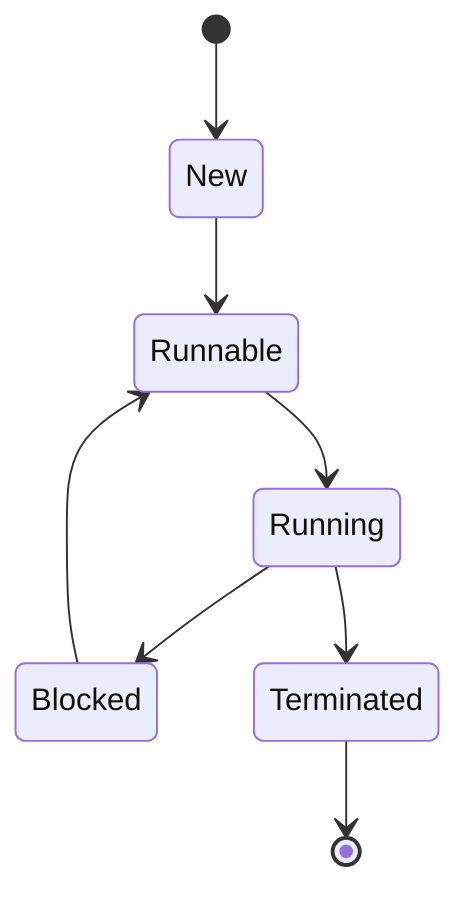

# Overview

Multithreading & Concurrency in Java enable parallel execution, improving performance and responsiveness. This involves creating and managing threads, synchronizing access to shared resources, and handling concurrency issues like race conditions and deadlocks.

# Detailed Explanation

## Threads and Thread Lifecycle

Threads are lightweight processes. Lifecycle: New, Runnable, Running, Blocked, Terminated.



## Synchronization

Use `synchronized` blocks/methods, locks, and atomic variables to prevent race conditions.

## Concurrency Utilities

`java.util.concurrent` package provides Executors, Futures, and concurrent collections.

| Utility | Purpose | Example |
|---------|---------|---------|
| ExecutorService | Manage thread pools | `Executors.newFixedThreadPool(10)` |
| Future | Represent async results | `future.get()` |
| AtomicInteger | Thread-safe counters | `atomic.incrementAndGet()` |
| ConcurrentHashMap | Thread-safe maps | `map.put(key, value)` |

# Real-world Examples & Use Cases

- **Web Servers**: Handle multiple requests concurrently.
- **Data Processing**: Parallelize computations in big data apps.
- **GUI Apps**: Keep UI responsive with background threads.
- **Gaming**: Simulate multiple entities simultaneously.

# Code Examples

## Creating Threads
```java
public class MyThread extends Thread {
    public void run() {
        System.out.println("Thread running");
    }
}

public class Main {
    public static void main(String[] args) {
        MyThread t = new MyThread();
        t.start();
    }
}
```

## Synchronization
```java
public class Counter {
    private int count = 0;
    
    public synchronized void increment() {
        count++;
    }
    
    public int getCount() {
        return count;
    }
}
```

## ExecutorService
```java
import java.util.concurrent.ExecutorService;
import java.util.concurrent.Executors;

public class ExecutorExample {
    public static void main(String[] args) {
        ExecutorService executor = Executors.newFixedThreadPool(2);
        executor.submit(() -> System.out.println("Task 1"));
        executor.submit(() -> System.out.println("Task 2"));
        executor.shutdown();
    }
}
```

# Common Pitfalls & Edge Cases

- **Race Conditions**: Unsynchronized shared data access.
- **Deadlocks**: Circular wait for resources.
- **Starvation**: Threads unable to proceed.
- **Memory Consistency**: Ensure visibility with `volatile`.

# References

- [Concurrency in Java](https://docs.oracle.com/javase/tutorial/essential/concurrency/)
- [java.util.concurrent](https://docs.oracle.com/javase/8/docs/api/java/util/concurrent/package-summary.html)
- [Threading Best Practices](https://www.oracle.com/technetwork/articles/javase/index-140767.html)

# Github-README Links & Related Topics

- [Java Executors](./java-executorservice/README.md)
- [Java Locks](./java-locks/README.md)
- [Concurrent Collections](./concurrent-collections/README.md)