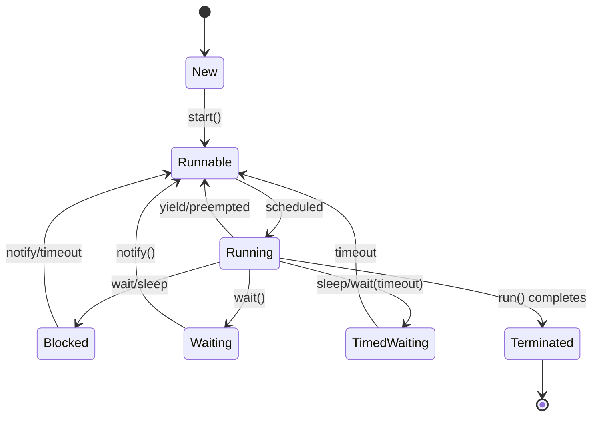

# Multithreading & Concurrency in Java

## Overview

Multithreading allows a program to execute multiple threads concurrently, improving performance and responsiveness. Concurrency in Java involves managing multiple threads, synchronization, and avoiding issues like race conditions and deadlocks.

## Detailed Explanation

### Threads in Java

- **Creating Threads**: Using Thread class or Runnable interface.
- **Thread Lifecycle**: Threads transition through various states during execution.

| State | Description | Transitions |
|-------|-------------|-------------|
| NEW | Thread created but not started | start() → RUNNABLE |
| RUNNABLE | Ready to run or running | schedule → RUNNING, yield/preempt → RUNNABLE |
| BLOCKED | Waiting for monitor lock | acquire lock → RUNNABLE |
| WAITING | Waiting indefinitely for another thread | notify() → RUNNABLE |
| TIMED_WAITING | Waiting for specified time | timeout/notify() → RUNNABLE |
| TERMINATED | Execution completed | - |

### Synchronization

- **Synchronized Methods/Blocks**: Ensure atomicity.
- **Volatile Keyword**: For visibility of changes across threads.
- **Locks**: ReentrantLock, ReadWriteLock.

### Concurrency Utilities

Java provides high-level concurrency utilities in java.util.concurrent package:

| Utility | Description | Example Use Case |
|---------|-------------|------------------|
| ExecutorService | Manages thread pools | Submitting tasks for execution |
| ConcurrentHashMap | Thread-safe hash map | Shared cache with concurrent access |
| AtomicInteger/Long | Lock-free atomic operations | Counters in multi-threaded environments |
| CountDownLatch | Synchronization aid | Waiting for multiple threads to complete |
| CyclicBarrier | Synchronization aid | Coordinating multiple threads |
| Semaphore | Controlling access to resources | Limiting concurrent access |
| Future/CompletableFuture | Asynchronous computation | Non-blocking task execution |

### Common Issues

- **Race Conditions**: When multiple threads access shared data.
- **Deadlocks**: Circular waiting for resources.
- **Starvation**: A thread unable to gain access to resources.

## Real-world Examples & Use Cases

- **Web Servers**: Handling multiple client requests concurrently.
- **Data Processing**: Parallel computation in big data applications.
- **GUI Applications**: Keeping UI responsive while performing background tasks.

## Code Examples

### Creating a Thread

```java
public class MyThread extends Thread {
    public void run() {
        System.out.println("Thread running");
    }
}

public class Main {
    public static void main(String[] args) {
        MyThread t = new MyThread();
        t.start();
    }
}
```

### Using Runnable

```java
public class MyRunnable implements Runnable {
    public void run() {
        System.out.println("Runnable running");
    }
}

public class Main {
    public static void main(String[] args) {
        Thread t = new Thread(new MyRunnable());
        t.start();
    }
}
```

### Synchronization

```java
public class Counter {
    private int count = 0;

    public synchronized void increment() {
        count++;
    }

    public int getCount() {
        return count;
    }
}
```

### Using ExecutorService

```java
import java.util.concurrent.ExecutorService;
import java.util.concurrent.Executors;

public class ExecutorExample {
    public static void main(String[] args) {
        ExecutorService executor = Executors.newFixedThreadPool(5);

        for (int i = 0; i < 10; i++) {
            Runnable task = () -> {
                System.out.println("Task executed by " + Thread.currentThread().getName());
            };
            executor.submit(task);
        }

        executor.shutdown();
    }
}
```

### Atomic Variables

```java
import java.util.concurrent.atomic.AtomicInteger;

public class AtomicExample {
    private AtomicInteger counter = new AtomicInteger(0);

    public void increment() {
        counter.incrementAndGet();
    }

    public int getCounter() {
        return counter.get();
    }
}
```



## Common Pitfalls & Edge Cases

- **Race Conditions**: Use synchronization or atomic variables.
- **Deadlocks**: Avoid nested locks; use tryLock.
- **Visibility Issues**: Use volatile or synchronized for shared variables.
- **Thread Safety**: Immutable objects or proper synchronization.
- **Performance**: Too many threads can cause overhead; use thread pools.

## Tools & Libraries

- **Java Concurrency Utilities**: java.util.concurrent package.
- **Thread Dump Tools**: jstack for analyzing deadlocks.
- **Profilers**: VisualVM, JProfiler for concurrency issues.
- **Libraries**: Akka for actor-based concurrency.

## References

- [Oracle Concurrency Tutorial](https://docs.oracle.com/javase/tutorial/essential/concurrency/)
- [Baeldung: Java Concurrency](https://www.baeldung.com/java-concurrency)

## Github-README Links & Related Topics

- [JVM Internals & Class Loading](../jvm-internals-and-class-loading/README.md)
- [Java Collections](../java-collections/README.md)
- [Concurrent Collections](../concurrent-collections/README.md)
