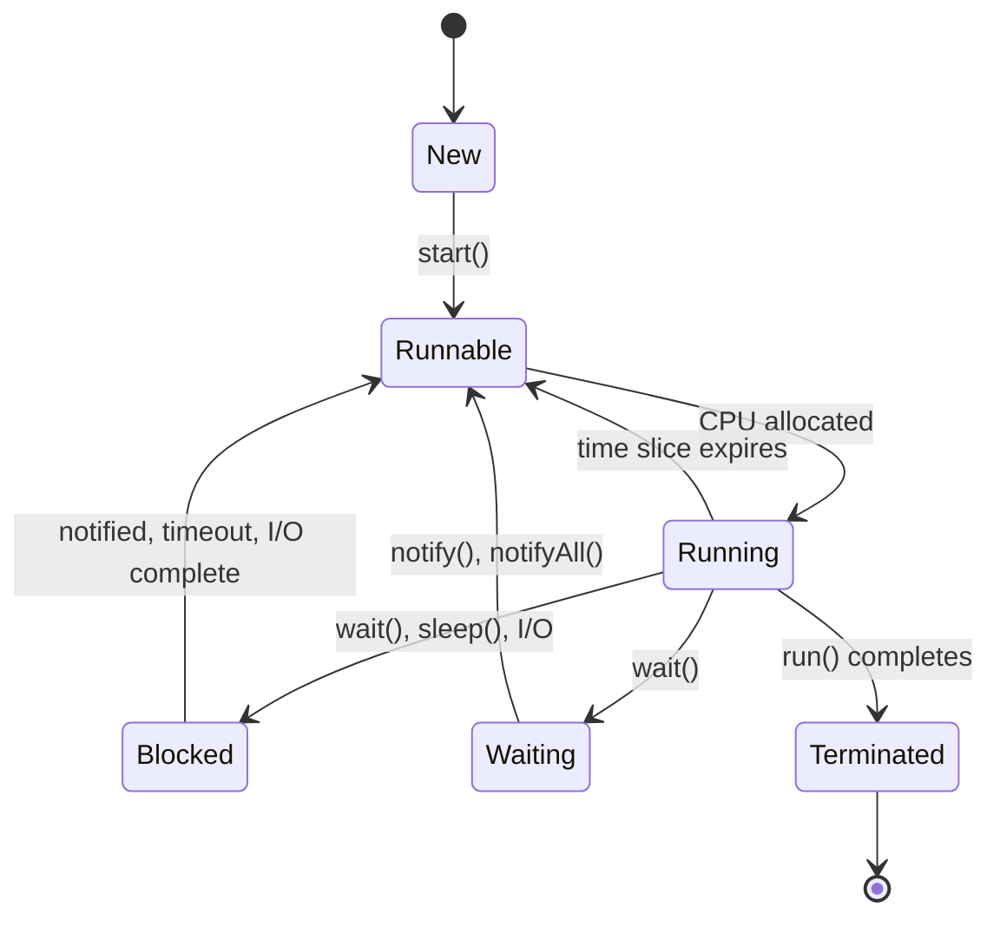

# Multithreading & Concurrency in Java

## Overview

Multithreading and concurrency in Java enable the execution of multiple threads simultaneously, allowing for better resource utilization and responsive applications. Understanding these concepts is essential for developing high-performance, scalable Java applications that can handle multiple tasks concurrently.

## Detailed Explanation

### Threads vs Processes

- **Processes:** Independent execution units with separate memory spaces
- **Threads:** Lightweight sub-processes that share the same memory space within a process
- **Advantages of Threads:** Lower resource consumption, faster context switching, shared memory

### Thread Lifecycle

1. **New:** Thread created but not started
2. **Runnable:** Thread ready to run, waiting for CPU time
3. **Running:** Thread currently executing
4. **Blocked/Waiting:** Thread waiting for a resource or condition
5. **Terminated:** Thread completed execution

### Creating Threads

1. **Extending Thread Class:**
   ```java
   public class MyThread extends Thread {
       public void run() {
           // Thread logic
       }
   }
   ```

2. **Implementing Runnable Interface:**
   ```java
   public class MyRunnable implements Runnable {
       public void run() {
           // Thread logic
       }
   }
   ```

3. **Using ExecutorService:** Preferred approach for managing thread pools

### Synchronization

- **Synchronized Methods:** Lock the entire method
- **Synchronized Blocks:** Lock specific code sections
- **Volatile Keyword:** Ensures visibility of changes across threads
- **Locks:** ReentrantLock, ReadWriteLock for more control

### Concurrency Issues

- **Race Conditions:** Multiple threads accessing shared data simultaneously
- **Deadlocks:** Threads waiting indefinitely for resources held by each other
- **Starvation:** A thread unable to gain access to shared resources
- **Livelocks:** Threads actively trying to resolve a conflict but making no progress

### Concurrent Collections

- **ConcurrentHashMap:** Thread-safe HashMap
- **CopyOnWriteArrayList:** Thread-safe ArrayList for read-heavy operations
- **BlockingQueue:** Thread-safe queues with blocking operations

## Real-world Examples & Use Cases

- **Web Servers:** Handling multiple client requests concurrently (e.g., Tomcat, Jetty)
- **GUI Applications:** Keeping the UI responsive while performing background tasks
- **Data Processing:** Parallel processing of large datasets
- **Game Development:** Managing game loops, physics, and rendering in separate threads
- **Financial Systems:** Processing multiple transactions simultaneously

## Code Examples

### Creating Threads

```java
// Extending Thread
public class MyThread extends Thread {
    @Override
    public void run() {
        for (int i = 0; i < 5; i++) {
            System.out.println("Thread: " + Thread.currentThread().getName() + " - " + i);
            try {
                Thread.sleep(100);
            } catch (InterruptedException e) {
                e.printStackTrace();
            }
        }
    }
    
    public static void main(String[] args) {
        MyThread t1 = new MyThread();
        MyThread t2 = new MyThread();
        t1.start();
        t2.start();
    }
}

// Implementing Runnable
public class MyRunnable implements Runnable {
    @Override
    public void run() {
        for (int i = 0; i < 5; i++) {
            System.out.println("Runnable: " + Thread.currentThread().getName() + " - " + i);
        }
    }
    
    public static void main(String[] args) {
        Thread t1 = new Thread(new MyRunnable(), "Thread-1");
        Thread t2 = new Thread(new MyRunnable(), "Thread-2");
        t1.start();
        t2.start();
    }
}
```

### Synchronization Example

```java
public class Counter {
    private int count = 0;
    
    // Synchronized method
    public synchronized void increment() {
        count++;
    }
    
    // Synchronized block
    public void incrementWithBlock() {
        synchronized (this) {
            count++;
        }
    }
    
    public int getCount() {
        return count;
    }
    
    public static void main(String[] args) throws InterruptedException {
        Counter counter = new Counter();
        
        Runnable task = () -> {
            for (int i = 0; i < 1000; i++) {
                counter.increment();
            }
        };
        
        Thread t1 = new Thread(task);
        Thread t2 = new Thread(task);
        
        t1.start();
        t2.start();
        
        t1.join();
        t2.join();
        
        System.out.println("Final count: " + counter.getCount()); // Should be 2000
    }
}
```

### Producer-Consumer Problem

```java
import java.util.LinkedList;
import java.util.Queue;

public class ProducerConsumer {
    private final Queue<Integer> queue = new LinkedList<>();
    private final int capacity = 5;
    
    public void produce() throws InterruptedException {
        int value = 0;
        while (true) {
            synchronized (this) {
                while (queue.size() == capacity) {
                    wait();
                }
                System.out.println("Produced: " + value);
                queue.add(value++);
                notify();
                Thread.sleep(1000);
            }
        }
    }
    
    public void consume() throws InterruptedException {
        while (true) {
            synchronized (this) {
                while (queue.isEmpty()) {
                    wait();
                }
                int val = queue.remove();
                System.out.println("Consumed: " + val);
                notify();
                Thread.sleep(1000);
            }
        }
    }
    
    public static void main(String[] args) {
        ProducerConsumer pc = new ProducerConsumer();
        
        Thread producer = new Thread(() -> {
            try {
                pc.produce();
            } catch (InterruptedException e) {
                Thread.currentThread().interrupt();
            }
        });
        
        Thread consumer = new Thread(() -> {
            try {
                pc.consume();
            } catch (InterruptedException e) {
                Thread.currentThread().interrupt();
            }
        });
        
        producer.start();
        consumer.start();
    }
}
```

### Using ExecutorService

```java
import java.util.concurrent.ExecutorService;
import java.util.concurrent.Executors;
import java.util.concurrent.TimeUnit;

public class ExecutorExample {
    public static void main(String[] args) {
        ExecutorService executor = Executors.newFixedThreadPool(3);
        
        for (int i = 0; i < 5; i++) {
            final int taskId = i;
            executor.submit(() -> {
                System.out.println("Task " + taskId + " executed by " + Thread.currentThread().getName());
                try {
                    Thread.sleep(1000);
                } catch (InterruptedException e) {
                    Thread.currentThread().interrupt();
                }
            });
        }
        
        executor.shutdown();
        try {
            if (!executor.awaitTermination(10, TimeUnit.SECONDS)) {
                executor.shutdownNow();
            }
        } catch (InterruptedException e) {
            executor.shutdownNow();
            Thread.currentThread().interrupt();
        }
    }
}
```

## Data Models / Message Formats

### Thread Lifecycle Diagram



## Common Pitfalls & Edge Cases

- **Race Conditions:** Use proper synchronization
- **Deadlocks:** Avoid circular wait conditions
- **Memory Visibility:** Use volatile or synchronized for shared variables
- **Thread Starvation:** Ensure fair resource allocation
- **Improper Thread Pool Sizing:** Can lead to resource exhaustion or underutilization

## Tools & Libraries

- **java.util.concurrent package:** High-level concurrency utilities
- **Thread Dump Analysis:** jstack, VisualVM
- **Performance Monitoring:** JConsole, VisualVM
- **Testing:** JCStress for concurrency testing

## References

- [Oracle Java Concurrency Tutorial](https://docs.oracle.com/javase/tutorial/essential/concurrency/)
- [Java Concurrency in Practice](https://jcip.net/)
- [Concurrent Programming in Java](https://www.baeldung.com/java-concurrent-programming)
- [Threading in Java](https://www.geeksforgeeks.org/multithreading-in-java/)

## Github-README Links & Related Topics

- [Java Fundamentals](./java-fundamentals)
- [Concurrent Collections](../java/concurrent-collections)
- [Java Memory Model](../java/java-memory-model-and-concurrency)
