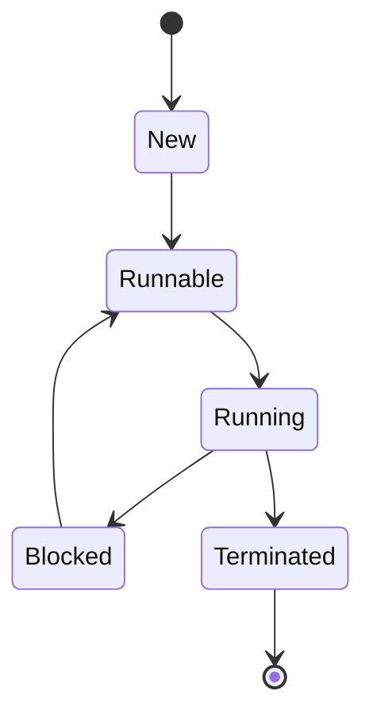

# Multithreading & Concurrency in Java

## Overview

Multithreading in Java enables concurrent execution of code, improving performance and responsiveness. Concurrency utilities like locks and executors manage thread safety and coordination.

## Detailed Explanation

### Threads and Runnable

Create threads using `Thread` class or `Runnable` interface.

### Synchronization

Use `synchronized` keyword or `Lock` interfaces for thread safety.

### Concurrency Utilities

- `ExecutorService` for thread pools.
- `ConcurrentHashMap` for thread-safe collections.

## Real-world Examples & Use Cases

- Web servers handling multiple requests.
- Data processing pipelines with parallel tasks.

## Code Examples

```java
// Thread creation
public class MyThread extends Thread {
    public void run() {
        System.out.println("Thread running");
    }
}
public class Main {
    public static void main(String[] args) {
        MyThread t = new MyThread();
        t.start();
    }
}
```

```java
// Synchronization
public class Counter {
    private int count = 0;
    public synchronized void increment() {
        count++;
    }
}
```

## Journey / Sequence



## Common Pitfalls & Edge Cases

- Race conditions without synchronization.
- Deadlocks with improper lock ordering.

## Tools & Libraries

- `java.util.concurrent` package.

## References

- [Oracle Concurrency Tutorial](https://docs.oracle.com/javase/tutorial/essential/concurrency/)
- [Baeldung Java Concurrency](https://www.baeldung.com/java-concurrency)

## Github-README Links & Related Topics

- [Java Fundamentals](../java-fundamentals)
- [Concurrency & Parallelism](../concurrency-parallelism)
