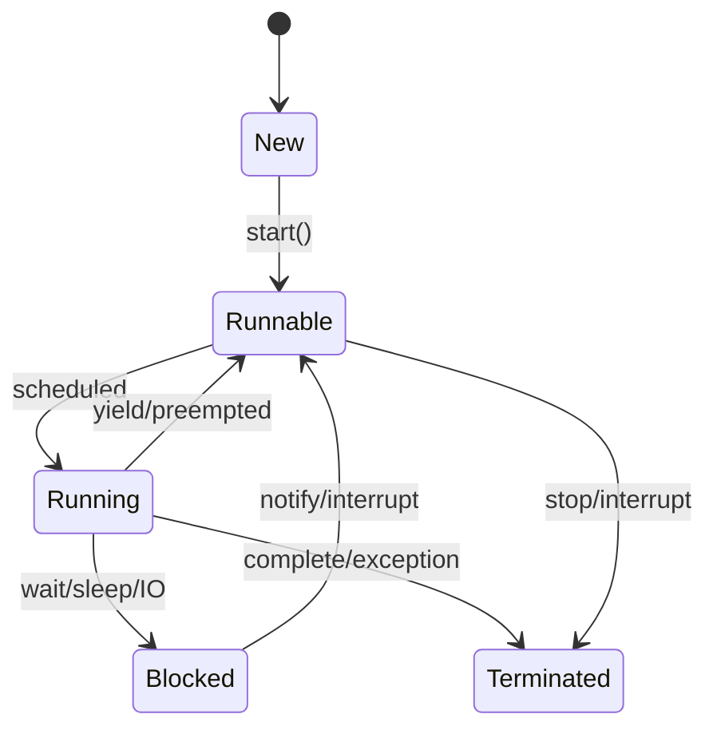

# Overview

Multithreading & Concurrency in Java covers the principles and practices of writing concurrent programs using Java's threading model, synchronization mechanisms, and concurrent utilities. Mastering these concepts is essential for building scalable, responsive applications that can leverage multi-core processors effectively.

# Detailed Explanation

## Thread Fundamentals

### Thread Lifecycle



### Creating Threads

#### Extending Thread Class

```java
class MyThread extends Thread {
    @Override
    public void run() {
        System.out.println("Thread running: " + Thread.currentThread().getName());
    }
}

public class ThreadExample {
    public static void main(String[] args) {
        MyThread thread = new MyThread();
        thread.start(); // Don't call run() directly
    }
}
```

#### Implementing Runnable

```java
class MyRunnable implements Runnable {
    @Override
    public void run() {
        System.out.println("Runnable running: " + Thread.currentThread().getName());
    }
}

public class RunnableExample {
    public static void main(String[] args) {
        Thread thread = new Thread(new MyRunnable());
        thread.start();
    }
}
```

## Synchronization

### Synchronized Methods and Blocks

```java
class Counter {
    private int count = 0;
    
    // Synchronized method
    public synchronized void increment() {
        count++;
    }
    
    // Synchronized block
    public void incrementBlock() {
        synchronized(this) {
            count++;
        }
    }
    
    public int getCount() {
        return count;
    }
}
```

### Volatile Keyword

```java
class VolatileExample {
    private volatile boolean flag = false;
    
    public void setFlag(boolean value) {
        flag = value;
    }
    
    public boolean getFlag() {
        return flag;
    }
}
```

## Concurrent Collections

### Thread-Safe Collections

| Collection | Description | Use Case |
|------------|-------------|----------|
| ConcurrentHashMap | Thread-safe HashMap | High-concurrency read/write operations |
| CopyOnWriteArrayList | Thread-safe ArrayList | Read-heavy, infrequent writes |
| BlockingQueue | Thread-safe queue with blocking operations | Producer-consumer patterns |
| ConcurrentLinkedQueue | Non-blocking concurrent queue | High-performance concurrent access |

```java
import java.util.concurrent.ConcurrentHashMap;
import java.util.concurrent.CopyOnWriteArrayList;

public class ConcurrentCollectionsExample {
    public static void main(String[] args) {
        // ConcurrentHashMap
        ConcurrentHashMap<String, Integer> map = new ConcurrentHashMap<>();
        map.put("key1", 1);
        
        // CopyOnWriteArrayList
        CopyOnWriteArrayList<String> list = new CopyOnWriteArrayList<>();
        list.add("item1");
    }
}
```

## Executor Framework

### Thread Pools

```java
import java.util.concurrent.ExecutorService;
import java.util.concurrent.Executors;

public class ExecutorExample {
    public static void main(String[] args) {
        // Fixed thread pool
        ExecutorService executor = Executors.newFixedThreadPool(5);
        
        for (int i = 0; i < 10; i++) {
            executor.submit(() -> {
                System.out.println("Task executed by: " + Thread.currentThread().getName());
            });
        }
        
        executor.shutdown();
    }
}
```

### Callable and Future

```java
import java.util.concurrent.Callable;
import java.util.concurrent.ExecutionException;
import java.util.concurrent.ExecutorService;
import java.util.concurrent.Executors;
import java.util.concurrent.Future;

public class CallableExample {
    public static void main(String[] args) throws ExecutionException, InterruptedException {
        ExecutorService executor = Executors.newSingleThreadExecutor();
        
        Callable<Integer> task = () -> {
            Thread.sleep(1000);
            return 42;
        };
        
        Future<Integer> future = executor.submit(task);
        
        // Do other work...
        
        Integer result = future.get(); // Blocks until result available
        System.out.println("Result: " + result);
        
        executor.shutdown();
    }
}
```

## Synchronization Primitives

### Locks

```java
import java.util.concurrent.locks.Lock;
import java.util.concurrent.locks.ReentrantLock;

class LockExample {
    private final Lock lock = new ReentrantLock();
    private int count = 0;
    
    public void increment() {
        lock.lock();
        try {
            count++;
        } finally {
            lock.unlock();
        }
    }
}
```

### Semaphores

```java
import java.util.concurrent.Semaphore;

class SemaphoreExample {
    private final Semaphore semaphore = new Semaphore(3); // Allow 3 concurrent accesses
    
    public void accessResource() {
        try {
            semaphore.acquire();
            // Access shared resource
            System.out.println("Accessing resource: " + Thread.currentThread().getName());
            Thread.sleep(1000);
        } catch (InterruptedException e) {
            Thread.currentThread().interrupt();
        } finally {
            semaphore.release();
        }
    }
}
```

## Real-world Examples & Use Cases

- **Web Servers**: Handling multiple client requests concurrently
- **Database Connection Pools**: Managing limited database connections
- **File Processing**: Parallel processing of large files
- **GUI Applications**: Keeping UI responsive during long operations
- **Game Development**: Managing game loops, physics, and rendering threads

# Code Examples

### Producer-Consumer Pattern

```java
import java.util.concurrent.BlockingQueue;
import java.util.concurrent.LinkedBlockingQueue;

class Producer implements Runnable {
    private final BlockingQueue<Integer> queue;
    
    Producer(BlockingQueue<Integer> queue) {
        this.queue = queue;
    }
    
    @Override
    public void run() {
        try {
            for (int i = 0; i < 10; i++) {
                queue.put(i);
                System.out.println("Produced: " + i);
                Thread.sleep(100);
            }
        } catch (InterruptedException e) {
            Thread.currentThread().interrupt();
        }
    }
}

class Consumer implements Runnable {
    private final BlockingQueue<Integer> queue;
    
    Consumer(BlockingQueue<Integer> queue) {
        this.queue = queue;
    }
    
    @Override
    public void run() {
        try {
            while (true) {
                Integer item = queue.take();
                System.out.println("Consumed: " + item);
                Thread.sleep(200);
            }
        } catch (InterruptedException e) {
            Thread.currentThread().interrupt();
        }
    }
}

public class ProducerConsumerDemo {
    public static void main(String[] args) {
        BlockingQueue<Integer> queue = new LinkedBlockingQueue<>(5);
        
        Thread producer = new Thread(new Producer(queue));
        Thread consumer = new Thread(new Consumer(queue));
        
        producer.start();
        consumer.start();
    }
}
```

### Thread-Safe Singleton

```java
public class ThreadSafeSingleton {
    private static volatile ThreadSafeSingleton instance;
    
    private ThreadSafeSingleton() {}
    
    public static ThreadSafeSingleton getInstance() {
        if (instance == null) {
            synchronized (ThreadSafeSingleton.class) {
                if (instance == null) {
                    instance = new ThreadSafeSingleton();
                }
            }
        }
        return instance;
    }
}
```

# Journey / Sequence

1. **Thread Creation**: Instantiate Thread or implement Runnable
2. **Thread Start**: Call start() method to begin execution
3. **Execution**: run() method executes in separate thread
4. **Synchronization**: Use locks/synchronized blocks for shared resources
5. **Communication**: Use wait/notify for thread coordination
6. **Completion**: Thread terminates when run() completes
7. **Cleanup**: Ensure proper resource cleanup

# Common Pitfalls & Edge Cases

- **Race Conditions**: Unprotected shared state modifications
- **Deadlocks**: Circular waiting for locks
- **Starvation**: Thread unable to acquire resources
- **Memory Visibility**: Changes not visible across threads without proper synchronization
- **Thread Leaks**: Threads not properly terminated
- **InterruptedException**: Proper handling of thread interruption

# Tools & Libraries

- **Java Concurrency Utilities**: java.util.concurrent package
- **Thread Dump Analysis**: jstack, VisualVM
- **Performance Monitoring**: JConsole, JMX
- **Testing**: ConcurrentUnit, JCStress for concurrency testing

# References

- [Oracle Java Concurrency Tutorial](https://docs.oracle.com/javase/tutorial/essential/concurrency/)
- [Java Concurrency in Practice](https://www.amazon.com/Java-Concurrency-Practice-Brian-Goetz/dp/0321349601)
- [Baeldung Concurrency](https://www.baeldung.com/java-concurrency)

# Github-README Links & Related Topics

- [Java Fundamentals](../java-fundamentals/README.md)
- [Java Volatile Keyword](../java-volatile-keyword/README.md)
- [Java Synchronized Blocks](../java-synchronized-blocks/README.md)
- [Java ThreadLocal](../java-threadlocal/README.md)
